# Космическая станция "Севастополь" (Чужой)  

Система управления шлюзами и доступом станции а также взаимодействие с землей и другими станциями 

## Краткое описание проектируемой системы

Разрабатывается система управления критической инфраструктурой космической станции «Севастополь» — автономного орбитального комплекса, предназначенного для длительного пребывания экипажа, приёма кораблей, хранения грузов и проведения технических операций.
Система обеспечивает безопасное управление внутренними и внешними шлюзами станции, контроль перемещения персонала по отсекам, управление доступом в критические зоны, координацию стыковки прибывающих кораблей, а также обмен данными с Землёй и внешними судами.
Система получает команды от центрального вычислительного ядра станции, проверяет их допустимость, исполняет разрешённые сценарии и передаёт телеметрию, журналы событий и результаты самодиагностики оператору и в центральную систему.

---
## Ценности, ущербы и неприемлемые события

| Ценность | Негативное событие | Оценка ущерба | Комментарий |
|---|---|---|---|
| Экипаж станции | Ошибочное открытие шлюза привело к гибели или травмам персонала | Высокий | Прямой риск жизни людей |
| Герметичность отсеков | Разгерметизация жилого или технического модуля | Критический | Возможна потеря сектора станции |
| Шлюзовая система | Одновременное открытие внутренних и внешних створок шлюза | Критический | Немедленная аварийная ситуация |
| Доступ в отсеки | Получен доступ в командный или технический сектор | Высокий | Возможен саботаж управления |
| Стыковочный узел | Ошибка управления вызвала повреждение прибывающего корабля | Высокий | Потеря груза или транспорта |
| Связь с Землёй | Потеря канала связи и невозможность передачи телеметрии | Средний | Переход в автономный режим |
| Центральная система управления | Нарушена целостность команд управления шлюзами | Критический | Потеря контроля над инфраструктурой |
| Журналы событий | Удалены или изменены записи инцидентов | Средний | Усложнение расследования |
| Эвакуационные маршруты | Заблокирован доступ к спасательным капсулам | Критический | Невозможность эвакуации |

## Известные ограничения и вводные условия

По условиям проекта система должна быть реализована с использованием микросервисной архитектуры. Для обмена данными между сервисами должен использоваться брокер сообщений и асинхронная модель взаимодействия. Использование сторонних API и внешних облачных сервисов не допускается из-за требований конфиденциальности данных станции. Система должна обеспечивать работу как в штатном режиме, так и при нестабильных каналах связи с Землёй и внешними кораблями.

## Базовая архитектура системы

## Базовые сценарии

## Расширенная архитектура системы

## Контекст работы системы

Система функционирует в составе космической станции «Севастополь» и взаимодействует с центральной системой управления станции, экипажем, внешними кораблями и наземным центром управления.Во внешнем контуре система обменивается телеметрией и служебными сообщениями с Землёй, транспортными кораблями и другими станциями по каналам связи с возможными задержками и потерями пакетов.При отказах оборудования, потере связи, попытках несанкционированного доступа или обнаружении опасного состояния система обязана сохранять работоспособность критических функций.

---
## Расширенные функциональные сценарии

## Компоненты системы

| Компонент | Назначение |
|---|---|
| Центральная система управления станции | Формирует команды для подсистем станции, получает телеметрию и статусы выполнения операций |
| Сервис управления шлюзами | Управляет внутренними и внешними шлюзами, проверяет допустимость открытия и закрытия створок |
| Сервис управления доступом | Контролирует проход между отсеками и доступ в критические зоны |
| Сервис контроля отсеков | Получает данные о давлении, герметичности, температуре и аварийных событиях |
| Сервис стыковки кораблей | Обрабатывает запросы на стыковку и управляет стыковочными узлами |
| Интерфейс связи с Землёй | Обеспечивает обмен командами, телеметрией и отчетами с наземным центром |
| Интерфейс связи с кораблями | Обеспечивает обмен служебными сообщениями с внешними кораблями |
| База данных состояний | Хранит статусы шлюзов, отсеков, пользователей, кораблей и результаты операций |
| Сервис журналирования | Сохраняет события системы, действия операторов и аварийные сообщения |
| Сервис мониторинга | Контролирует состояние сервисов, оборудования, связи и питания |
| Локальный операторский терминал | Позволяет экипажу выполнять разрешённые операции и получать информацию о состоянии системы |
| Аварийный модуль | Переводит систему в безопасное состояние при отказах, потере связи или опасных условиях |

## Цели безопасности

1. При любых обстоятельствах команды на управление шлюзами, гермодверями и доступом принимаются только от авторизованных источников.
2. При любых обстоятельствах внешние команды от Земли, кораблей и других станций выполняются только после проверки подлинности и допустимости.
3. При любых обстоятельствах открытие шлюзов выполняется только при безопасных параметрах давления, герметичности и готовности отсека.
4. При любых обстоятельствах доступ в командные, технические и критические отсеки получают только пользователи с необходимыми правами.
5. При любых обстоятельствах при аварии, отказе оборудования или потере связи система переходит в безопасный режим работы.
6. При любых обстоятельствах данные о состоянии шлюзов, отсеков, стыковке и операциях сохраняют целостность и не подменяются.
7. При любых обстоятельствах все критические действия операторов, сервисов и автоматических модулей журналируются.
8. При любых обстоятельствах стыковка внешнего корабля выполняется только после подтверждения состояния стыковочного узла и разрешения станции.
9. При любых обстоятельствах экипаж сохраняет доступ к маршрутам эвакуации и аварийным средствам спасения.
10. При любых обстоятельствах система сохраняет работоспособность критических функций либо переходит в контролируемое безопасное состояние.

## Предположения безопасности

1. Станция обменивается командами и телеметрией с Землёй, кораблями и другими станциями по каналам связи с задержками и возможными сбоями.
2. Аутентифицированный персонал станции считается благонадёжным и обладает необходимой квалификацией для работы с системой.
3. Обеспечена физическая безопасность серверов, управляющего оборудования, терминалов и сетевых устройств станции.
---

## Матрица нарушений целей безопасности

| Атакованный компонент | ЦБ1 | ЦБ2 | ЦБ3 | ЦБ4 | ЦБ5 | ЦБ6 | ЦБ7 | Кол-во нарушений |
|---|---|---|---|---|---|---|---|---|
| Интерфейс связи с Землёй | 🔴 | 🔴 | 🔴 | 🟢 | 🟢 | 🔴 | 🔴 | 5/7 |
| Центральная система управления станции | 🔴 | 🔴 | 🔴 | 🟢 | 🔴 | 🔴 | 🔴 | 6/7 |
| Сервис управления шлюзами | 🔴 | 🟢 | 🔴 | 🟢 | 🔴 | 🔴 | 🔴 | 5/7 |
| Сервис управления доступом | 🔴 | 🟢 | 🟢 | 🔴 | 🔴 | 🔴 | 🔴 | 5/7 |
| Сервис контроля отсеков | 🟢 | 🟢 | 🔴 | 🟢 | 🔴 | 🔴 | 🔴 | 4/7 |
| Сервис стыковки кораблей | 🔴 | 🔴 | 🔴 | 🟢 | 🔴 | 🔴 | 🔴 | 6/7 |
| Интерфейс связи с кораблями | 🔴 | 🔴 | 🔴 | 🟢 | 🔴 | 🔴 | 🔴 | 6/7 |
| База данных состояний | 🟢 | 🟢 | 🔴 | 🔴 | 🔴 | 🔴 | 🔴 | 5/7 |
| Сервис журналирования | 🟢 | 🟢 | 🟢 | 🟢 | 🟢 | 🔴 | 🔴 | 2/7 |
| Сервис мониторинга | 🟢 | 🟢 | 🔴 | 🟢 | 🔴 | 🔴 | 🔴 | 4/7 |
| Локальный операторский терминал | 🔴 | 🟢 | 🟢 | 🔴 | 🔴 | 🔴 | 🔴 | 5/7 |
| Аварийный модуль | 🔴 | 🟢 | 🔴 | 🔴 | 🔴 | 🔴 | 🔴 | 6/7 |

🟢 — цель безопасности не нарушена  
🔴 — цель безопасности нарушена

---

## Негативные сценарии нарушения целей безопасности

| Название сценария | Описание |
|---|---|
| НС-1 | Интерфейс связи с Землёй получил корректную команду, но изменил её содержимое и передал ложные параметры открытия шлюза. Нарушаются ЦБ1, ЦБ2, ЦБ3. |
| НС-2 | Интерфейс связи с кораблями передал поддельный запрос на стыковку от внешнего судна. Нарушаются ЦБ2, ЦБ8. |
| НС-3 | Центральная система управления отправила команду открытия шлюза без проверки давления в отсеке. Нарушаются ЦБ1, ЦБ3. |
| НС-4 | Сервис управления шлюзами открыл внутреннюю и внешнюю створку одновременно. Нарушаются ЦБ3, ЦБ5. |
| НС-5 | Сервис управления доступом предоставил доступ в реакторный сектор пользователю без полномочий. Нарушается ЦБ4. |
| НС-6 | Сервис контроля отсеков передал ложные данные о нормальном давлении при разгерметизации. Нарушаются ЦБ3, ЦБ5. |
| НС-7 | Сервис стыковки кораблей подтвердил соединение при неисправном стыковочном узле. Нарушаются ЦБ3, ЦБ8. |
| НС-8 | Центральная система управления подменила команду безопасного закрытия шлюза на команду открытия. Нарушаются ЦБ1, ЦБ3, ЦБ6. |
| НС-9 | База данных состояний содержит ложный статус шлюза «закрыт», хотя шлюз открыт. Нарушаются ЦБ3, ЦБ6. |
| НС-10 | Сервис журналирования не сохранил запись об аварийном открытии шлюза. Нарушается ЦБ7. |
| НС-11 | Сервис мониторинга не сообщил об отказе питания шлюзового контура. Нарушается ЦБ5. |
| НС-12 | Локальный операторский терминал отправил несанкционированную команду разблокировки сектора. Нарушаются ЦБ1, ЦБ4. |
| НС-13 | Аварийный модуль не перевёл систему в безопасный режим при разгерметизации. Нарушаются ЦБ5, ЦБ10. |
| НС-14 | При пожаре система заблокировала доступ экипажа к спасательным капсулам. Нарушается ЦБ9. |
| НС-15 | Интерфейс связи с Землёй повторно отправил устаревшую команду открытия шлюза после отмены операции. Нарушаются ЦБ1, ЦБ2, ЦБ3. |
| НС-16 | Интерфейс связи с кораблями исказил телеметрию прибывающего корабля и скрыл повреждение стыковочного узла. Нарушаются ЦБ3, ЦБ8. |
| НС-17 | Центральная система управления отправила одновременно взаимоисключающие команды открытия и блокировки шлюза. Нарушаются ЦБ1, ЦБ5. |
| НС-18 | Центральная система управления задержала доставку аварийной команды закрытия шлюза до момента разгерметизации. Нарушаются ЦБ5, ЦБ10. |
| НС-19 | База данных состояний потеряла записи о правах доступа экипажа, после чего критический сектор стал доступен без проверки. Нарушаются ЦБ4, ЦБ6. |
| НС-20 | Сервис мониторинга сформировал ложный сигнал тревоги и инициировал необоснованный переход станции в безопасный режим. Нарушаются ЦБ5, ЦБ10. |

---

## Диаграммы негативных сценариев

### НС-1. Интерфейс связи с Землёй изменяет команду управления шлюзом
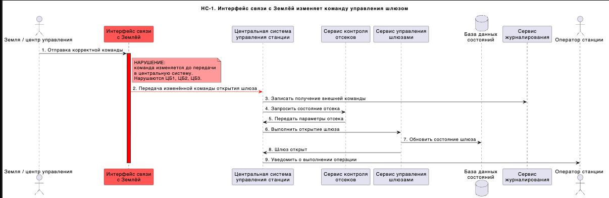

### НС-2. Интерфейс связи с кораблями передаёт поддельный запрос на стыковку
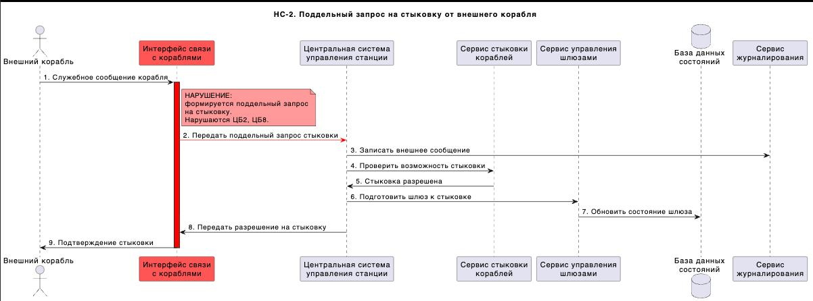

### НС-3. Центральная система управления отправляет команду открытия без проверки давления
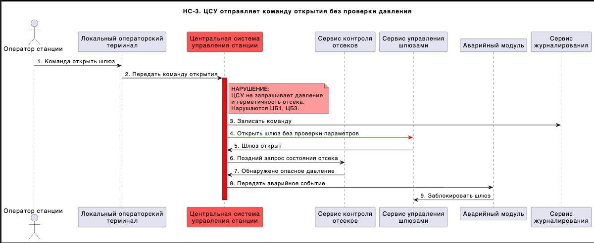

### НС-4. Сервис управления шлюзами открывает внутреннюю и внешнюю створку одновременно
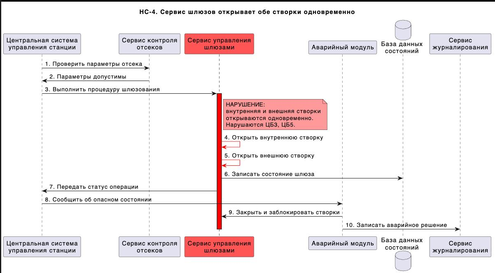

### НС-5. Сервис управления доступом выдаёт доступ без полномочий
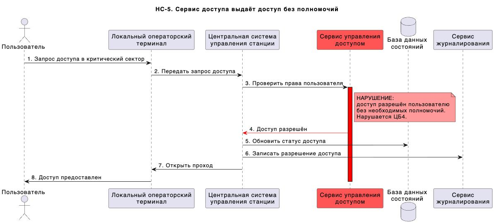

### НС-6. Сервис контроля отсеков передаёт ложные данные
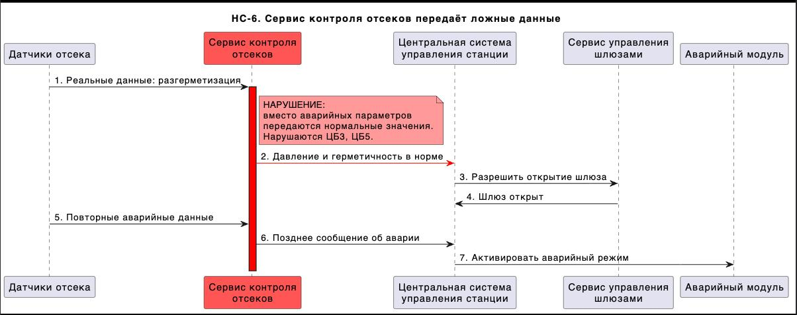

### НС-7. Сервис стыковки подтверждает неисправный узел
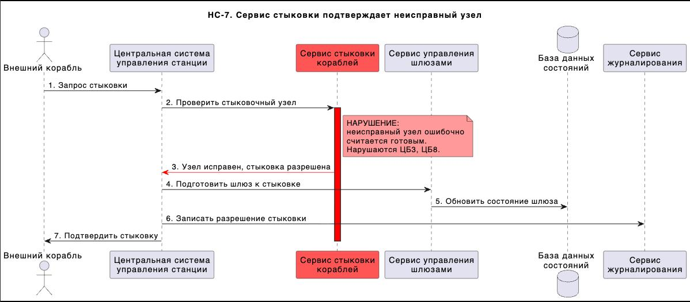

### НС-8. Центральная система управления подменила команду безопасного закрытия шлюза на команду открытия.
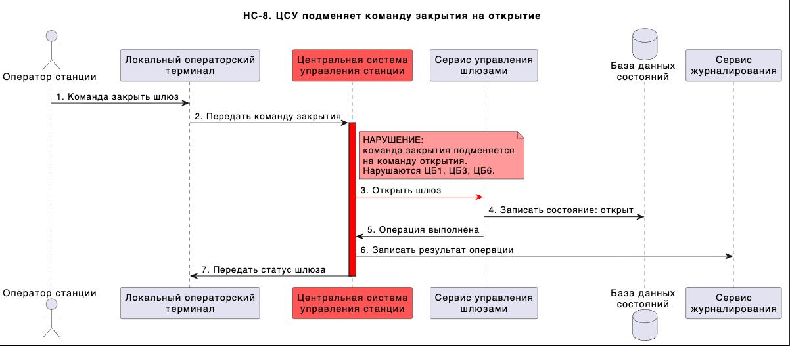

### НС-9. База данных содержит ложный статус шлюза
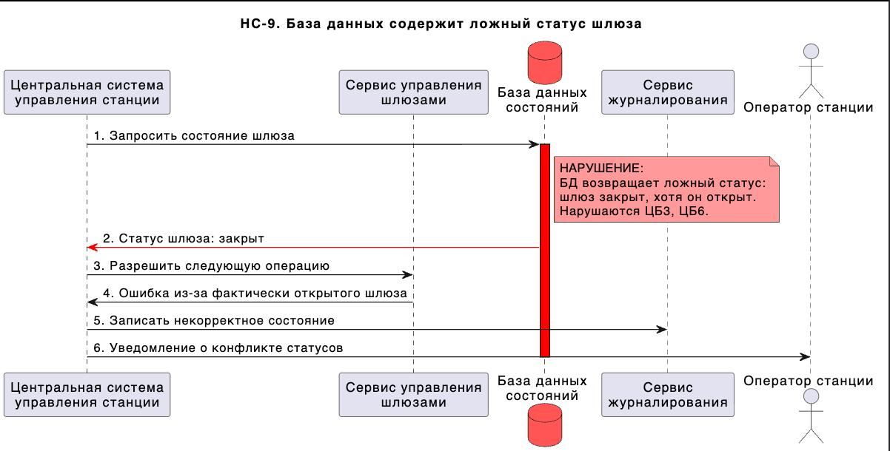

### НС-10. Сервис журналирования не сохраняет запись инцидента
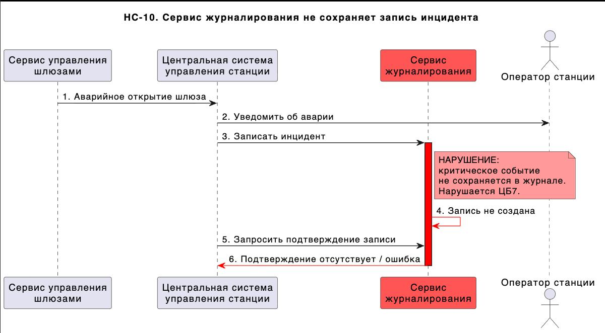

### НС-11. Сервис мониторинга не сообщает об отказе питания шлюзового контура
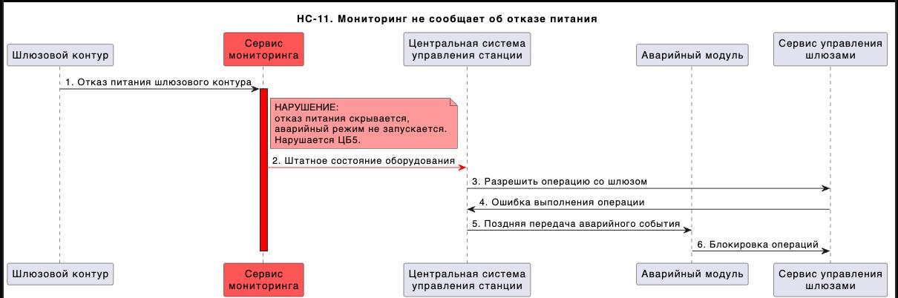

### НС-12. Локальный операторский терминал отправляет несанкционированную команду
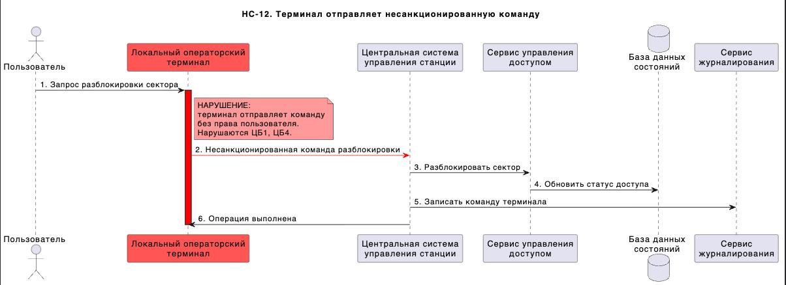

### НС-13. Аварийный модуль не переводит систему в безопасный режим
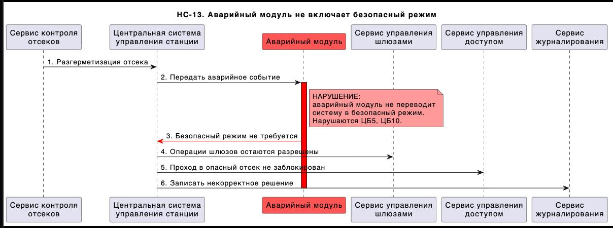

### НС-14. При пожаре блокируется доступ экипажа к спасательным капсулам
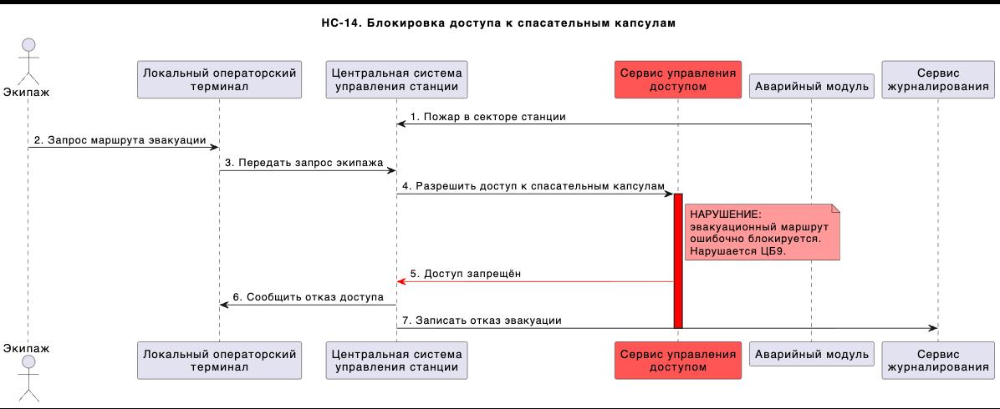

### НС-15. Интерфейс связи с Землёй повторно отправляет устаревшую команду
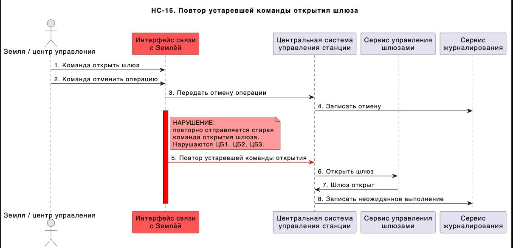

### НС-16. Интерфейс связи с кораблями искажает телеметрию корабля
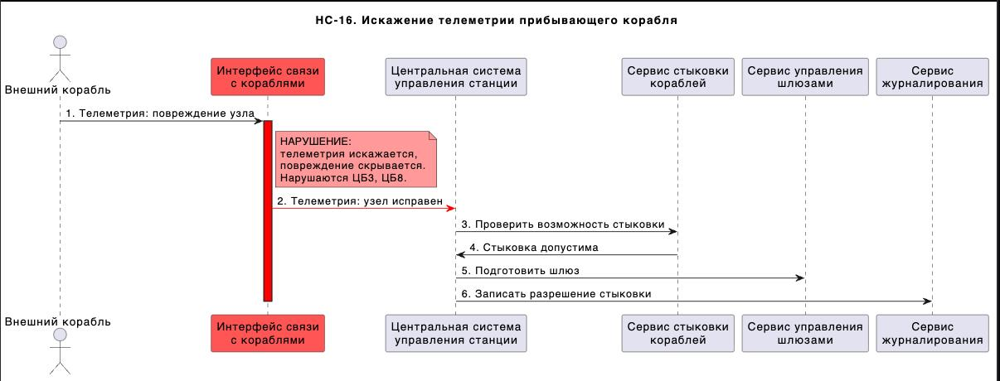

### НС-17. Центральная система отправляет взаимоисключающие команды
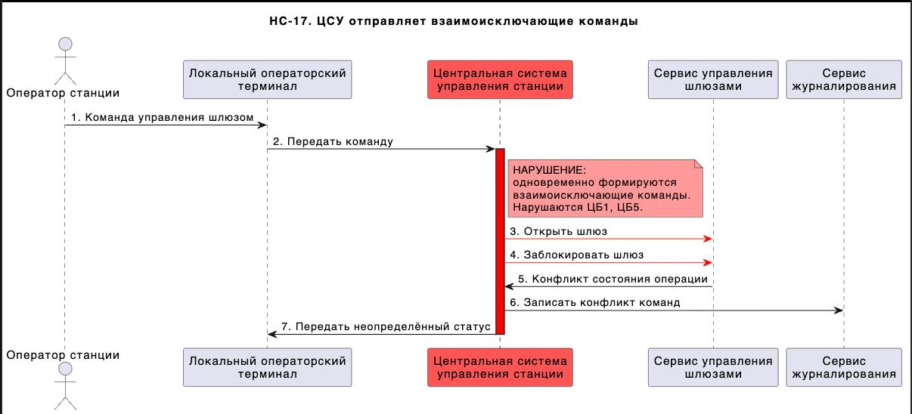

### НС-18. Центральная система управления задержала доставку аварийной команды закрытия шлюза до момента разгерметизации.
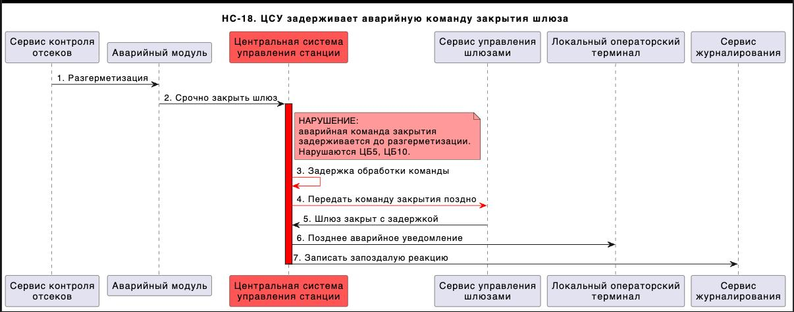

### НС-19. База данных потеряла записи о правах доступа
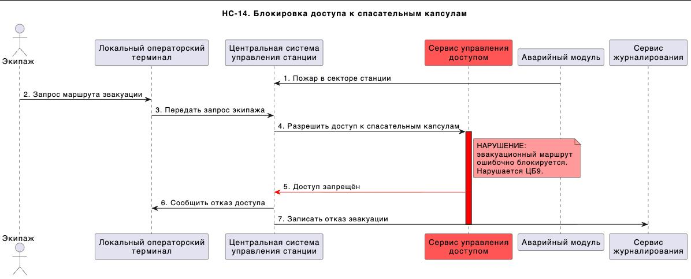

### НС-20. Сервис мониторинга формирует ложный сигнал тревоги
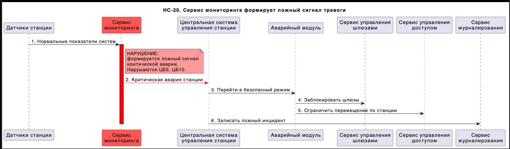

# Переработанная архитектура системы управления станции "Севастополь"

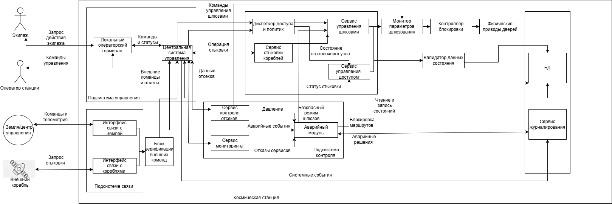

## Описание декомпозиции
Для обеспечения кибериммунитета системы и защиты целей безопасности (ЦБ1–ЦБ10) исходные монолитные и сложные сервисы были подвергнуты декомпозиции. Критические функции проверки параметров, криптографии и разграничения прав вынесены из недоверенных компонентов (таких как Центральная система управления и интерфейсы связи) в изолированные доверенные модули минимального размера. Теперь, даже если ЦСУ или внешние интерфейсы будут полностью скомпрометированы, новые доверенные прослойки заблокируют выполнение опасных или неавторизованных команд.

| Компонент | Функции |
| :--- | :--- |
| Интерфейс связи с Землёй и кораблями | Приём внешних сигналов, трансляция сырых пакетов данных телеметрии наружу и приём командных последовательностей. |
| Блок криптографии и шифрования | Дешифрование входящих потоков, проверка имитозащиты, шифрование исходящей телеметрии и отчётов. |
| Проверка подлинности и валидация команд | Проверка цифровой подписи (ЦП) внешних директив, фильтрация повторных (Replay) атак и устаревших пакетов. |
| Разграничение и политики доступа | Контроль полномочий членов экипажа при перемещении, валидация прав операторов локальных терминалов и систем на выдачу управляющих команд. |
| Монитор параметров шлюзования | Изолированная автоматическая проверка показателей давления, герметичности и газовой среды перед физическим срабатыванием механизмов дверей. |
| Контроллер блокировки створок (Интерлок) | Аппаратно-программный модуль, исключающий одновременное открытие внутренних и внешних створок шлюза при любых условиях. |
| Валидатор данных состояния | Контроль целостности записей, поступающих в Базу Данных, и верификация считываемых статусов критических систем. |
| Доверенный аварийный контроллер | Принудительный перевод шлюзовых затворов и систем жизнеобеспечения в безопасный режим при фиксации критических сбоев. |
| Доверенное логирование | Изолированная запись событий безопасности и команд в некорректируемое хранилище (WORM). |

## Таблица новых компонентов

| Компонент | Описание | Комментарий |
| :--- | :--- | :--- |
| Блок криптографии и шифрования | Криптографическая защита межкомпонентных и внешних каналов связи. | Исключает перехват и подмену данных на сетевом уровне космической связи. |
| Проверка подлинности внешних команд | Модуль аутентификации директив от Наземного центра и прибывающих судов. | Защищает от выполнения поддельных команд управления инфраструктурой станции. |
| Разграничение доступа | Диспетчер проверки прав субъектов системы (персонал, ЦСУ, терминалы). | Определяет, имеет ли право источник запрашивать доступ в конкретный отсек или менять режим шлюза. |
| Политики доступа | Хранилище и интерпретатор строгих правил разграничения доступа. | Работает в связке с механизмом разграничения доступа, не позволяя обойти правила. |
| Монитор параметров шлюзования | Маленький сервис проверки физических условий в отсеках перед шлюзованием. | Запрещает открытие дверей, если датчики фиксируют вакуум или опасную разницу давлений. |
| Контроллер блокировки створок | Блокиратор взаимоисключающих физических состояний шлюзовых механизмов. | Гарантирует физическую невозможность устроить сквозной выброс атмосферы в открытый космос. |
| Валидатор данных состояния | Прослойка контроля корректности данных, записываемых в Базу Данных состояний. | Исключает атаки типа подмены статуса шлюза или искажения прав в таблицах БД. |
| Проверка валидности команд шлюзования | Фильтр логической корректности управляющих импульсов, идущих к исполнительным приводам шлюзов. | Не пропускает одновременно конфликтующие команды (например, «открыть» и «заблокировать»). |
| Учет состояний отсеков | Модуль сбора и хранения верифицированных параметров датчиков среды. | Предоставляет только достоверные данные о температуре, радиации и давлении для монитора. |
| Доверенный аварийный контроллер | Модуль автоматического реагирования на внештатные ситуации и аварии. | Автономно переводит механизмы в безопасное состояние при потере питания или связи. |

## Таблица доверенных компонентов

| Компонент | Уровень доверия | Обоснование | Комментарий |
| :--- | :--- | :--- | :--- |
| Центральная система управления | Недоверенный | Слишком сложный монолитный код бизнес-логики; высокий риск компрометации. | Её взлом больше не ведёт к катастрофе, так как её команды перепроверяются. |
| Интерфейсы связи (Земля/корабли) | Недоверенный | Прямой контакт с внешней агрессивной средой и нестабильными каналами связи. | Обрабатывают сырой трафик, могут подвергаться сетевым атакам. |
| Локальный операторский терминал | Недоверенный | Точка интерфейса взаимодействия с пользователем, уязвимая к локальным сбоям. | Команды терминала валидируются диспетчером доступа. |
| Сервис мониторинга | Недоверенный | Содержит большой объём логики сбора метрик со всей станции. | Ошибки в нём не должны нарушать физическую безопасность шлюзов. |
| База данных состояний | Недоверенный | Сложная СУБД, уязвимая к сбоям хранения или логическим инъекциям данных. | Окружена доверенным Валидатором данных. |
| Проверка подлинности внешних команд | Повышающий доверие | Соблюдение ЦБ 2 (верификация внешних запросов). | Отсекает ложные команды и повторные атаки на подсистемы связи. |
| Монитор параметров шлюзования | Повышающий доверие | Соблюдение ЦБ 3 (блокировка открытия при разнице давлений). | Защищает экипаж от баротравм и удушья при ложных командах открытия. |
| Валидатор данных состояния | Повышающий доверие | Соблюдение ЦБ 6 (целостность данных инфраструктуры). | Не даёт перезаписать критические статусы систем фиктивными значениями. |
| Проверка валидности команд шлюзования | Повышающий доверие | Соблюдение ЦБ 1 (приём команд только от авторизованных источников). | Фильтрует логически некорректные и конфликтующие запросы. |
| Блок криптографии и шифрования | Доверенный | Соблюдение ЦБ 2, ЦБ 6 (конфиденциальность и некорректируемость каналов). | Реализует криптографическое ядро защиты периметра станции. |
| Разграничение доступа | Доверенный | Соблюдение ЦБ 4, ЦБ 9 (контроль прохода по отсекам и путям эвакуации). | Изолированная среда принятия решений по правам доступа. |
| Политики доступа | Доверенный | Соблюдение ЦБ 4, ЦБ 9 (неизменяемость правил авторизации). | Хранит эталонную матрицу прав доступа персонала станции. |
| Контроллер блокировки створок (Интерлок) | Доверенный | Соблюдение ЦБ 3, ЦБ 10 (недопущение одновременного открытия створок шлюза). | Физический/аппаратный затвор безопасности шлюзовых камер. |
| Доверенный аварийный контроллер | Доверенный | Соблюдение ЦБ 5, ЦБ 10 (гарантированный переход в безопасный режим). | Перехватывает управление при авариях и открывает эвакуационные пути. |
| Доверенное логирование | Доверенный | Соблюдение ЦБ 7 (неизменяемость и полнота журналов аудита). | Исключает подчистку логов злоумышленником или сломавшейся ЦСУ. |

## Качественная оценка доменов

| Компонент | Уровень доверия | Размер | Кол-во вх. интерфейсов | Комментарий |
| :--- | :--- | :--- | :--- | :--- |
| Блок криптографии и шифрования | Доверенный | CXL | 4 | Программный криптографический модуль с большим объёмом математических вычислений. |
| Разграничение доступа | Доверенный | MM | 1 | Средний изолированный сервис проверки токенов и прав субъектов. |
| Политики доступа | Доверенный | MM | 1 | Статический модуль хранения и интерпретации правил разграничения. |
| Проверка подлинности внешних команд | Доверенный | SS | 2 | Минимальный по размеру код валидации электронных подсей команд. |
| Контроллер блокировки створок | Доверенный | SS | 1 | Простейший низкоуровневый контроллер (схемная логика), блокирующий реле. |
| Монитор параметров шлюзования | Доверенный | MM | 2 | Логический модуль сопоставления показаний датчиков давления. |
| Проверка валидности команд шлюзования | Доверенный | SS | 1 | Простой синтаксический фильтр поступающих команд на приводы. |
| Валидатор данных состояния | Доверенный | MM | 2 | Прослойка проверки схемы данных и отсутствия инъекций перед БД. |
| Доверенный аварийный контроллер | Доверенный | SS | 2 | Компактный отказоустойчивый автомат переключения режимов («штатный/опасный»). |
| Доверенное логирование | Доверенный | SS | 3 | Простой сервис последовательной однонаправленной записи логов на физический носитель. |
| Центральная система управления | Недоверенный | XL | 5 | Огромная комплексная система управления всей жизнедеятельностью станции. |
| Интерфейсы связи (Земля/корабли) | Недоверенный | XL | 2 | Сложный сетевой стек обработки радиосигналов и космических протоколов связи. |
| База данных состояний | Недоверенный | XL | 2 | Промышленная реляционная или NoSQL база данных параметров станции. |
| Локальный операторский терминал | Недоверенный | MM | 2 | Графический интерфейс (GUI) для взаимодействия с экипажем. |
| Сервис мониторинга | Недоверенный | CXL | 1 | Развесистая система агрегации телеметрии и высоконагруженного сбора метрик. |
