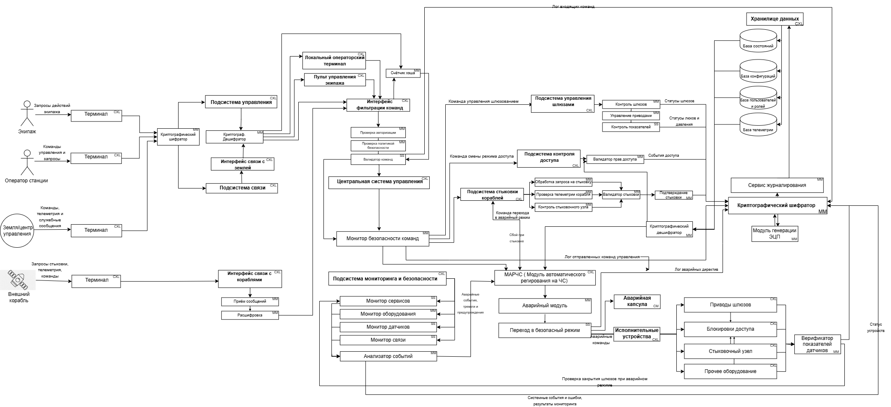
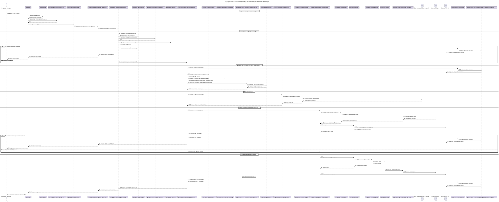
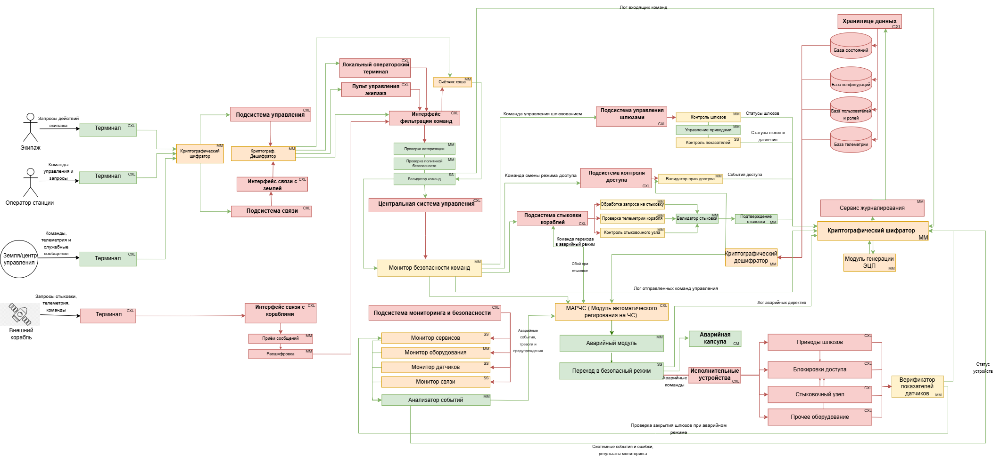

# Космическая станция "Севастополь" (Чужой)  

Система управления шлюзами и доступом станции а также взаимодействие с землей и другими станциями 

## Краткое описание проектируемой системы

Разрабатывается система управления критической инфраструктурой космической станции «Севастополь» — автономного орбитального комплекса, предназначенного для длительного пребывания экипажа, приёма кораблей, хранения грузов и проведения технических операций.
Система обеспечивает безопасное управление внутренними и внешними шлюзами станции, контроль перемещения персонала по отсекам, управление доступом в критические зоны, координацию стыковки прибывающих кораблей, а также обмен данными с Землёй и внешними судами.
Система получает команды от центрального вычислительного ядра станции, проверяет их допустимость, исполняет разрешённые сценарии и передаёт телеметрию, журналы событий и результаты самодиагностики оператору и в центральную систему.

---
## Структура
[структура](doki/report.md)
## Ценности, ущербы и неприемлемые события

| Ценность | Негативное событие | Оценка ущерба | Комментарий |
|---|---|---|---|
| Экипаж станции | Ошибочное открытие шлюза привело к гибели или травмам персонала | Высокий | Прямой риск жизни людей |
| Герметичность отсеков | Разгерметизация жилого или технического модуля | Критический | Возможна потеря сектора станции |
| Шлюзовая система | Одновременное открытие внутренних и внешних створок шлюза | Критический | Немедленная аварийная ситуация |
| Доступ в отсеки | Получен доступ в командный или технический сектор | Высокий | Возможен саботаж управления |
| Стыковочный узел | Ошибка управления вызвала повреждение прибывающего корабля | Высокий | Потеря груза или транспорта |
| Связь с Землёй | Потеря канала связи и невозможность передачи телеметрии | Средний | Переход в автономный режим |
| Центральная система управления | Нарушена целостность команд управления шлюзами | Критический | Потеря контроля над инфраструктурой |
| Журналы событий | Удалены или изменены записи инцидентов | Средний | Усложнение расследования |
| Эвакуационные маршруты | Заблокирован доступ к спасательным капсулам | Критический | Невозможность эвакуации |

## Известные ограничения и вводные условия

По условиям проекта система должна быть реализована с использованием микросервисной архитектуры. Для обмена данными между сервисами должен использоваться брокер сообщений и асинхронная модель взаимодействия. Использование сторонних API и внешних облачных сервисов не допускается из-за требований конфиденциальности данных станции. Система должна обеспечивать работу как в штатном режиме, так и при нестабильных каналах связи с Землёй и внешними кораблями.

## Базовая архитектура системы

## Базовые сценарии

## Расширенная архитектура системы

## Контекст работы системы

Система функционирует в составе космической станции «Севастополь» и взаимодействует с центральной системой управления станции, экипажем, внешними кораблями и наземным центром управления.Во внешнем контуре система обменивается телеметрией и служебными сообщениями с Землёй, транспортными кораблями и другими станциями по каналам связи с возможными задержками и потерями пакетов.При отказах оборудования, потере связи, попытках несанкционированного доступа или обнаружении опасного состояния система обязана сохранять работоспособность критических функций.

---
## Расширенные функциональные сценарии

## Компоненты системы

| Компонент | Назначение |
|---|---|
| Центральная система управления станции | Формирует команды для подсистем станции, получает телеметрию и статусы выполнения операций |
| Сервис управления шлюзами | Управляет внутренними и внешними шлюзами, проверяет допустимость открытия и закрытия створок |
| Сервис управления доступом | Контролирует проход между отсеками и доступ в критические зоны |
| Сервис контроля отсеков | Получает данные о давлении, герметичности, температуре и аварийных событиях |
| Сервис стыковки кораблей | Обрабатывает запросы на стыковку и управляет стыковочными узлами |
| Интерфейс связи с Землёй | Обеспечивает обмен командами, телеметрией и отчетами с наземным центром |
| Интерфейс связи с кораблями | Обеспечивает обмен служебными сообщениями с внешними кораблями |
| База данных состояний | Хранит статусы шлюзов, отсеков, пользователей, кораблей и результаты операций |
| Сервис журналирования | Сохраняет события системы, действия операторов и аварийные сообщения |
| Сервис мониторинга | Контролирует состояние сервисов, оборудования, связи и питания |
| Локальный операторский терминал | Позволяет экипажу выполнять разрешённые операции и получать информацию о состоянии системы |
| Аварийный модуль | Переводит систему в безопасное состояние при отказах, потере связи или опасных условиях |

## Цели безопасности

1. При любых обстоятельствах команды на управление шлюзами, гермодверями и доступом принимаются только от авторизованных источников.
2. При любых обстоятельствах внешние команды от Земли, кораблей и других станций выполняются только после проверки подлинности и допустимости.
3. При любых обстоятельствах открытие шлюзов выполняется только при безопасных параметрах давления, герметичности и готовности отсека.
4. При любых обстоятельствах доступ в командные, технические и критические отсеки получают только пользователи с необходимыми правами.
5. При любых обстоятельствах при аварии, отказе оборудования или потере связи система переходит в безопасный режим работы.
6. При любых обстоятельствах данные о состоянии шлюзов, отсеков, стыковке и операциях сохраняют целостность и не подменяются.
7. При любых обстоятельствах все критические действия операторов, сервисов и автоматических модулей журналируются.
8. При любых обстоятельствах стыковка внешнего корабля выполняется только после подтверждения состояния стыковочного узла и разрешения станции.
9. При любых обстоятельствах экипаж сохраняет доступ к маршрутам эвакуации и аварийным средствам спасения.
10. При любых обстоятельствах система сохраняет работоспособность критических функций либо переходит в контролируемое безопасное состояние.

## Предположения безопасности

1. Станция обменивается командами и телеметрией с Землёй, кораблями и другими станциями по каналам связи с задержками и возможными сбоями.
2. Аутентифицированный персонал станции считается благонадёжным и обладает необходимой квалификацией для работы с системой.
3. Обеспечена физическая безопасность серверов, управляющего оборудования, терминалов и сетевых устройств станции.
---

## Матрица нарушений целей безопасности

| Атакованный компонент | ЦБ1 | ЦБ2 | ЦБ3 | ЦБ4 | ЦБ5 | ЦБ6 | ЦБ7 | Кол-во нарушений |
|---|---|---|---|---|---|---|---|---|
| Интерфейс связи с Землёй | 🔴 | 🔴 | 🔴 | 🟢 | 🟢 | 🔴 | 🔴 | 5/7 |
| Центральная система управления станции | 🔴 | 🔴 | 🔴 | 🟢 | 🔴 | 🔴 | 🔴 | 6/7 |
| Сервис управления шлюзами | 🔴 | 🟢 | 🔴 | 🟢 | 🔴 | 🔴 | 🔴 | 5/7 |
| Сервис управления доступом | 🔴 | 🟢 | 🟢 | 🔴 | 🔴 | 🔴 | 🔴 | 5/7 |
| Сервис контроля отсеков | 🟢 | 🟢 | 🔴 | 🟢 | 🔴 | 🔴 | 🔴 | 4/7 |
| Сервис стыковки кораблей | 🔴 | 🔴 | 🔴 | 🟢 | 🔴 | 🔴 | 🔴 | 6/7 |
| Интерфейс связи с кораблями | 🔴 | 🔴 | 🔴 | 🟢 | 🔴 | 🔴 | 🔴 | 6/7 |
| База данных состояний | 🟢 | 🟢 | 🔴 | 🔴 | 🔴 | 🔴 | 🔴 | 5/7 |
| Сервис журналирования | 🟢 | 🟢 | 🟢 | 🟢 | 🟢 | 🔴 | 🔴 | 2/7 |
| Сервис мониторинга | 🟢 | 🟢 | 🔴 | 🟢 | 🔴 | 🔴 | 🔴 | 4/7 |
| Локальный операторский терминал | 🔴 | 🟢 | 🟢 | 🔴 | 🔴 | 🔴 | 🔴 | 5/7 |
| Аварийный модуль | 🔴 | 🟢 | 🔴 | 🔴 | 🔴 | 🔴 | 🔴 | 6/7 |

🟢 — цель безопасности не нарушена  
🔴 — цель безопасности нарушена

---

## Негативные сценарии нарушения целей безопасности

| Название сценария | Описание |
|---|---|
| НС-1 | Интерфейс связи с Землёй получил корректную команду, но изменил её содержимое и передал ложные параметры открытия шлюза. Нарушаются ЦБ1, ЦБ2, ЦБ3. |
| НС-2 | Интерфейс связи с кораблями передал поддельный запрос на стыковку от внешнего судна. Нарушаются ЦБ2, ЦБ8. |
| НС-3 | Центральная система управления отправила команду открытия шлюза без проверки давления в отсеке. Нарушаются ЦБ1, ЦБ3. |
| НС-4 | Сервис управления шлюзами открыл внутреннюю и внешнюю створку одновременно. Нарушаются ЦБ3, ЦБ5. |
| НС-5 | Сервис управления доступом предоставил доступ в реакторный сектор пользователю без полномочий. Нарушается ЦБ4. |
| НС-6 | Сервис контроля отсеков передал ложные данные о нормальном давлении при разгерметизации. Нарушаются ЦБ3, ЦБ5. |
| НС-7 | Сервис стыковки кораблей подтвердил соединение при неисправном стыковочном узле. Нарушаются ЦБ3, ЦБ8. |
| НС-8 | Центральная система управления подменила команду безопасного закрытия шлюза на команду открытия. Нарушаются ЦБ1, ЦБ3, ЦБ6. |
| НС-9 | База данных состояний содержит ложный статус шлюза «закрыт», хотя шлюз открыт. Нарушаются ЦБ3, ЦБ6. |
| НС-10 | Сервис журналирования не сохранил запись об аварийном открытии шлюза. Нарушается ЦБ7. |
| НС-11 | Сервис мониторинга не сообщил об отказе питания шлюзового контура. Нарушается ЦБ5. |
| НС-12 | Локальный операторский терминал отправил несанкционированную команду разблокировки сектора. Нарушаются ЦБ1, ЦБ4. |
| НС-13 | Аварийный модуль не перевёл систему в безопасный режим при разгерметизации. Нарушаются ЦБ5, ЦБ10. |
| НС-14 | Интерфейс связи с Землёй повторно отправил устаревшую команду открытия шлюза после отмены операции. Нарушаются ЦБ1, ЦБ2, ЦБ3. |
| НС-15 | Интерфейс связи с кораблями исказил телеметрию прибывающего корабля и скрыл повреждение стыковочного узла. Нарушаются ЦБ3, ЦБ8. |
| НС-16 | Центральная система управления отправила одновременно взаимоисключающие команды открытия и блокировки шлюза. Нарушаются ЦБ1, ЦБ5. |
| НС-17 | Центральная система управления задержала доставку аварийной команды закрытия шлюза до момента разгерметизации. Нарушаются ЦБ5, ЦБ10. |

---

## Диаграммы негативных сценариев

### НС-1. Интерфейс связи с Землёй изменяет команду управления шлюзом

### НС-2. Интерфейс связи с кораблями передаёт поддельный запрос на стыковку

### НС-3. Центральная система управления отправляет команду открытия без проверки давления

### НС-4. Сервис управления шлюзами открывает внутреннюю и внешнюю створку одновременно

### НС-5. Сервис управления доступом выдаёт доступ без полномочий

### НС-6. Сервис контроля отсеков передаёт ложные данные

### НС-7. Сервис стыковки подтверждает неисправный узел

### НС-8. Центральная система управления подменила команду безопасного закрытия шлюза на команду открытия.

### НС-9. База данных содержит ложный статус шлюза

### НС-10. Сервис журналирования не сохраняет запись инцидента

### НС-11. Сервис мониторинга не сообщает об отказе питания шлюзового контура

### НС-12. Локальный операторский терминал отправляет несанкционированную команду

### НС-13. Аварийный модуль не переводит систему в безопасный режим

### НС-14. Интерфейс связи с Землёй повторно отправляет устаревшую команду

### НС-15. Интерфейс связи с кораблями искажает телеметрию корабля

### НС-16. Центральная система отправляет взаимоисключающие команды

### НС-17. Центральная система управления задержала доставку аварийной команды закрытия шлюза до момента разгерметизации.

# Переработанная архитектура системы управления станции "Севастополь"

## Описание декомпозиции
Для обеспечения кибериммунитета системы и защиты целей безопасности (ЦБ1–ЦБ17) исходные монолитные и сложные сервисы были подвергнуты декомпозиции. Критические функции проверки параметров, криптографии и разграничения прав вынесены из недоверенных компонентов (таких как Центральная система управления и интерфейсы связи) в изолированные доверенные модули минимального размера. Теперь, даже если ЦСУ или внешние интерфейсы будут полностью скомпрометированы, новые доверенные прослойки заблокируют выполнение опасных или неавторизованных команд.

| Компонент | Функции |
| :--- | :--- |
| **Аутентификация** | Терминал Криптографический шифратор (терминал) |
| **Подсистема управления** | Криптографический дешифратор(связь) Локальный операторский терминал Пульт управления экипажа Интерфейс фильтрации команд |
| **Интерфейс фильтрации команд** | Счётчик хэша Проверка авторизации Проверка политикой безопасности Валидатор команд |
| **Интерфейс связи с Землёй** | Криптографический дешифратор |
| **Интерфейс связи с кораблями** | Приём сообщений Расшифровка |
| **Центральная система управления (ЦСУ)** | Монитор безопасности команд |
| **Подсистема управления шлюзами** | Контроллер шлюзов Управление приводами Контроль показателей |
| **Подсистема контроля доступа** | Валидатор прав доступа |
| **Подсистема стыковки кораблей** | Обработка запроса на стыковку Проверка телеметрии корабля Контроль стыковочного узла Валидатор стыковки Подтверждение стыковки |
| **Подсистема мониторинга и безопасности** | Монитор сервисов Монитор оборудования Монитор датчиков Монитор связи Анализатор событий |
| **Аварийный модуль** | МАРЧС Аварийный модуль Переход в безопасный режим Аварийная капсула |
| **Исполнительные устройства** | Приводы шлюзов Блокировки доступа Стыковочный узел Прочее оборудование Верификатор показателей датчиков |
| **Хранилище данных** | База состояний База конфигураций База пользователей и ролей База телеметрии |
| **Сервис журналирования** | Криптографический шифратор (журналирование) Криптографический дешифратор (журналирование) Модуль генерации ЭЦП |
| **Локальный операторский терминал** | | 
| **Пульт управления экипажа** | |

# Таблица новых компонентов

| Компонент | Описание | Комментарий |
| :--- | :--- | :--- |
| **Терминал** | Внешний интерфейс для ввода команд и отображения статуса | Точка входа для оператора, инженера или экипажа. |
| **Криптографический шифратор (терминал)** | Обеспечивает защиту данных путем наложения криптографического слоя | Используется в терминалах операторов для защиты исходящих управляющих воздействий. |
| **Криптографический дешифратор (связь)** | Снятие защиты с внешних сообщений | Используется в интерфейсе связи с Землёй для разбора и перевода входящих зашифрованных пакетов в читаемый формат. |
| **Пульт управления экипажа** | Аппаратно-программный комплекс для ручного управления | Интегрирует физические кнопки и тумблеры в подсистему управления для ручного ввода директив. |
| **Интерфейс фильтрации команд** | Единая точка входа и очистки всех управляющих сообщений | Изолирует центральную систему от прямых внешних воздействий. |
| **Счётчик хэша** | Компонент для подсчета и проверки контрольных сумм поступающих команд | Выявляет попытки искажения или подмены команд в процессе передачи. |
| **Проверка авторизации** | Верификация прав субъекта на выполнение конкретного типа действий | Первый эшелон защиты внутри интерфейса фильтрации. |
| **Проверка политикой безопасности** | Сверка команды с глобальным набором правил и технологических лимитов | Второй эшелон защиты, блокирующий опасные запросы. |
| **Валидатор команд** | Проверка синтаксической и логической корректности структуры команды | Финальный проверяющий блок перед передачей команды в систему. |
| **Приём сообщения** | Приемник внешних данных из радиоканалов связи | Работает с сырыми пакетами из внешней среды в интерфейсе связи с кораблями. |
| **Расшифровка** | Локальный дешифратор сообщений, поступающих от приближающихся кораблей | Изолирует сетевой стек ближней связи от логики обработки запросов. |
| **Монитор безопасности команд** | Диспетчер и контролер исходящих управляющих воздействий в ЦСУ | Распределяет одобренные команды по конкретным подсистемам. |
| **Контроллер шлюзов** | Управляет последовательностью этапов шлюзования | Координирует совместную работу люков и насосов подсистемы управления шлюзами. |
| **Управление приводами** | Прямое формирование команд для моторов и механизмов | Преобразует логическую команду в физический сигнал движения. |
| **Контроль показателей** | Сбор и первичная обработка данных с датчиков подсистемы | Позволяет подсистеме управления шлюзами видеть результат своих действий. |
| **Валидатор прав доступа** | Программный блок верификации физического доступа персонала | Отвечает за контроль доступа, управление электрозамками и допусками сотрудников в отсеки подсистемы. |
| **Обработка запроса на стыковку** | Логика взаимодействия с внешним кораблем при сближении | Принимает решение о возможности начала процесса стыковки. |
| **Проверка телеметрии корабля** | Математический расчет параметров сближения и стыковки | Анализирует физические векторы и скорости объектов. |
| **Контроль стыковочного узла** | Мониторинг состояния захватов и амортизаторов порта | Обеспечивает безопасность механического контакта при сцепке. |
| **Валидатор стыковки** | Программный блок проверки выполнения критериев безопасной сцепки | Блокирует жесткий захват при выходе параметров за критические лимиты. |
| **Подтверждение стыковки** | Фиксация успешного завершения операции и герметичности шва | Регистрирует финальный статус стыковки после проверок. |
| **Монитор сервисов** | Контроль стабильности работы программных модулей | Выявляет зависания и внутренние ошибки софта. |
| **Монитор оборудования** | Слежение за аппаратным статусом компонентов | Обнаруживает физические отказы вычислителей и памяти. |
| **Монитор датчиков** | Непрерывный опрос сенсоров жизнеобеспечения | Следит за давлением, газами и температурой на станции. |
| **Монитор связи** | Контроль доступности внешних каналов коммуникации | Проверяет наличие линка с Землей и кораблями. |
| **Анализатор событий** | Корреляция данных от мониторов для выявления аномалий | Формирует консолидированный сигнал о состоянии безопасности для аварийного модуля. |
| **МАРЧС** | Модуль автоматического реагирования на чрезвычайные ситуации | Выступает главным аналитическим диспетчером аварийного контура. |
| **Аварийный модуль** | Исполнительный блок диспетчеризации защитных протоколов | Принимает директиву от МАРЧС и инициирует экстренные сценарии. |
| **Переход в безопасный режим** | Исполнитель экстренных сценариев спасения станции | Отдает прямые команды на блокировку исполнительным органам при ЧС. |
| **Аварийная капсула** | Логический контроллер управления средствами эвакуации экипажа | Координирует техническую готовность, запуск и шлюзование спасательных средств в аварийном контуре. |
| **Приводы шлюзов** | Физические механизмы открытия и закрытия люков | Отрабатывают штатные команды управления и аварийные директивы. |
| **Блокировки доступа** | Электромагнитные и механические замки переборок | Физически ограничивают перемещение людей при ЧП или запрете. |
| **Стыковочный узел** | Механика захвата и удержания космических аппаратов | Выполняет физическую стыковку и расстыковку кораблей в космосе. |
| **Прочее оборудование** | Системы жизнеобеспечения, освещения и вентиляции | Вспомогательные устройства под контролем мониторинга. |
| **Верификатор показателей датчиков** | Компонент кросс-валидации технологических данных от железа | Обеспечивает проверку истинности показателей датчиков исполнительных устройств перед отправкой в систему. |
| **Криптографический шифратор (журналирование)** | Обеспечивает защиту данных путем наложения криптографического слоя | Используется в сервисе журналирования для зашифрования системных логов перед отправкой в архив. |
| **Криптографический дешифратор (журналирование)** | Снятие защиты с внутренних зашифрованных архивных сообщений | Применяется в сервисе журналирования для санкционированного чтения и аудита логов из базы. |
| **База состояний** | Оперативное хранилище текущих параметров станции | Источник данных для учета текущих технологических статусов системы. |
| **База конфигураций** | Хранилище эталонных настроек и лимитов безопасности | Используется для сверки действий с политиками безопасности. |
| **База пользователей и ролей** | Реестр идентификаторов и прав доступа персонала | Обеспечивает работу систем авторизации и хранение списков прав. |
| **База телеметрии** | Архив всех произошедших событий и метрик | Обеспечивает функцию «черного ящика» для последующего аудита. |
| **Модуль генерации ЭЦП** | Модуль криптографической защиты системных логов и подписей | Осуществляет расчет хэш-сумм и формирование электронных цифровых подписей для транслируемых в хранилище журналов. |

## Диаграмма последовательности

## Доверенные компоненты на архитектуре

# Таблица доверенности компонентов

| Компонент | Уровень доверия | Обоснование | Комментарий |
| :--- | :--- | :--- | :--- |
| **Терминал** | Недоверенный | | Внешняя оболочка интерфейса рабочих мест, оцениваемая по наихудшему сценарию из-за потенциальных уязвимостей UI-софта. |
| **Криптографический шифратор (терминал)** | Повышающий доверие | Соблюдается ЦБ 2 | Накладывает защитный криптографический слой на исходящие управляющие воздействия, отправляемые от терминалов операторов. |
| **Криптографический дешифратор (связь)** | Повышающий доверие | Соблюдается ЦБ 2 | Используется для разбора и снятия защиты с входящих внешних пакетов управления, поступающих от Земли. |
| **Пульт управления экипажа** | Недоверенный | | Внешнее физическое устройство ручного ввода, которое может подвергнуться аппаратному сбою, дребезгу контактов или саботажу. |
| **Интерфейс фильтрации команд** | Недоверенный | | Внешняя программная граница системы, принимающая сырые входящие пакеты управления со всех каналов. |
| **Счётчик хэша** | Повышающий доверие | Соблюдается ЦБ 1, ЦБ 2 | Выявляет попытки искажения, подмены или повтора пакетов команд в процессе их передачи к ядру. |
| **Проверка авторизации** | Доверенный | Соблюдается ЦБ 1, ЦБ 2, ЦБ 4 | Инспектирует поток данных и проверяет права субъекта (оператора, Земли, робота) на выполнение запрошенного действия. |
| **Проверка политикой безопасности** | Доверенный | Соблюдается ЦБ 1, ЦБ 2, ЦБ 3, ЦБ 8 | Сверяет параметры пришедшей команды с глобальной матрицей ограничений и текущими технологическими лимитами системы. |
| **Валидатор команд** | Доверенный | Соблюдается ЦБ 1, ЦБ 2, ЦБ 3, ЦБ 8 | Выполняет финальную синтаксическую очистку и проверку корректности структуры команды перед её отправкой исполнителю. |
| **Приём сообщения** | Недоверенный | | Первичный радиоприемник пакетов из открытого космоса, работающий в незащищенной и агрессивной внешней среде. |
| **Расшифровка** | Недоверенный | | Локальный дешифратор сообщений от кораблей, изолирующий сетевой стек ближней связи от внутренней логики системы. |
| **Монитор безопасности команд** | Повышающий доверие | Соблюдается ЦБ 1, ЦБ 3, ЦБ 8 | Выступает центральным диспетчером ЦСУ, контролируя и распределяя одобренные ядром команды по подсистемам. |
| **Контроллер шлюзов** | Повышающий доверие | Соблюдается ЦБ 1, ЦБ 3 | Обеспечивает строгую пошаговую последовательность этапов открытия/закрытия люков шлюза и выравнивания давления. |
| **Управление приводами** | Доверенный | Соблюдается ЦБ 3, ЦБ 10 | Формирует и передает эталонные сигналы для силовых реле и электромоторов на основе логики шлюзования. |
| **Контроль показателей** | Повышающий доверие | Соблюдается ЦБ 3, ЦБ 6 | Превращает сырые телеметрические данные со шлюзового оборудования в проверенные подсистемой статусы. |
| **Валидатор прав доступа** | Повышающий доверие | Соблюдается ЦБ 1, ЦБ 4, ЦБ 9 | Проверяет права персонала на перемещение по станции, координирует управление электрозамками отсеков и следит за доступом к путям эвакуации. |
| **Обработка запроса на стыковку** | Повышающий доверие | Соблюдается ЦБ 2, ЦБ 8 | Отвечает за логику начального сеанса связи и удержание протокола сближения с подлетающим космическим аппаратом. |
| **Проверка телеметрии корабля** | Повышающий доверие | Соблюдается ЦБ 2, ЦБ 8 | Обсчитывает физические векторы, скорость, ускорение и соосность подлетающего аппарата для безопасности стыковки. |
| **Контроль стыковочного узла** | Повышающий доверие | Соблюдается ЦБ 8 | Проверяет механическую готовность захватов, демпферов, амортизаторов и замков порта к первому контакту. |
| **Валидатор стыковки** | Доверенный | Соблюдается ЦБ 2, ЦБ 8 | Принимает окончательное решение и блокирует выполнение жесткого захвата при выходе критических параметров сближения за лимиты. |
| **Подтверждение стыковки** | Доверенный | Соблюдается ЦБ 6, ЦБ 8 | Фиксатор жесткого захвата, регистрирующий успешность стягивания замков и финальный статус герметичности стыковочного шва. |
| **Монитор сервисов** | Повышающий доверие | Соблюдается ЦБ 5, ЦБ 10 | Контролирует стабильность работы программных модулей и операционной системы платформы на предмет зависаний. |
| **Монитор оборудования** | Повышающий доверие | Соблюдается ЦБ 5, ЦБ 10 | Следит за аппаратным здоровьем вычислителей, материнских плат, внутренних шин данных и оперативной памяти. |
| **Монитор датчиков** | Повышающий доверие | Соблюдается ЦБ 3, ЦБ 5 | Постоянно опрашивает сенсоры жизнеобеспечения на предмет задымления, утечки газов или критического падения давления. |
| **Монитор связи** | Повышающий доверие | Соблюдается ЦБ 5, ЦБ 10 | Анализирует наличие, стабильность и качество радиосигнала внешних и внутренних каналов коммуникации. |
| **Анализатор событий** | Доверенный | Соблюдается ЦБ 5, ЦБ 10 | Сопоставляет и коррелирует логи всех четырех мониторов для выявления скрытых аномалий, атак и признаков ЧП. |
| **МАРЧС** | Повышающий доверие | Соблюдается ЦБ 5, ЦБ 10 | Главный аналитический диспетчер аварийного контура, инициирующий запуск защитных протоколов при фиксации ЧП. |
| **Аварийный модуль** | Доверенный | Соблюдается ЦБ 5, ЦБ 9, ЦБ 10 | Исполнительный блок, отвечающий за диспетчеризацию защитных и экстренных протоколов по подсистемам. |
| **Переход в безопасный режим** | Доверенный | Соблюдается ЦБ 5, ЦБ 9, ЦБ 10 | Автономный силовой блок, выдающий прямые жесткие директивы на блокировку железа в обход стандартных цепочек команд. |
| **Аварийная капсула** | Доверенный | Соблюдается ЦБ 5, ЦБ 9 | Управляет автоматикой подготовки, шлюзования и экстренного пуска средств эвакуации экипажа при катастрофических сценариях. |
| **Приводы шлюзов** | Недоверенный | | Физические электромоторы и механизмы люков, относящиеся к недоверенной аппаратной среде (риск заклинивания/отказа). |
| **Блокировки доступа** | Недоверенный | | Механические ригели и электромагнитные замки дверей, способные подвергнуться физическому износу или поломке. |
| **Стыковочный узел** | Недоверенный | | Исполнительные механизмы и стягивающие замки стыковочного порта, работающие в открытом космосе. |
| **Прочее оборудование** | Недоверенный | | Вспомогательные общестанционные агрегаты, датчики освещения и системы поддержания атмосферы вне доверенного периметра. |
| **Верификатор показателей датчиков** | Повышающий доверие | Соблюдается ЦБ 3, ЦБ 6 | Санитарный кордон, выполняющий кросс-валидацию сырых технологических данных от датчиков железа перед отправкой в ядро. |
| **Криптографический шифратор (журналирование)** | Повышающий доверие | Соблюдается ЦБ 6, ЦБ 7 | Защищает конфиденциальность и структуру логов перед направлением их в архивное хранилище. |
| **Криптографический дешифратор (журналирование)** | Повышающий доверие | Соблюдается ЦБ 6, ЦБ 7 | Позволяет осуществлять безопасное изолированное чтение зашифрованных архивных журналов для целей аудита. |
| **База состояний** | Недоверенный | | Оперативное храличище текущих технологических параметров станции, изолированное от ядра по принципу Data Sink. |
| **База конфигураций** | Недоверенный | | Изолированный реестр эталонных настроек, лимитов безопасности, констант датчиков и матриц доступа (Data Sink). |
| **База пользователей и ролей** | Недоверенный | | Реестр идентификаторов и мандатов доступа персонала, изолированный по принципу Data Sink. |
| **База телеметрии** | Недоверенный | | Функция «черного ящика», обеспечивающая сбор исторических логов; защищена от модификации внешним контуром (Data Sink). |
| **Модуль генерации ЭЦП** | Повышающий доверие | Соблюдается ЦБ 6, ЦБ 7 | Осуществляет криптографический расчет хэш-сумм и ставит электронную подпись на логи перед их записью в Базу телеметрии. |

## Качественная оценка доменов

| Компонент | Уровень доверия | Оценка | Кол-во входящих интерфейсов | Комментарий |
| :--- | :--- | :---: | :---: | :--- |
| **Терминал** | Недоверенный | CXL | 1 | Внешняя графическая оболочка рабочих мест операторов, оцениваемая по наихудшему сценарию из-за потенциальных уязвимостей UI-софта. |
| **Криптографический шифратор (терминал)** | Повышающий доверие | MM | 3 | Изолированный программно-аппаратный модуль, накладывающий защитный криптографический слой на исходящие сообщения терминалов. |
| **Криптографический дешифратор (связь)** | Повышающий доверие | MM | 2 | Снимает защитный слой с входящих радиосообщений внешних каналов коммуникации, локализуя в себе сложные криптобиблиотеки. |
| **Пульт управления экипажа** | Недоверенный | CXL | 1 | Физический модуль ручного резервного ввода, вынесенный за периметр центрального ядра из-за риска аппаратного сбоя или дребезга контактов. |
| **Интерфейс фильтрации команд** | Недоверенный | CXL | 4 | Внешняя программная граница системы, принимающая сырой входящий поток пакетов управления из всех доступных источников. |
| **Счётчик хэша** | Повышающий доверие | MM | 2 | Вычислительный блок для контроля целостности пакетов, выявляющий попытки подмены или повтора команд на входе. |
| **Проверка авторизации** | Доверенный | MM | 1 | Доверенный инспектор прав доступа, проверяющий мандат конкретного субъекта на выполнение запрошенного типа действий. |
| **Проверка политикой безопасности** | Доверенный | MM | 1 | Логический блок сопоставления параметров команды с глобальной матрицей правил, ограничений и текущих фаз работы станции. |
| **Валидатор команд** | Доверенный | SS | 2 | Финальный очищающий шлюз, выполняющий синтаксический разбор, валидацию структуры и очистку одобренных команд. |
| **Приём сообщения** | Недоверенный | MM | 1 | Первичный радиоприемник пакетов дальней связи из открытого космоса, взаимодействующий с незащищенной внешней средой. |
| **Расшифровка** | Недоверенный | MM | 1 | Выделенный парсер ближней связи, изолирующий сетевой стек взаимодействия с подлетающими кораблями от логики ядра. |
| **Монитор безопасности команд** | Повышающий доверие | MM | 2 | Диспетчер и контролер одобренных ядром управляющих воздействий перед их распределением в функциональные подсистемы. |
| **Контроллер шлюзов** | Повышающий доверие | MM | 1 | Автомат состояний, координирующий строгую пошаговую последовательность этапов шлюзования, откачки газов и открытия люков. |
| **Управление приводами** | Доверенный | MM | 1 | Драйвер формирования эталонных низкоуровневых сигналов для физических реле и силовых агрегатов люков. |
| **Контроль показателей** | Повышающий доверие | SS | 1 | Фильтр технологических параметров подсистемы шлюзования, транслирующий данные в ядро после локальной агрегации. |
| **Валидатор прав доступа** | Повышающий доверие | MM | 2 | Диспетчер верификации перемещений персонала, управляющий разблокировкой межотсечных переборок и электрозамков. |
| **Обработка запроса на стыковку** | Повышающий доверие | MM | 1 | Компонент удержания протокола связи и логики начального этапа сближения с космическими аппаратами. |
| **Проверка телеметрии корабля** | Повышающий доверие | MM | 1 | Вычислительный модуль, выполняющий математический обсчет векторов, скоростей и соосности подлетающего объекта. |
| **Контроль стыковочного узла** | Повышающий доверие | MM | 1 | Модуль слежения за механической готовностью захватов, замков и амортизаторов стыковочного порта к контакту. |
| **Валидатор стыковки** | Доверенный | MM | 3 | Программный блок жесткой кросс-проверки условий сцепки, блокирующий операцию при выходе параметров за лимиты. |
| **Подтверждение стыковки** | Доверенный | MM | 1 | Фиксатор жесткого захвата, регистрирующий успешность стягивания замков и финальный статус герметичности шва. |
| **Монитор сервисов** | Повышающий доверие | SS | 2 | Контролер стабильности и отсутствия зависаний или критических сбоев программных модулей операционной среды. |
| **Монитор оборудования** | Повышающий доверие | MM | 1 | Независимый аппаратный супервизор состояния вычислительных модулей, внутренних шин данных и оперативной памяти. |
| **Монитор датчиков** | Повышающий доверие | SS | 1 | Модуль непрерывного фонового опроса критических сенсоров жизнеобеспечения станции (давление, газы, задымление). |
| **Монитор связи** | Повышающий доверие | SS | 1 | Анализатор качества, доступности и стабильности внешних и внутренних радиочастотных каналов коммуникации. |
| **Анализатор событий** | Доверенный | MM | 4 | Коррелятор метрик от всех четырех мониторов, предназначенный для выявления скрытых аномалий и признаков компрометации. |
| **МАРЧС** | Повышающий доверие | CXL | 4 | Логический диспетчер аварийного контура, инициирующий запуск защитных протоколов при фиксации чрезвычайного происшествия. |
| **Аварийный модуль** | Доверенный | MM | 1 | Распределитель экстренных директив, координирующий совместную работу подсистем в аварийных сценариях. |
| **Переход в безопасный режим** | Доверенный | SS | 1 | Исполнительный блок защиты, выдающий прямые жесткие команды на изоляцию и блокировку оборудования. |
| **Аварийная капсула** | Доверенный | CM | 1 | Логический контроллер управления средствами эвакуации, отвечающий за автоматику пуска и жизнеобеспечение капсул. |
| **Приводы шлюзов** | Недоверенный | CXL | 1 | Физические электромоторы и механизмы люков, подверженные рискам механического заклинивания и физических отказов. |
| **Блокировки доступа** | Недоверенный | CXL | 4 | Ригельные и электромагнитные замки внутренних дверей, находящиеся в недоверенной аппаратной среде исполнителей. |
| **Стыковочный узел** | Недоверенный | CXL | 1 | Силовые замки и захваты стыковочного порта, подвергающиеся внешним агрессивным воздействиям открытого космоса. |
| **Прочее оборудование** | Недоверенный | CXL | 1 | Вспомогательные общестанционные агрегаты, датчики освещения и вентиляции за пределами доверенного периметра. |
| **Верификатор показателей датчиков** | Повышающий доверие | MM | 4 | Санитарный барьер кросс-валидации данных, очищающий сырые показатели датчиков железа перед отправкой в систему. |
| **Криптографический шифратор (журналирование)** | Повышающий доверие | MM | 6 | Выделенный криптографический блок, шифрующий потоки системных логов перед их отправкой на долгосрочное хранение. |
| **Криптографический дешифратор (журналирование)** | Повышающий доверие | MM | 4 | Модуль дешифрации логов, необходимый для безопасного санкционированного чтения данных аудиторами безопасности. |
| **База состояний** | Недоверенный | CXL | 1 | Оперативное хранилище текущих технологических статусов, изолированное от ядра по принципу пассивного приемника (Data Sink). |
| **База конфигураций** | Недоверенный | CXL | 1 | Архив эталонных настроек, констант безопасности и лимитов датчиков, изолированный по принципу пассивного приемника (Data Sink). |
| **База пользователей и ролей** | Недоверенный | CXL | 1 | Изолированный реестр идентификаторов, мандатов доступа и прав персонала, работающий в режиме Data Sink. |
| **База телеметрии** | Недоверенный | CXL | 1 | Исторический архив системных событий («черный ящик»), защищенный от несанкционированной модификации внешним контуром. |
| **Модуль генерации ЭЦП** | Повышающий доверие | MM | 1 | Вычислительный компонент, осуществляющий расчет хэшей и наложение электронных цифровых подписей на входящий поток журналов. |

