# Космическая станция "Севастополь" (Чужой)  

Система управления шлюзами и доступом станции а также взаимодействие с землей и другими станциями 

## Краткое описание проектируемой системы

Разрабатывается система управления критической инфраструктурой космической станции «Севастополь» — автономного орбитального комплекса, предназначенного для длительного пребывания экипажа, приёма кораблей, хранения грузов и проведения технических операций.
Система обеспечивает безопасное управление внутренними и внешними шлюзами станции, контроль перемещения персонала по отсекам, управление доступом в критические зоны, координацию стыковки прибывающих кораблей, а также обмен данными с Землёй и внешними судами.
Система получает команды от центрального вычислительного ядра станции, проверяет их допустимость, исполняет разрешённые сценарии и передаёт телеметрию, журналы событий и результаты самодиагностики оператору и в центральную систему.

---
## Ценности, ущербы и неприемлемые события

| Ценность | Негативное событие | Оценка ущерба | Комментарий |
|---|---|---|---|
| Экипаж станции | Ошибочное открытие шлюза привело к гибели или травмам персонала | Высокий | Прямой риск жизни людей |
| Герметичность отсеков | Разгерметизация жилого или технического модуля | Критический | Возможна потеря сектора станции |
| Шлюзовая система | Одновременное открытие внутренних и внешних створок шлюза | Критический | Немедленная аварийная ситуация |
| Доступ в отсеки | Получен доступ в командный или технический сектор | Высокий | Возможен саботаж управления |
| Стыковочный узел | Ошибка управления вызвала повреждение прибывающего корабля | Высокий | Потеря груза или транспорта |
| Связь с Землёй | Потеря канала связи и невозможность передачи телеметрии | Средний | Переход в автономный режим |
| Центральная система управления | Нарушена целостность команд управления шлюзами | Критический | Потеря контроля над инфраструктурой |
| Журналы событий | Удалены или изменены записи инцидентов | Средний | Усложнение расследования |
| Эвакуационные маршруты | Заблокирован доступ к спасательным капсулам | Критический | Невозможность эвакуации |

## Известные ограничения и вводные условия

По условиям проекта система должна быть реализована с использованием микросервисной архитектуры. Для обмена данными между сервисами должен использоваться брокер сообщений и асинхронная модель взаимодействия. Использование сторонних API и внешних облачных сервисов не допускается из-за требований конфиденциальности данных станции. Система должна обеспечивать работу как в штатном режиме, так и при нестабильных каналах связи с Землёй и внешними кораблями.

## Архитектура системы

## Контекст работы системы

Система функционирует в составе космической станции «Севастополь» и взаимодействует с центральной системой управления станции, экипажем, внешними кораблями и наземным центром управления.Во внешнем контуре система обменивается телеметрией и служебными сообщениями с Землёй, транспортными кораблями и другими станциями по каналам связи с возможными задержками и потерями пакетов.При отказах оборудования, потере связи, попытках несанкционированного доступа или обнаружении опасного состояния система обязана сохранять работоспособность критических функций.

---
## Основной сценарии

## Компоненты системы

| Компонент | Назначение |
|---|---|
| Центральная система управления станции | Формирует команды для подсистем станции, получает телеметрию и статусы выполнения операций |
| Сервис управления шлюзами | Управляет внутренними и внешними шлюзами, проверяет допустимость открытия и закрытия створок |
| Сервис управления доступом | Контролирует проход между отсеками и доступ в критические зоны |
| Сервис контроля отсеков | Получает данные о давлении, герметичности, температуре и аварийных событиях |
| Сервис стыковки кораблей | Обрабатывает запросы на стыковку и управляет стыковочными узлами |
| Интерфейс связи с Землёй | Обеспечивает обмен командами, телеметрией и отчетами с наземным центром |
| Интерфейс связи с кораблями | Обеспечивает обмен служебными сообщениями с внешними кораблями |
| Брокер сообщений | Обеспечивает асинхронный обмен командами, событиями и телеметрией между сервисами |
| База данных состояний | Хранит статусы шлюзов, отсеков, пользователей, кораблей и результаты операций |
| Сервис журналирования | Сохраняет события системы, действия операторов и аварийные сообщения |
| Сервис мониторинга | Контролирует состояние сервисов, оборудования, связи и питания |
| Локальный операторский терминал | Позволяет экипажу выполнять разрешённые операции и получать информацию о состоянии системы |
| Аварийный модуль | Переводит систему в безопасное состояние при отказах, потере связи или опасных условиях |

## Цели безопасности

1. При любых обстоятельствах команды на управление шлюзами, гермодверями и доступом принимаются только от авторизованных источников.
2. При любых обстоятельствах внешние команды от Земли, кораблей и других станций выполняются только после проверки подлинности и допустимости.
3. При любых обстоятельствах открытие шлюзов выполняется только при безопасных параметрах давления, герметичности и готовности отсека.
4. При любых обстоятельствах доступ в командные, технические и критические отсеки получают только пользователи с необходимыми правами.
5. При любых обстоятельствах при аварии, отказе оборудования или потере связи система переходит в безопасный режим работы.
6. При любых обстоятельствах данные о состоянии шлюзов, отсеков, стыковке и операциях сохраняют целостность и не подменяются.
7. При любых обстоятельствах все критические действия операторов, сервисов и автоматических модулей журналируются.
8. При любых обстоятельствах стыковка внешнего корабля выполняется только после подтверждения состояния стыковочного узла и разрешения станции.
9. При любых обстоятельствах экипаж сохраняет доступ к маршрутам эвакуации и аварийным средствам спасения.
10. При любых обстоятельствах система сохраняет работоспособность критических функций либо переходит в контролируемое безопасное состояние.

## Предложения безопасности

1. Станция обменивается командами и телеметрией с Землёй, кораблями и другими станциями по каналам связи с задержками и возможными сбоями.
2. Аутентифицированный персонал станции считается благонадёжным и обладает необходимой квалификацией для работы с системой.
3. Обеспечена физическая безопасность серверов, управляющего оборудования, терминалов и сетевых устройств станции.
---

## Матрица нарушений целей безопасности

| Атакованный компонент | ЦБ1 | ЦБ2 | ЦБ3 | ЦБ4 | ЦБ5 | ЦБ6 | ЦБ7 | Кол-во нарушений |
|---|---|---|---|---|---|---|---|---|
| Интерфейс связи с Землёй | 🔴 | 🔴 | 🔴 | 🟢 | 🟢 | 🔴 | 🔴 | 5/7 |
| Центральная система управления станции | 🔴 | 🔴 | 🔴 | 🟢 | 🔴 | 🔴 | 🔴 | 6/7 |
| Сервис управления шлюзами | 🔴 | 🟢 | 🔴 | 🟢 | 🔴 | 🔴 | 🔴 | 5/7 |
| Сервис управления доступом | 🔴 | 🟢 | 🟢 | 🔴 | 🔴 | 🔴 | 🔴 | 5/7 |
| Сервис контроля отсеков | 🟢 | 🟢 | 🔴 | 🟢 | 🔴 | 🔴 | 🔴 | 4/7 |
| Сервис стыковки кораблей | 🔴 | 🔴 | 🔴 | 🟢 | 🔴 | 🔴 | 🔴 | 6/7 |
| Интерфейс связи с кораблями | 🔴 | 🔴 | 🔴 | 🟢 | 🔴 | 🔴 | 🔴 | 6/7 |
| Брокер сообщений | 🔴 | 🔴 | 🔴 | 🔴 | 🔴 | 🔴 | 🔴 | 7/7 |
| База данных состояний | 🟢 | 🟢 | 🔴 | 🔴 | 🔴 | 🔴 | 🔴 | 5/7 |
| Сервис журналирования | 🟢 | 🟢 | 🟢 | 🟢 | 🟢 | 🔴 | 🔴 | 2/7 |
| Сервис мониторинга | 🟢 | 🟢 | 🔴 | 🟢 | 🔴 | 🔴 | 🔴 | 4/7 |
| Локальный операторский терминал | 🔴 | 🟢 | 🟢 | 🔴 | 🔴 | 🔴 | 🔴 | 5/7 |
| Аварийный модуль | 🔴 | 🟢 | 🔴 | 🔴 | 🔴 | 🔴 | 🔴 | 6/7 |

🟢 — цель безопасности не нарушена  
🔴 — цель безопасности нарушена

---

## Негативные сценарии нарушения целей безопасности

| Название сценария | Описание |
|---|---|
| НС-1 | Интерфейс связи с Землёй получил корректную команду, но изменил её содержимое и передал ложные параметры открытия шлюза. Нарушаются ЦБ1, ЦБ2, ЦБ3. |
| НС-2 | Интерфейс связи с кораблями передал поддельный запрос на стыковку от внешнего судна. Нарушаются ЦБ2, ЦБ8. |
| НС-3 | Центральная система управления отправила команду открытия шлюза без проверки давления в отсеке. Нарушаются ЦБ1, ЦБ3. |
| НС-4 | Сервис управления шлюзами открыл внутреннюю и внешнюю створку одновременно. Нарушаются ЦБ3, ЦБ5. |
| НС-5 | Сервис управления доступом предоставил доступ в реакторный сектор пользователю без полномочий. Нарушается ЦБ4. |
| НС-6 | Сервис контроля отсеков передал ложные данные о нормальном давлении при разгерметизации. Нарушаются ЦБ3, ЦБ5. |
| НС-7 | Сервис стыковки кораблей подтвердил соединение при неисправном стыковочном узле. Нарушаются ЦБ3, ЦБ8. |
| НС-8 | Брокер сообщений подменил команду безопасного закрытия шлюза на команду открытия. Нарушаются ЦБ1, ЦБ3, ЦБ6. |
| НС-9 | База данных состояний содержит ложный статус шлюза «закрыт», хотя шлюз открыт. Нарушаются ЦБ3, ЦБ6. |
| НС-10 | Сервис журналирования не сохранил запись об аварийном открытии шлюза. Нарушается ЦБ7. |
| НС-11 | Сервис мониторинга не сообщил об отказе питания шлюзового контура. Нарушается ЦБ5. |
| НС-12 | Локальный операторский терминал отправил несанкционированную команду разблокировки сектора. Нарушаются ЦБ1, ЦБ4. |
| НС-13 | Аварийный модуль не перевёл систему в безопасный режим при разгерметизации. Нарушаются ЦБ5, ЦБ10. |
| НС-14 | При пожаре система заблокировала доступ экипажа к спасательным капсулам. Нарушается ЦБ9. |
| НС-15 | Интерфейс связи с Землёй повторно отправил устаревшую команду открытия шлюза после отмены операции. Нарушаются ЦБ1, ЦБ2, ЦБ3. |
| НС-16 | Интерфейс связи с кораблями исказил телеметрию прибывающего корабля и скрыл повреждение стыковочного узла. Нарушаются ЦБ3, ЦБ8. |
| НС-17 | Центральная система управления отправила одновременно взаимоисключающие команды открытия и блокировки шлюза. Нарушаются ЦБ1, ЦБ5. |
| НС-18 | Брокер сообщений задержал доставку аварийной команды закрытия шлюза до момента разгерметизации. Нарушаются ЦБ5, ЦБ10. |
| НС-19 | База данных состояний потеряла записи о правах доступа экипажа, после чего критический сектор стал доступен без проверки. Нарушаются ЦБ4, ЦБ6. |
| НС-20 | Сервис мониторинга сформировал ложный сигнал тревоги и инициировал необоснованный переход станции в безопасный режим. Нарушаются ЦБ5, ЦБ10. |

---

## Диаграммы негативных сценариев

### НС-1. Интерфейс связи с Землёй изменяет команду управления шлюзом
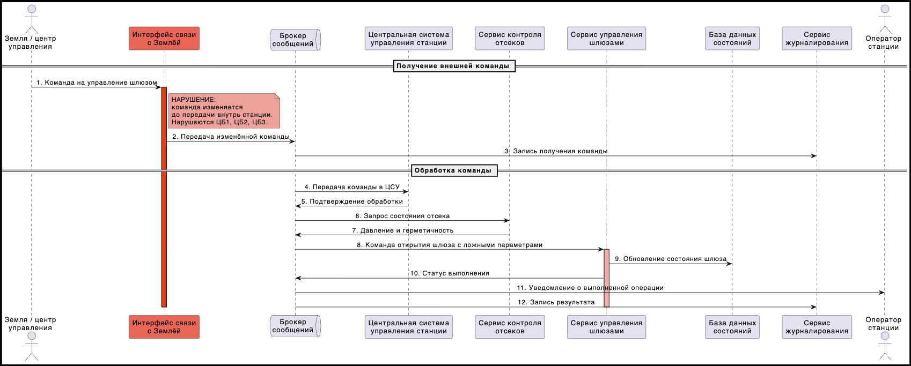

### НС-2. Интерфейс связи с кораблями передаёт поддельный запрос на стыковку
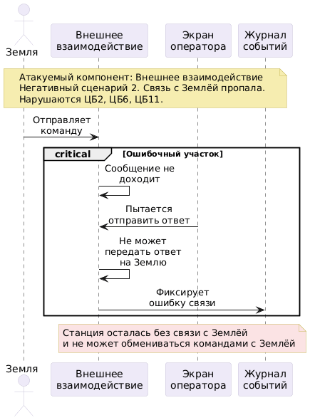

### НС-3. Центральная система управления отправляет команду открытия без проверки давления
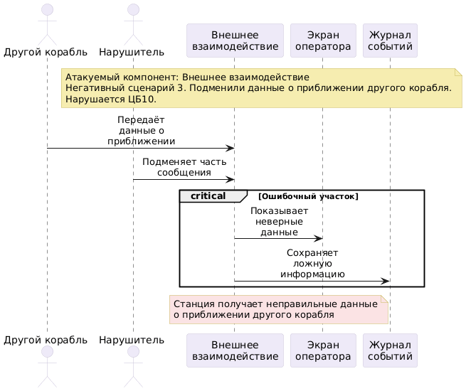

### НС-4. Сервис управления шлюзами открывает внутреннюю и внешнюю створку одновременно
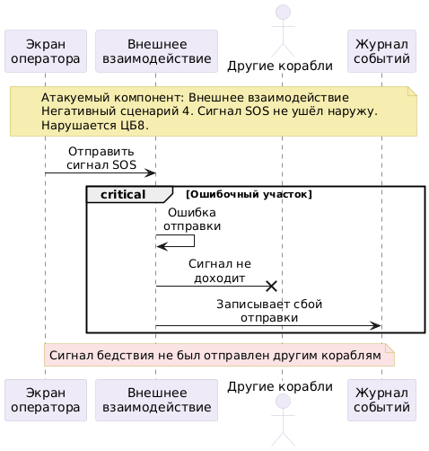

### НС-5. Сервис управления доступом выдаёт доступ без полномочий
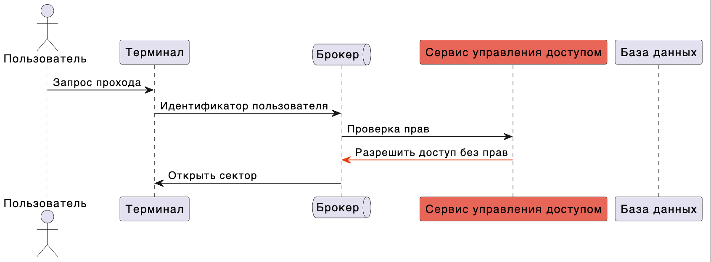

### НС-6. Сервис контроля отсеков передаёт ложные данные
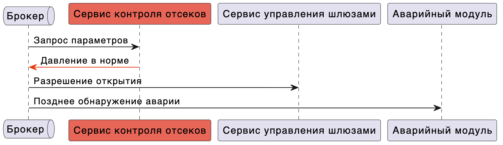

### НС-7. Сервис стыковки подтверждает неисправный узел
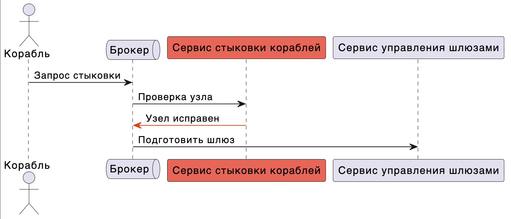

### НС-8. Брокер сообщений подменяет команду закрытия
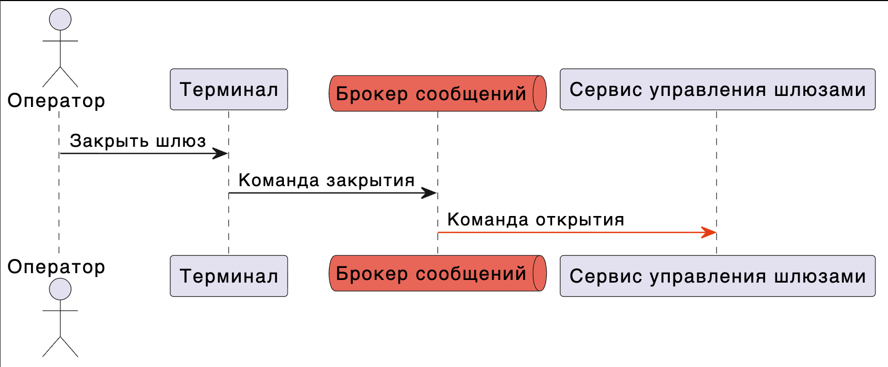

### НС-9. База данных содержит ложный статус шлюза
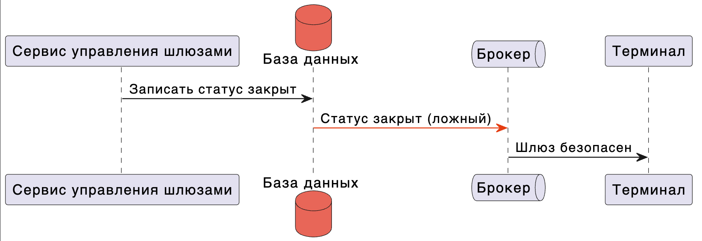

### НС-10. Сервис журналирования не сохраняет запись инцидента
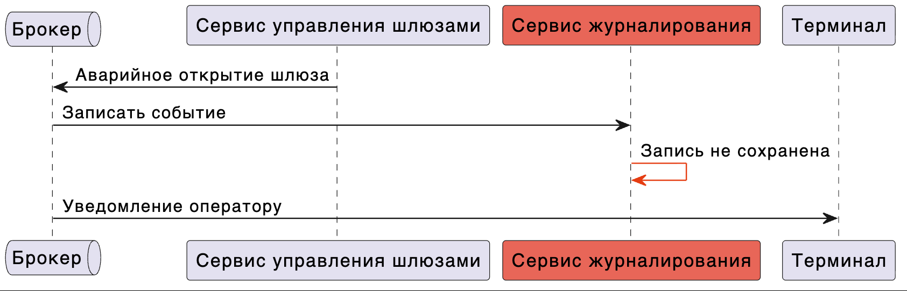
### НС-11. Сервис мониторинга не сообщает об отказе питания шлюзового контура
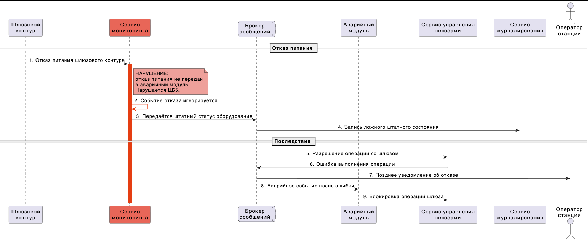

### НС-12. Локальный операторский терминал отправляет несанкционированную команду
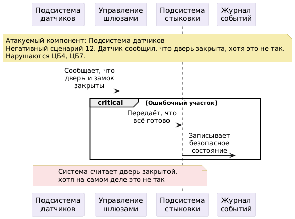

### НС-13. Аварийный модуль не переводит систему в безопасный режим
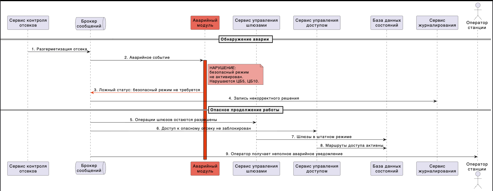

### НС-14. При пожаре блокируется доступ экипажа к спасательным капсулам
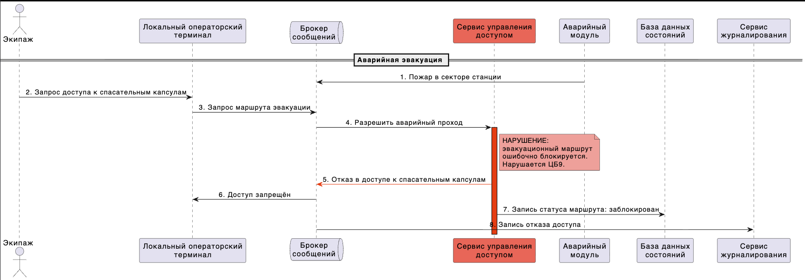

### НС-15. Интерфейс связи с Землёй повторно отправляет устаревшую команду
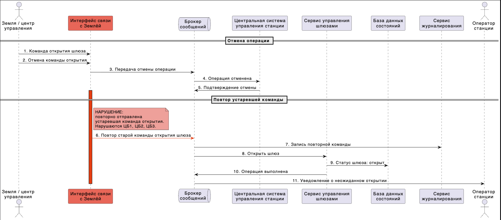

### НС-16. Интерфейс связи с кораблями искажает телеметрию корабля
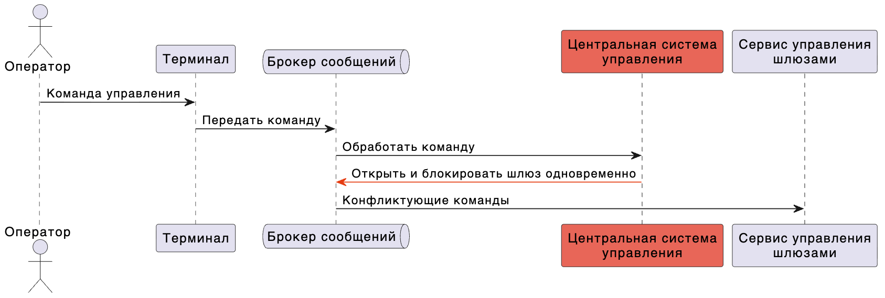

### НС-17. Центральная система отправляет взаимоисключающие команды
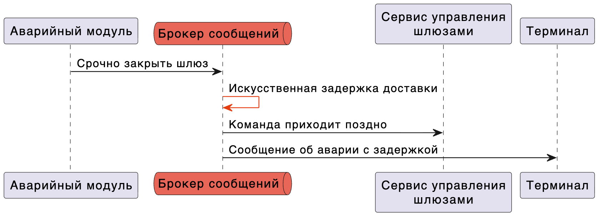

### НС-18. Брокер сообщений задерживает аварийную команду
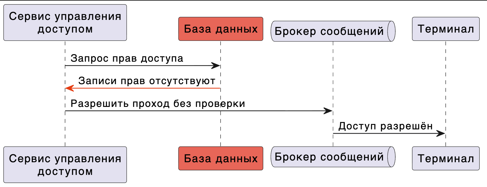

### НС-19. База данных потеряла записи о правах доступа
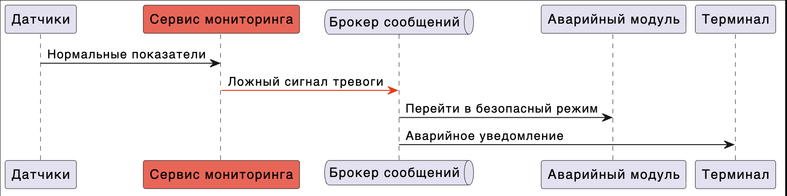

### НС-20. Сервис мониторинга формирует ложный сигнал тревоги
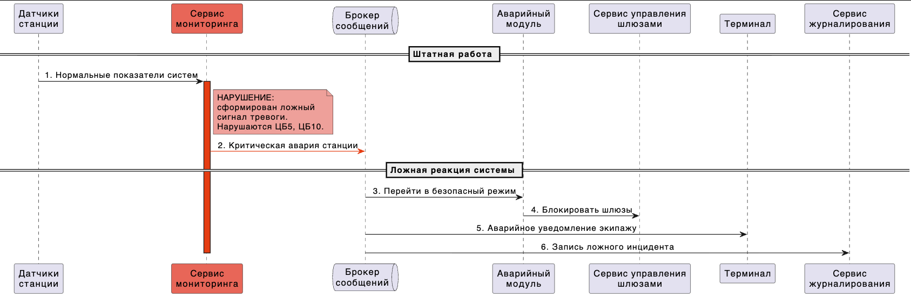
