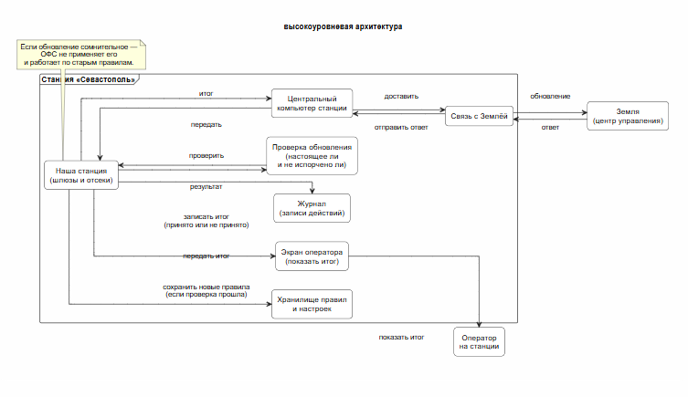

# Космическая станция "Севастополь" (Чужой)  

Система управления шлюзами и доступом станции а также взаимодействие с землей и другими станциями 

## Краткое описание проектируемой системы

Мы разрабатываем систему управления шлюзами и доступом по отсекам космического комплекса "Севастополь", получающую команды из центральной системы управления станцией и обеспечивающую безопасные режимы работы. Система также передаёт статусы и результаты самодиагностики обратно в центральную систему и оператору.Вместе с этим также обеспечивается внешние взаимодействия с землей и другими станциями.

## Ключевые ценности, ущербы, неприемлемые события
| Ценность | Негативное событие | Оценка ущерба | Комментарий |
|---|---|---|---|
| люди (экипаж или пассажиры) | шлюз открылся, когда давление не выровнено, или когда уже открыта вторая дверь шлюза, следовательно начинается разгерметизация | высокий | Это напрямую угрожает жизни людей: воздух уходит быстро, времени на исправление почти нет. |
| безопасность станции | человек без прав попал в важный отсек (например, с энергией, связью или медблоком), поэтому он может вмешаться в работу станции | высокий | Из-за этого можно отключить важные системы или вызвать аварию, последствия затронут всю станцию. |
| стыковка с другими станциями или кораблями | стыковку разрешили объекту, который не подтверждён, или параметры стыковки подменили, следовательно стыковка может пройти неправильно | высокий | Ошибка стыковки может повредить узел стыковки и привести к аварии, а также открыть путь для проникновения. |
| взаимодействие с другими станциями | между станциями передали неправильные команды или статусы, поэтому станция принимает неверные решения (например, открывает или закрывает не то) | высокий | Неверные решения могут привести к опасным действиям и ухудшить реакцию на аварии. |
| связь с Землёй (управление) | с Земли пришла неверная команда или изменили правила доступа, следовательно станция может перейти в неправильный режим | высокий | Земля может влиять сразу на многое, поэтому одна ошибка или взлом дают большие последствия. |
| непрерывность управления | связь с Землёй или другими станциями пропала, поэтому система “зависла” или начала делать неправильные действия “по умолчанию” | высокий | В опасной ситуации нельзя терять управление: это мешает спасению и может привести к аварии. |
| правдивость данных (показания датчиков) | датчики показали неверные данные о давлении или дверях, следовательно система принимает неправильные решения | высокий | Если система верит неправильным данным, она может сделать физически опасное действие. |
| ресурсы станции (энергия, воздух, жизнеобеспечение) | из-за сбоя перекрылись важные маршруты или отсеки, поэтому людям сложно безопасно перемещаться и действовать | средний | Это серьёзно, но обычно есть время включить запасные варианты и действовать по аварийным правилам. |
| разбор происшествий (кто что сделал) | записи событий отсутствуют или их подменили, поэтому нельзя понять, кто и что сделал и почему | средний | Это не ломает станцию сразу, но потом ошибки повторяются, а виновные действия сложно найти. |
| секретность данных (внешняя связь) | наружу утекла информация о режимах, доступах или происшествиях, следовательно другим проще подготовить атаку | средний | Обычно это не приводит к аварии сразу, но повышает риск будущих проблем и атак. ||

## Контекст
1)Станция получает команды и отправляет данные внутри станции, на Землю и другим станциям или кораблям.

2)Оператор на станции задаёт режимы и принимает решения в экстренных ситуациях через центральный компьютер.

3)Наша система управляет отсеками и шлюзами: открывает и закрывает двери, включает нужные режимы и проверяет, что действие безопасно.

4)Датчики сообщают, закрыты ли двери, какое давление и готова ли стыковка.

5)Земля и другие станции или корабли могут присылать команды и запросы, но они могут ошибаться, поэтому их нельзя выполнять “вслепую”.

6)Если связь пропадает или данные странные, система должна перейти в безопасный режим и не делать опасных действий.

7)Все важные действия должны записываться, чтобы потом можно было понять, что произошло.

## Основной сценарии

## Высокоуровневая архитектура

Система управления шлюзами и доступом космической станции **«Севастополь»** состоит из набора подсистем, каждая из которых выполняет отдельные функции и взаимодействует с другими через контролируемые интерфейсы.  
Разделение на подсистемы позволяет ограничить влияние ошибок, повысить безопасность и обеспечить устойчивую работу системы в аварийных и штатных режимах.

Подсистемы взаимодействуют только через определённые интерфейсы, а все действия проходят проверку безопасности перед выполнением.

---

### Подсистема управления шлюзами

**Назначение:** управление шлюзами и контроль безопасного открытия и закрытия дверей.

**Основные функции:**

- открытие и закрытие дверей шлюзов
- контроль выравнивания давления
- проверка состояния второй двери шлюза
- блокировка опасных операций
- переход в безопасный режим при ошибках
- передача событий в журнал

**Входные данные:**

- команды от центральной системы
- данные от датчиков давления
- данные о состоянии дверей
- команды от оператора

**Выходные данные:**

- команды на открытие/закрытие шлюзов
- статус шлюза
- сообщения об ошибках
- записи в журнал

---

### Подсистема контроля доступа по отсекам

**Назначение:** контроль перемещения экипажа и проверка прав доступа.

**Основные функции:**

- идентификация пользователя
- проверка прав доступа
- разрешение или запрет входа
- контроль перемещения между отсеками
- передача событий в журнал

**Входные данные:**

- идентификатор пользователя
- запрос на доступ
- команды от оператора

**Выходные данные:**

- разрешение доступа
- запрет доступа
- запись в журнал

---

### Подсистема стыковки

**Назначение:** управление процессом стыковки с кораблями и другими станциями.

**Основные функции:**

- проверка объекта стыковки
- получение параметров стыковки
- проверка безопасности
- разрешение стыковки
- блокировка неподтверждённых объектов
- передача событий в журнал

**Входные данные:**

- параметры стыковки
- данные от датчиков
- команды от внешней системы

**Выходные данные:**

- разрешение стыковки
- отказ в стыковке
- статус стыковочного узла
- запись в журнал

---

### Подсистема внешнего взаимодействия

**Назначение:** обмен данными с Землёй и другими станциями.

**Основные функции:**

- приём команд
- передача статусов
- фильтрация команд
- проверка корректности сообщений
- защита от ошибочных или вредоносных команд
- передача событий в журнал

**Входные данные:**

- команды с Земли
- команды от других станций
- данные от оператора

**Выходные данные:**

- команды в систему управления
- статусы на Землю
- статусы другим станциям
- записи в журнал

---

### Подсистема датчиков

**Назначение:** сбор информации о состоянии станции.

**Основные функции:**

- измерение давления
- контроль состояния дверей
- контроль стыковочного узла
- контроль состояния отсеков
- передача данных в систему управления

**Входные данные:**

- физические параметры среды

**Выходные данные:**

- данные давления
- данные состояния дверей
- данные стыковки
- сигналы тревоги

---

### Подсистема журнала событий

**Назначение:** фиксация всех действий системы.

**Основные функции:**

- запись команд
- запись операций
- запись ошибок
- хранение истории событий
- передача данных оператору

**Входные данные:**

- события от всех подсистем

**Выходные данные:**

- журнал событий
- отчёты

---

### Подсистема оператора

**Назначение:** управление системой человеком.

**Основные функции:**

- управление режимами
- просмотр состояния станции
- подтверждение действий
- управление в аварийных ситуациях
- контроль системы

**Входные данные:**

- информация о состоянии станции
- журнал событий

**Выходные данные:**

- команды управления
- аварийные команды
- настройки режимов

---

## Диаграмма подсистем

Диаграмма показывает взаимодействие подсистем внутри системы управления станции.
