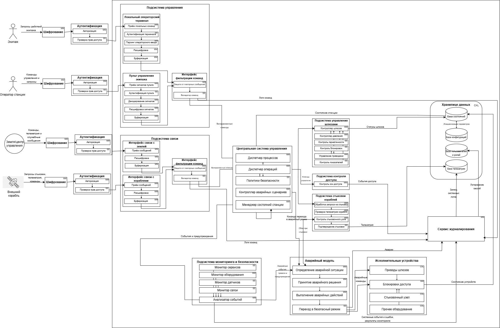
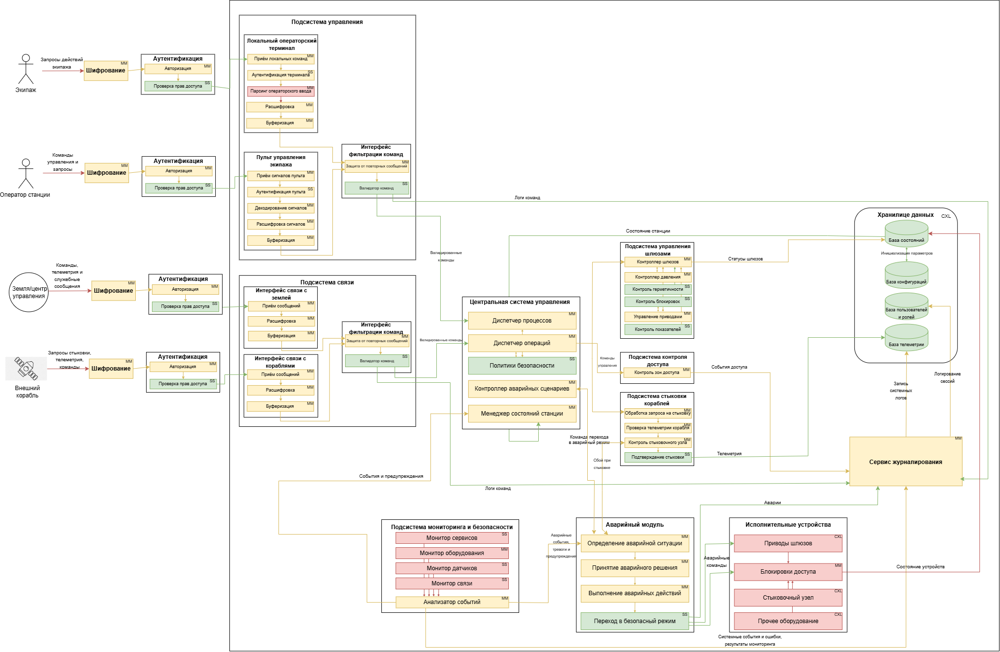

# Космическая станция "Севастополь" (Чужой)  

Система управления шлюзами и доступом станции а также взаимодействие с землей и другими станциями 

## Краткое описание проектируемой системы

Разрабатывается система управления критической инфраструктурой космической станции «Севастополь» — автономного орбитального комплекса, предназначенного для длительного пребывания экипажа, приёма кораблей, хранения грузов и проведения технических операций.
Система обеспечивает безопасное управление внутренними и внешними шлюзами станции, контроль перемещения персонала по отсекам, управление доступом в критические зоны, координацию стыковки прибывающих кораблей, а также обмен данными с Землёй и внешними судами.
Система получает команды от центрального вычислительного ядра станции, проверяет их допустимость, исполняет разрешённые сценарии и передаёт телеметрию, журналы событий и результаты самодиагностики оператору и в центральную систему.

---
## Ценности, ущербы и неприемлемые события

| Ценность | Негативное событие | Оценка ущерба | Комментарий |
|---|---|---|---|
| Экипаж станции | Ошибочное открытие шлюза привело к гибели или травмам персонала | Высокий | Прямой риск жизни людей |
| Герметичность отсеков | Разгерметизация жилого или технического модуля | Критический | Возможна потеря сектора станции |
| Шлюзовая система | Одновременное открытие внутренних и внешних створок шлюза | Критический | Немедленная аварийная ситуация |
| Доступ в отсеки | Получен доступ в командный или технический сектор | Высокий | Возможен саботаж управления |
| Стыковочный узел | Ошибка управления вызвала повреждение прибывающего корабля | Высокий | Потеря груза или транспорта |
| Связь с Землёй | Потеря канала связи и невозможность передачи телеметрии | Средний | Переход в автономный режим |
| Центральная система управления | Нарушена целостность команд управления шлюзами | Критический | Потеря контроля над инфраструктурой |
| Журналы событий | Удалены или изменены записи инцидентов | Средний | Усложнение расследования |
| Эвакуационные маршруты | Заблокирован доступ к спасательным капсулам | Критический | Невозможность эвакуации |

## Известные ограничения и вводные условия

По условиям проекта система должна быть реализована с использованием микросервисной архитектуры. Для обмена данными между сервисами должен использоваться брокер сообщений и асинхронная модель взаимодействия. Использование сторонних API и внешних облачных сервисов не допускается из-за требований конфиденциальности данных станции. Система должна обеспечивать работу как в штатном режиме, так и при нестабильных каналах связи с Землёй и внешними кораблями.

## Базовая архитектура системы

## Базовые сценарии

## Расширенная архитектура системы

## Контекст работы системы

Система функционирует в составе космической станции «Севастополь» и взаимодействует с центральной системой управления станции, экипажем, внешними кораблями и наземным центром управления.Во внешнем контуре система обменивается телеметрией и служебными сообщениями с Землёй, транспортными кораблями и другими станциями по каналам связи с возможными задержками и потерями пакетов.При отказах оборудования, потере связи, попытках несанкционированного доступа или обнаружении опасного состояния система обязана сохранять работоспособность критических функций.

---
## Расширенные функциональные сценарии

## Компоненты системы

| Компонент | Назначение |
|---|---|
| Центральная система управления станции | Формирует команды для подсистем станции, получает телеметрию и статусы выполнения операций |
| Сервис управления шлюзами | Управляет внутренними и внешними шлюзами, проверяет допустимость открытия и закрытия створок |
| Сервис управления доступом | Контролирует проход между отсеками и доступ в критические зоны |
| Сервис контроля отсеков | Получает данные о давлении, герметичности, температуре и аварийных событиях |
| Сервис стыковки кораблей | Обрабатывает запросы на стыковку и управляет стыковочными узлами |
| Интерфейс связи с Землёй | Обеспечивает обмен командами, телеметрией и отчетами с наземным центром |
| Интерфейс связи с кораблями | Обеспечивает обмен служебными сообщениями с внешними кораблями |
| База данных состояний | Хранит статусы шлюзов, отсеков, пользователей, кораблей и результаты операций |
| Сервис журналирования | Сохраняет события системы, действия операторов и аварийные сообщения |
| Сервис мониторинга | Контролирует состояние сервисов, оборудования, связи и питания |
| Локальный операторский терминал | Позволяет экипажу выполнять разрешённые операции и получать информацию о состоянии системы |
| Аварийный модуль | Переводит систему в безопасное состояние при отказах, потере связи или опасных условиях |

## Цели безопасности

1. При любых обстоятельствах команды на управление шлюзами, гермодверями и доступом принимаются только от авторизованных источников.
2. При любых обстоятельствах внешние команды от Земли, кораблей и других станций выполняются только после проверки подлинности и допустимости.
3. При любых обстоятельствах открытие шлюзов выполняется только при безопасных параметрах давления, герметичности и готовности отсека.
4. При любых обстоятельствах доступ в командные, технические и критические отсеки получают только пользователи с необходимыми правами.
5. При любых обстоятельствах при аварии, отказе оборудования или потере связи система переходит в безопасный режим работы.
6. При любых обстоятельствах данные о состоянии шлюзов, отсеков, стыковке и операциях сохраняют целостность и не подменяются.
7. При любых обстоятельствах все критические действия операторов, сервисов и автоматических модулей журналируются.
8. При любых обстоятельствах стыковка внешнего корабля выполняется только после подтверждения состояния стыковочного узла и разрешения станции.
9. При любых обстоятельствах экипаж сохраняет доступ к маршрутам эвакуации и аварийным средствам спасения.
10. При любых обстоятельствах система сохраняет работоспособность критических функций либо переходит в контролируемое безопасное состояние.

## Предположения безопасности

1. Станция обменивается командами и телеметрией с Землёй, кораблями и другими станциями по каналам связи с задержками и возможными сбоями.
2. Аутентифицированный персонал станции считается благонадёжным и обладает необходимой квалификацией для работы с системой.
3. Обеспечена физическая безопасность серверов, управляющего оборудования, терминалов и сетевых устройств станции.
---

## Матрица нарушений целей безопасности

| Атакованный компонент | ЦБ1 | ЦБ2 | ЦБ3 | ЦБ4 | ЦБ5 | ЦБ6 | ЦБ7 | Кол-во нарушений |
|---|---|---|---|---|---|---|---|---|
| Интерфейс связи с Землёй | 🔴 | 🔴 | 🔴 | 🟢 | 🟢 | 🔴 | 🔴 | 5/7 |
| Центральная система управления станции | 🔴 | 🔴 | 🔴 | 🟢 | 🔴 | 🔴 | 🔴 | 6/7 |
| Сервис управления шлюзами | 🔴 | 🟢 | 🔴 | 🟢 | 🔴 | 🔴 | 🔴 | 5/7 |
| Сервис управления доступом | 🔴 | 🟢 | 🟢 | 🔴 | 🔴 | 🔴 | 🔴 | 5/7 |
| Сервис контроля отсеков | 🟢 | 🟢 | 🔴 | 🟢 | 🔴 | 🔴 | 🔴 | 4/7 |
| Сервис стыковки кораблей | 🔴 | 🔴 | 🔴 | 🟢 | 🔴 | 🔴 | 🔴 | 6/7 |
| Интерфейс связи с кораблями | 🔴 | 🔴 | 🔴 | 🟢 | 🔴 | 🔴 | 🔴 | 6/7 |
| База данных состояний | 🟢 | 🟢 | 🔴 | 🔴 | 🔴 | 🔴 | 🔴 | 5/7 |
| Сервис журналирования | 🟢 | 🟢 | 🟢 | 🟢 | 🟢 | 🔴 | 🔴 | 2/7 |
| Сервис мониторинга | 🟢 | 🟢 | 🔴 | 🟢 | 🔴 | 🔴 | 🔴 | 4/7 |
| Локальный операторский терминал | 🔴 | 🟢 | 🟢 | 🔴 | 🔴 | 🔴 | 🔴 | 5/7 |
| Аварийный модуль | 🔴 | 🟢 | 🔴 | 🔴 | 🔴 | 🔴 | 🔴 | 6/7 |

🟢 — цель безопасности не нарушена  
🔴 — цель безопасности нарушена

---

## Негативные сценарии нарушения целей безопасности

| Название сценария | Описание |
|---|---|
| НС-1 | Интерфейс связи с Землёй получил корректную команду, но изменил её содержимое и передал ложные параметры открытия шлюза. Нарушаются ЦБ1, ЦБ2, ЦБ3. |
| НС-2 | Интерфейс связи с кораблями передал поддельный запрос на стыковку от внешнего судна. Нарушаются ЦБ2, ЦБ8. |
| НС-3 | Центральная система управления отправила команду открытия шлюза без проверки давления в отсеке. Нарушаются ЦБ1, ЦБ3. |
| НС-4 | Сервис управления шлюзами открыл внутреннюю и внешнюю створку одновременно. Нарушаются ЦБ3, ЦБ5. |
| НС-5 | Сервис управления доступом предоставил доступ в реакторный сектор пользователю без полномочий. Нарушается ЦБ4. |
| НС-6 | Сервис контроля отсеков передал ложные данные о нормальном давлении при разгерметизации. Нарушаются ЦБ3, ЦБ5. |
| НС-7 | Сервис стыковки кораблей подтвердил соединение при неисправном стыковочном узле. Нарушаются ЦБ3, ЦБ8. |
| НС-8 | Центральная система управления подменила команду безопасного закрытия шлюза на команду открытия. Нарушаются ЦБ1, ЦБ3, ЦБ6. |
| НС-9 | База данных состояний содержит ложный статус шлюза «закрыт», хотя шлюз открыт. Нарушаются ЦБ3, ЦБ6. |
| НС-10 | Сервис журналирования не сохранил запись об аварийном открытии шлюза. Нарушается ЦБ7. |
| НС-11 | Сервис мониторинга не сообщил об отказе питания шлюзового контура. Нарушается ЦБ5. |
| НС-12 | Локальный операторский терминал отправил несанкционированную команду разблокировки сектора. Нарушаются ЦБ1, ЦБ4. |
| НС-13 | Аварийный модуль не перевёл систему в безопасный режим при разгерметизации. Нарушаются ЦБ5, ЦБ10. |
| НС-14 | Интерфейс связи с Землёй повторно отправил устаревшую команду открытия шлюза после отмены операции. Нарушаются ЦБ1, ЦБ2, ЦБ3. |
| НС-15 | Интерфейс связи с кораблями исказил телеметрию прибывающего корабля и скрыл повреждение стыковочного узла. Нарушаются ЦБ3, ЦБ8. |
| НС-16 | Центральная система управления отправила одновременно взаимоисключающие команды открытия и блокировки шлюза. Нарушаются ЦБ1, ЦБ5. |
| НС-17 | Центральная система управления задержала доставку аварийной команды закрытия шлюза до момента разгерметизации. Нарушаются ЦБ5, ЦБ10. |

---

## Диаграммы негативных сценариев

### НС-1. Интерфейс связи с Землёй изменяет команду управления шлюзом

### НС-2. Интерфейс связи с кораблями передаёт поддельный запрос на стыковку

### НС-3. Центральная система управления отправляет команду открытия без проверки давления

### НС-4. Сервис управления шлюзами открывает внутреннюю и внешнюю створку одновременно

### НС-5. Сервис управления доступом выдаёт доступ без полномочий

### НС-6. Сервис контроля отсеков передаёт ложные данные

### НС-7. Сервис стыковки подтверждает неисправный узел

### НС-8. Центральная система управления подменила команду безопасного закрытия шлюза на команду открытия.

### НС-9. База данных содержит ложный статус шлюза

### НС-10. Сервис журналирования не сохраняет запись инцидента

### НС-11. Сервис мониторинга не сообщает об отказе питания шлюзового контура

### НС-12. Локальный операторский терминал отправляет несанкционированную команду

### НС-13. Аварийный модуль не переводит систему в безопасный режим

### НС-14. Интерфейс связи с Землёй повторно отправляет устаревшую команду

### НС-15. Интерфейс связи с кораблями искажает телеметрию корабля

### НС-16. Центральная система отправляет взаимоисключающие команды

### НС-17. Центральная система управления задержала доставку аварийной команды закрытия шлюза до момента разгерметизации.

# Переработанная архитектура системы управления станции "Севастополь"

## Описание декомпозиции
Для обеспечения кибериммунитета системы и защиты целей безопасности (ЦБ1–ЦБ20) исходные монолитные и сложные сервисы были подвергнуты декомпозиции. Критические функции проверки параметров, криптографии и разграничения прав вынесены из недоверенных компонентов (таких как Центральная система управления и интерфейсы связи) в изолированные доверенные модули минимального размера. Теперь, даже если ЦСУ или внешние интерфейсы будут полностью скомпрометированы, новые доверенные прослойки заблокируют выполнение опасных или неавторизованных команд.

| Компонент | Функции |
| :--- | :--- |
| **Аутентификация** | Авторизация Проверка прав доступа |
| **Подсистема управления** | Локальный операторский терминал Пульт управления экипажа Интерфейс фильтрации команд |
| **Локальный операторский терминал** | Приём локальных команд Аутентификация терминала Парсинг операторского ввода Расшифровка Буферизация |
| **Интерфейс фильтрации команд** | Защита от повторных сообщений Валидатор команд |
| **Пульт управления экипажа** | Приём сигналов пульта Аутентификация пульта Декодирование сигналов Расшифровка сигналов Буферизация |
| **Подсистема связи** | Интерфейс связи с Землёй Интерфейс связи с кораблями Интерфейс фильтрации команд |
| **Интерфейс связи с Землёй** | Приём сообщений Расшифровка Буферизация |
| **Интерфейс связи с кораблями** | Приём сообщений Расшифровка Буферизация |
| **Центральная система управления (ЦСУ)** | Диспетчер процессов Менеджер состояний станции Диспетчер операций Политики безопасности Контроллер аварийных сценариев |
| **Подсистема управления шлюзами** | Контроллер шлюзов Контроллер давления Контроль герметичности Контроль блокировок Управление приводами Контроль показателей |
| **Подсистема контроля доступа** | Контроль зон доступа |
| **Подсистема стыковки кораблей** | Обработка запроса на стыковку Проверка телеметрии корабля Контроль стыковочного узла Подтверждение стыковки |
| **Подсистема мониторинга и безопасности** | Монитор сервисов Монитор оборудования Монитор датчиков Монитор связи Анализатор событий |
| **Аварийный модуль** | Определение аварийной ситуации Принятие аварийного решения Выполнение аварийных действий Переход в безопасный режим |
| **Исполнительные устройства** | Приводы шлюзов Блокировки доступа Стыковочный узел Прочее оборудование |
| **Хранилище данных** | База состояний База конфигураций База пользователей и ролей База телеметрии |
| **Сервис журналирования** | |
| **Шифрование** | |

# Таблица новых компонентов

| Компонент | Описание | Комментарий |
|---|---|---|
| Шифрование | Обеспечивает криптографическую защиту передаваемых данных на внешних и внутренних каналах связи | Защищает потоки данных от перехвата и модификации третьими лицами |
| Авторизация | Проверяет заявленную идентичность источника запроса и сопоставляет его с системой | Предшествует финальной проверке прав и мандатов |
| Проверка прав доступа | Осуществляет валидацию мандатов и разрешений субъекта на выполнение конкретного действия | Блокирует несанкционированные запросы на самой границе системы |
| Приём локальных команд | Первично захватывает ввод с клавиатуры или экрана инженера на терминале | Изолирует физический интерфейс от логики парсинга |
| Аутентификация терминала | Проверяет аппаратно-программную подлинность самого инженерного терминала | Исключает подключение сторонних устройств к порту управления |
| Парсинг операторского ввода | Преобразует сырой поток байтов ввода инженера в структурированные запросы | Защищает от инъекций кода при обработке строк |
| Расшифровка | Преобразует защищенное сообщение от терминала в обычный вид | Нужна, чтобы система могла прочитать команду инженера |
| Буферизация | Временно хранит сообщения от терминала перед обработкой | Помогает не потерять данные при высокой нагрузке |
| Защита от повторных сообщений | Проверяет уникальность временных меток и счетчиков команд | Защищает от повторного выполнения ранее перехваченных команд |
| Валидатор команд | Проверяет синтаксическую корректность команды перед отправкой дальше | Финальный проверяющий компонент интерфейса фильтрации |
| Приём сигналов пульта | Захватывает сигналы от аппаратных кнопок и тумблеров пульта экипажа | Первичная изоляция на аппаратном уровне |
| Аутентификация пульта | Аппаратно проверяет подлинность стационарного пульта управления экипажа | Предотвращает подмену пульта злоумышленником |
| Декодирование сигналов | Преобразует электрические сигналы матриц кнопок в цифровой код | Безопасно интерпретирует физические нажатия |
| Расшифровка сигналов | Дешифрует пакеты данных, идущие от пульта управления экипажа | Обеспечивает конфиденциальность внутренних шин |
| Буферизация | Очередь хранения сигналов пульта для предотвращения их потери | Стабилизирует поток ввода от экипажа |
| Приём сообщений | Получает внешние команды, запросы и данные из каналов связи | Сам по себе не решает, можно ли выполнять команду |
| Расшифровка | Снимает внешний криптографический слой с космических радиопакетов | Нужна для чтения команд от Земли или кораблей |
| Буферизация | Накапливает пакеты данных внешней космической сессии | Сглаживает задержки и защищает от сетевого флуда (DoS) |
| Диспетчер процессов | Управляет жизненным циклом и запуском программных задач в ЦСУ | Не должен сам принимать опасные решения |
| Менеджер состояний станции | Следит за текущим глобальным режимом и статусом систем станции | Используется при проверке шлюзов, аварий и доступа |
| Диспетчер операций | Направляет проверенные команды в нужную подсистему для исполнения | Работает только после прохождения всех фильтров |
| Политики безопасности | Проверяют, разрешено ли действие по правилам кибериммунитета | Главный компонент запрета опасных действий |
| Контроллер аварийных сценариев | Выбирает и координирует запуск аварийного режима внутри ЦСУ | Используется при отказах, авариях и потере связи |
| Контроллер шлюзов | Координирует общую логику и этапы процесса шлюзования | Не должен открывать люки без предварительных проверок |
| Контроллер давления | Управляет клапанами откачки и нагнетания воздуха в шлюзе | Нужен для безопасной работы и выравнивания давления |
| Контроль герметичности | Проверяет, удерживают ли шлюз или отсек стабильное давление | Обязательный шаг перед открытием дверей в вакуум |
| Контроль блокировок | Проверяет состояние механических и программных интерлоков замков | Не даёт выполнить действие в опасном состоянии |
| Управление приводами | Формирует и передаёт команды на физические силовые приводы люков | Выполняет действие только после прохождения всех проверок |
| Контроль показателей | Собирает физическую телеметрию и метрики с узлов шлюза | Помогает выявить износ или заклинивание механизмов |
| Контроль зон доступа | Проверяет права экипажа на перемещение между отсеками станции | Разграничивает физический доступ с учетом состояния станции |
| Обработка запроса на стыковку | Принимает и первично обрабатывает входящий запрос от внешнего корабля | Не должна сразу разрешать выполнение маневров |
| Проверка телеметрии корабля | Анализирует скорость, вектор и соосность приближающегося объекта | Нужна перед выдачей разрешения на захват |
| Контроль стыковочного узла | Проверяет техническую готовность замков и амортизаторов порта | Не даёт начать стыковку при обнаружении неисправностей |
| Подтверждение стыковки | Проверяет жесткую сцепку и герметичность стыковочного шва | Финально разрешает и фиксирует стыковку после проверок |
| Монитор сервисов | Непрерывно следит за работоспособностью программного обеспечения | Нужен для обнаружения программных отказов и зависаний |
| Монитор оборудования | Следит за статусом процессоров, памяти и шин данных | Проверяет, не отказало ли аппаратное обеспечение вычислителей |
| Монитор датчиков | Опрашивает сенсоры давления, состава газа и температуры на станции | Собирает физические метрики для выявления ЧП |
| Монитор связи | Контролирует стабильность и качество внешних радиоканалов | Важен при потере сигналов или радиопомехах |
| Анализатор событий | Сопоставляет и коррелирует данные от всех четырех мониторов | Ищет сложные аномалии, признаки кибератак и ЧП |
| Определение аварийной ситуации | Принимает сигналы от Анализатора событий и классифицирует тип ЧП | Инициализирует защитные алгоритмы Аварийного модуля |
| Принятие аварийного решения | Выбирает жестко зашитый сценарий действий для текущего типа аварии | Исключает человеческий фактор, работает по готовым правилам |
| Выполнение аварийных действий | Переводит выбранный логический сценарий спасения в команды для железа | Направляет экстренные директивы исполнительным органам |
| Переход в безопасный режим | Верифицирует аварийные команды и выдает финальный управляющий сигнал | Ключевой изолированный защитный компонент |
| Приводы шлюзов | Физические электродвигатели и редукторы, двигающие створки люков | Физический уровень (CXL), безопасность сам не проверяет |
| Блокировки доступа | Физические ригели, замки и электромагнитные фиксаторы дверей | Ограничивает доступ и собирает итоговую телеметрию железа |
| Стыковочный узел | Физические захваты, штыри и стягивающие механизмы порта | Аппаратный уровень (CXL), требует внешнего контроля |
| Прочее оборудование | Остальные вспомогательные устройства и системы жизнеобеспечения | Требуют контроля и мониторинга со стороны системы |
| База состояний | Хранит текущую оперативную карту параметров и режимов станции | Снабжает ЦСУ актуальными данными для бизнес-логики |
| База конфигураций | Хранит эталонные уставки, лимиты датчиков и сценарии работы | Служит источником доверенных лимитов для Политик безопасности |
| База пользователей и ролей | Хранит мандаты, права доступа, роли и криптографические ключи | Обеспечивает входные компоненты аутентификации списками прав |
| База телеметрии | Хранит исторические логи, графики работы и журналы аудита | Обеспечивает функцию «черного ящика» для разбора инцидентов |

## Диаграмма последовательности

## Доверенные компоненты на архитектуре

# Таблица доверенности компонентов

## Качественная оценка доменов

| Компонент | Уровень доверия | Оценка | Кол-во входящих интерфейсов | Комментарий |
| :--- | :--- | :--- | :---: | :--- |
| **Шлюз связи с Землёй** | Недоверенный | MM | 1 | Аппаратно-программный модуль, изолирующий физический интерфейс и логику приема/передачи радиосигналов с наземным ЦУП. |
| **Шлюз связи с кораблями** | Недоверенный | MM | 1 | Аппаратно-программный модуль, изолирующий физический канал обмена данными с приближающимися и пристыкованными судами. |
| **Подсистема связи** | Недоверенный | CXL | 4 | Объединяет функции приема, буферизации и первичной обработки пакетов. Из-за высокой сложности сетевых протоколов вынесена в недоверенную зону для удешевления разработки. |
| **Центральная система управления (ЦСУ)** | Недоверенный | CXL | 4 | Координирующее ядро бизнес-логики станции. Содержит избыточный объем сложного программного кода, поэтому полностью изолировано от критических функций безопасности. |
| **Подсистема управления шлюзами** | Доверенный | MM | 1 | Изолированный домен автоматики, отвечающий за расчет циклов шлюзования и сопоставление физических параметров отсеков. |
| **Подсистема контроля доступа** | Доверенный | MM | 1 | Программный модуль валидации прав и ролей экипажа при перемещении по отсекам станции. Работает автономно от ЦСУ. |
| **Подсистема стыковки кораблей** | Повышающий доверие | MM | 1 | Отвечает за логику сближения и захвата прибывающих космических аппаратов по командам от ЦСУ. |
| **Подсистема мониторинга и безопасности** | Повышающий доверие | CXL | 1 | Сложный комплекс анализа системных событий, телеметрии, сбора данных от датчиков и выявления аномалий. |
| **Аварийный модуль** | Доверенный | MM | 2 | Критический компонент, принимающий прямые сигналы о разгерметизации и переводящий станцию в безопасный режим при скомпрометированной ЦСУ. |
| **Исполнительные устройства (Приводы дверей)** | Доверенный | SS | 1 | Конечный физический уровень (актуаторы). Принимает только финальный проверенный сигнал на открытие/закрытие створок шлюза. |
| **Хранилище данных (База состояний)** | Доверенный | CXL | 3 | Изолированная СУБД для хранения конфигураций, политик и статусов. Защищена Валидатором данных состояния на входе. |
| **Сервис журналирования (Логирование)** | Доверенный | SS | 4 | Микромодуль гарантированной фиксации системных событий в режиме WORM (запись без возможности удаления для последующего аудита). |
