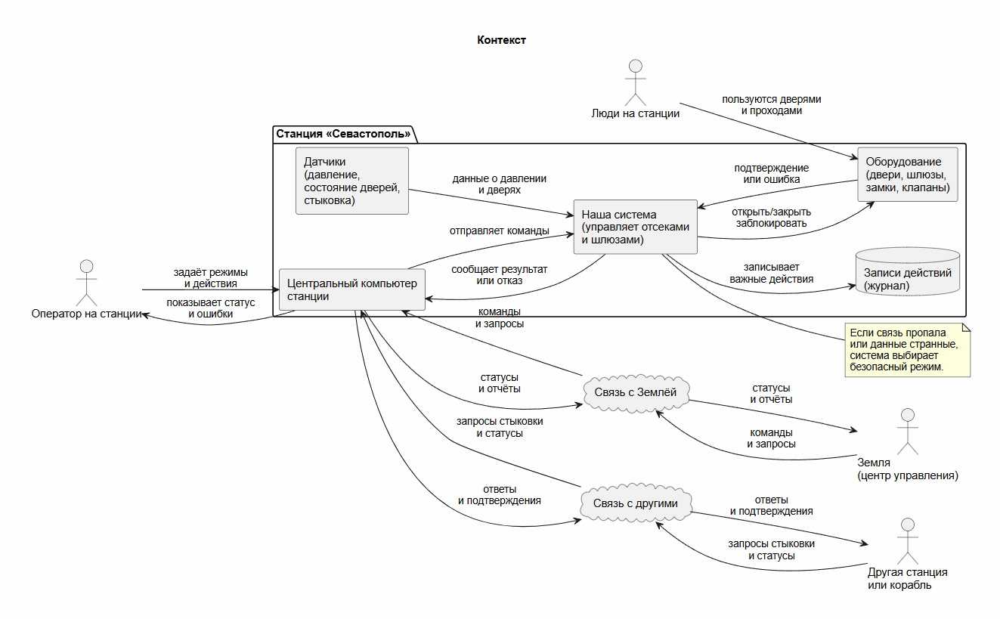
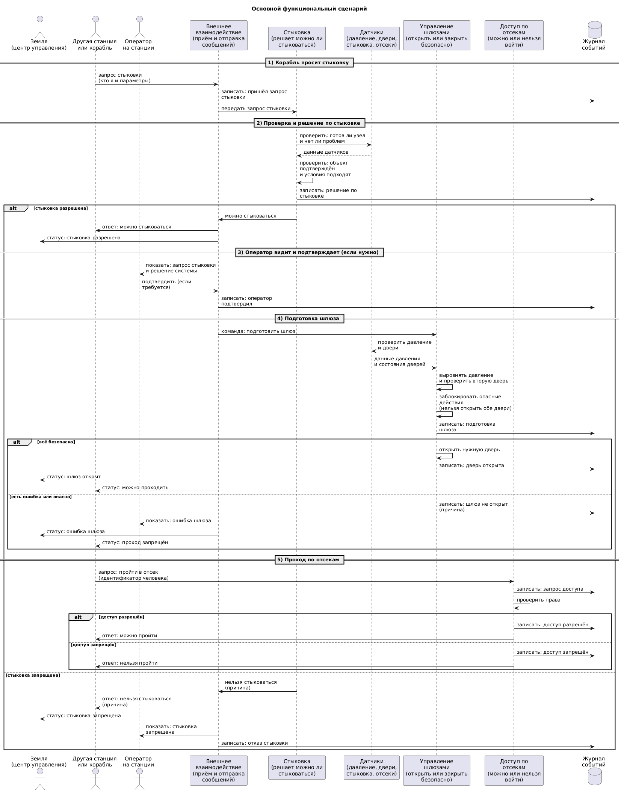
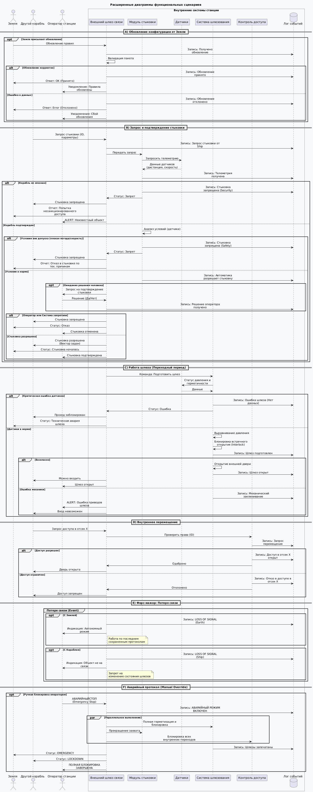

# Космическая станция "Севастополь" (Чужой)  

Система управления шлюзами и доступом станции а также взаимодействие с землей и другими станциями 

## Краткое описание проектируемой системы

Мы разрабатываем систему управления шлюзами и доступом по отсекам космического комплекса "Севастополь", получающую команды из центральной системы управления станцией и обеспечивающую безопасные режимы работы. Система также передаёт статусы и результаты самодиагностики обратно в центральную систему и оператору.Вместе с этим также обеспечивается внешние взаимодействия с землей и другими станциями.

## Ключевые ценности, ущербы, неприемлемые события
| Ценность | Негативное событие | Оценка ущерба | Комментарий |
|---|---|---|---|
| люди (экипаж или пассажиры) | шлюз открылся, когда давление не выровнено, или когда уже открыта вторая дверь шлюза, следовательно начинается разгерметизация | высокий | Это напрямую угрожает жизни людей: воздух уходит быстро, времени на исправление почти нет. |
| безопасность станции | человек без прав попал в важный отсек (например, с энергией, связью или медблоком), поэтому он может вмешаться в работу станции | высокий | Из-за этого можно отключить важные системы или вызвать аварию, последствия затронут всю станцию. |
| стыковка с другими станциями или кораблями | стыковку разрешили объекту, который не подтверждён, или параметры стыковки подменили, следовательно стыковка может пройти неправильно | высокий | Ошибка стыковки может повредить узел стыковки и привести к аварии, а также открыть путь для проникновения. |
| взаимодействие с другими станциями | между станциями передали неправильные команды или статусы, поэтому станция принимает неверные решения (например, открывает или закрывает не то) | высокий | Неверные решения могут привести к опасным действиям и ухудшить реакцию на аварии. |
| связь с Землёй (управление) | с Земли пришла неверная команда или изменили правила доступа, следовательно станция может перейти в неправильный режим | высокий | Земля может влиять сразу на многое, поэтому одна ошибка или взлом дают большие последствия. |
| непрерывность управления | связь с Землёй или другими станциями пропала, поэтому система “зависла” или начала делать неправильные действия “по умолчанию” | высокий | В опасной ситуации нельзя терять управление: это мешает спасению и может привести к аварии. |
| правдивость данных (показания датчиков) | датчики показали неверные данные о давлении или дверях, следовательно система принимает неправильные решения | высокий | Если система верит неправильным данным, она может сделать физически опасное действие. |
| ресурсы станции (энергия, воздух, жизнеобеспечение) | из-за сбоя перекрылись важные маршруты или отсеки, поэтому людям сложно безопасно перемещаться и действовать | средний | Это серьёзно, но обычно есть время включить запасные варианты и действовать по аварийным правилам. |
| разбор происшествий (кто что сделал) | записи событий отсутствуют или их подменили, поэтому нельзя понять, кто и что сделал и почему | средний | Это не ломает станцию сразу, но потом ошибки повторяются, а виновные действия сложно найти. |
| секретность данных (внешняя связь) | наружу утекла информация о режимах, доступах или происшествиях, следовательно другим проще подготовить атаку | средний | Обычно это не приводит к аварии сразу, но повышает риск будущих проблем и атак. ||

## Контекст
1)Станция получает команды и отправляет данные внутри станции, на Землю и другим станциям или кораблям.

2)Оператор на станции задаёт режимы и принимает решения в экстренных ситуациях через центральный компьютер.

3)Наша система управляет отсеками и шлюзами: открывает и закрывает двери, включает нужные режимы и проверяет, что действие безопасно.

4)Датчики сообщают, закрыты ли двери, какое давление и готова ли стыковка.

5)Земля и другие станции или корабли могут присылать команды и запросы, но они могут ошибаться, поэтому их нельзя выполнять “вслепую”.

6)Если связь пропадает или данные странные, система должна перейти в безопасный режим и не делать опасных действий.

7)Все важные действия должны записываться, чтобы потом можно было понять, что произошло.

## Основной сценарии

## Высокоуровневая архитектура

## Описание подсистем

| Название | Назначение |
|---|---|
| 1. Внешнее взаимодействие (связь и фильтрация) | Отвечает за обмен данными с Землёй, кораблями и другими станциями. Принимает внешние запросы на стыковку и проход, фильтрует сообщения, передаёт допустимые команды во внутренние подсистемы и отправляет наружу статусы и ошибки. |
| 2. Подсистема стыковки | Отвечает за обработку запросов на стыковку, проверку стыковочного узла и подтверждение готовности шлюза. Передаёт результат проверки в подсистему управления шлюзами и фиксирует события в журнале. |
| 3. Управление шлюзами | Отвечает за управление шлюзами станции: открытие и закрытие дверей, выполнение команд после подтверждённой стыковки, а также контроль безопасного выполнения операций с учётом данных о давлении. |
| 4. Контроль доступа по отсекам | Отвечает за проверку запросов на проход между отсеками станции. Контролирует доступ, взаимодействует с подсистемой датчиков для проверки состояния дверей и передаёт результаты в систему. |
| 5. Подсистема датчиков (давление, замки, статус) | Отвечает за сбор и передачу данных о состоянии станции: давление, состояние замков, дверей и текущий статус узлов. Используется для проверки безопасности при стыковке, проходе и работе шлюзов. |
| 6. Журнал событий (история и ошибки) | Отвечает за регистрацию всех важных действий системы: команд, операций, состояний и ошибок. Хранит историю событий и передаёт информацию оператору. |
| 7. Экран оператора (интерфейс управления) | Отвечает за взаимодействие оператора с системой. Позволяет просматривать состояние станции, журнал событий, а также отправлять управляющие и аварийные команды. |

## Внешние участники системы

| Участник | Роль |
|---|---|
| Земля (ЦУП) | Получает статусы и ошибки от станции, а также передаёт внешние команды. |
| Корабль / Станция | Отправляет запросы на стыковку и проход. |
| Оператор | Осуществляет контроль системы и подаёт команды через экран оператора. |

## Правило безопасности

При аномальных данных от датчиков или потере связи все подсистемы переходят в защищённый режим, при котором опасные операции блокируются до восстановления безопасного состояния системы.
---
## Расширенные диаграммы функциональных сценариев

# Цели безопасности

1. Система при любых обстоятельствах должна выполнять команды только от легитимных пользователей.
2. Система при любых обстоятельствах должна оставаться доступной.
3. Система при любых обстоятельствах должна выполнять только заданные команды.
4. Станция при любых обстоятельствах должна оставаться безопасной для пребывания людей.
5. Станция при любых обстоятельствах должна выполнять команды системы.
6. Станция при любых обстоятельствах должна оставаться на связи с Землёй.
7. Станция при любых обстоятельствах должна иметь возможность стыковаться с другими кораблями.
8. Станция при любых обстоятельствах должна иметь возможность отправить сигнал SOS другим кораблям.
9. Станция при любых обстоятельствах должна иметь возможность получать сигналы бедствия от других кораблей.
10. Станция при любых обстоятельствах должна иметь информацию о приближении других кораблей.
11. Земля при любых обстоятельствах должна оставаться на связи со станцией.
12. Земля при любых обстоятельствах должна отправлять только легитимные команды и сообщения.

# Предположения безопасности

1. Аутентифицированные сотрудники благонадёжны и обладают необходимой квалификацией.
2. Механизмы станции работают исправно.
3. Система управления станцией является доверенной.
4. Система получения команд с Земли является доверенной.
5. Никто из сотрудников станции не имеет заразных заболеваний.
6. На станции отсутствует огнестрельное оружие.
7. Все материалы станции качественные и не подвержены дефектам.
