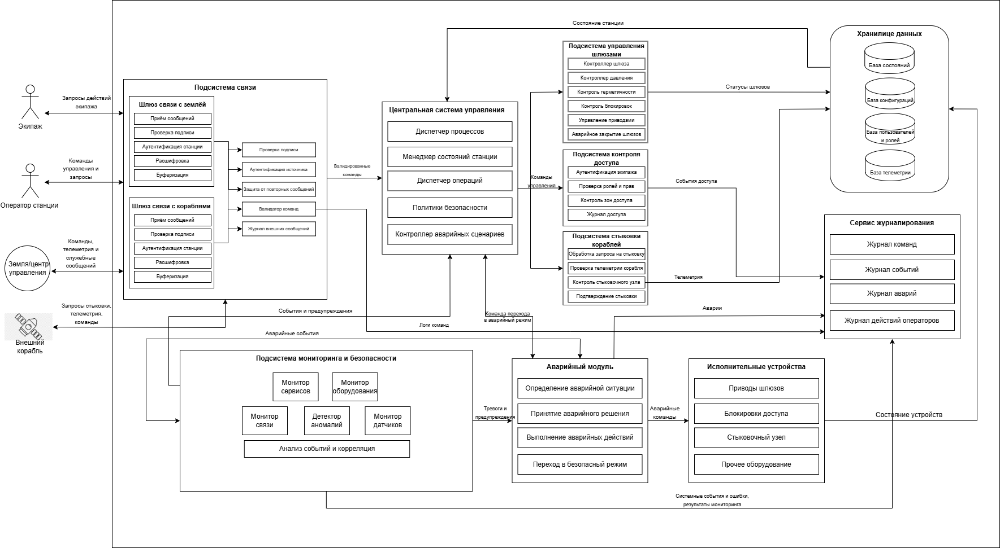

# Космическая станция "Севастополь" (Чужой)  

Система управления шлюзами и доступом станции а также взаимодействие с землей и другими станциями 

## Краткое описание проектируемой системы

Разрабатывается система управления критической инфраструктурой космической станции «Севастополь» — автономного орбитального комплекса, предназначенного для длительного пребывания экипажа, приёма кораблей, хранения грузов и проведения технических операций.
Система обеспечивает безопасное управление внутренними и внешними шлюзами станции, контроль перемещения персонала по отсекам, управление доступом в критические зоны, координацию стыковки прибывающих кораблей, а также обмен данными с Землёй и внешними судами.
Система получает команды от центрального вычислительного ядра станции, проверяет их допустимость, исполняет разрешённые сценарии и передаёт телеметрию, журналы событий и результаты самодиагностики оператору и в центральную систему.

---
## Ценности, ущербы и неприемлемые события

| Ценность | Негативное событие | Оценка ущерба | Комментарий |
|---|---|---|---|
| Экипаж станции | Ошибочное открытие шлюза привело к гибели или травмам персонала | Высокий | Прямой риск жизни людей |
| Герметичность отсеков | Разгерметизация жилого или технического модуля | Критический | Возможна потеря сектора станции |
| Шлюзовая система | Одновременное открытие внутренних и внешних створок шлюза | Критический | Немедленная аварийная ситуация |
| Доступ в отсеки | Получен доступ в командный или технический сектор | Высокий | Возможен саботаж управления |
| Стыковочный узел | Ошибка управления вызвала повреждение прибывающего корабля | Высокий | Потеря груза или транспорта |
| Связь с Землёй | Потеря канала связи и невозможность передачи телеметрии | Средний | Переход в автономный режим |
| Центральная система управления | Нарушена целостность команд управления шлюзами | Критический | Потеря контроля над инфраструктурой |
| Журналы событий | Удалены или изменены записи инцидентов | Средний | Усложнение расследования |
| Эвакуационные маршруты | Заблокирован доступ к спасательным капсулам | Критический | Невозможность эвакуации |

## Известные ограничения и вводные условия

По условиям проекта система должна быть реализована с использованием микросервисной архитектуры. Для обмена данными между сервисами должен использоваться брокер сообщений и асинхронная модель взаимодействия. Использование сторонних API и внешних облачных сервисов не допускается из-за требований конфиденциальности данных станции. Система должна обеспечивать работу как в штатном режиме, так и при нестабильных каналах связи с Землёй и внешними кораблями.

## Базовая архитектура системы

## Базовые сценарии

## Расширенная архитектура системы

## Контекст работы системы

Система функционирует в составе космической станции «Севастополь» и взаимодействует с центральной системой управления станции, экипажем, внешними кораблями и наземным центром управления.Во внешнем контуре система обменивается телеметрией и служебными сообщениями с Землёй, транспортными кораблями и другими станциями по каналам связи с возможными задержками и потерями пакетов.При отказах оборудования, потере связи, попытках несанкционированного доступа или обнаружении опасного состояния система обязана сохранять работоспособность критических функций.

---
## Расширенные функциональные сценарии

## Компоненты системы

| Компонент | Назначение |
|---|---|
| Центральная система управления станции | Формирует команды для подсистем станции, получает телеметрию и статусы выполнения операций |
| Сервис управления шлюзами | Управляет внутренними и внешними шлюзами, проверяет допустимость открытия и закрытия створок |
| Сервис управления доступом | Контролирует проход между отсеками и доступ в критические зоны |
| Сервис контроля отсеков | Получает данные о давлении, герметичности, температуре и аварийных событиях |
| Сервис стыковки кораблей | Обрабатывает запросы на стыковку и управляет стыковочными узлами |
| Интерфейс связи с Землёй | Обеспечивает обмен командами, телеметрией и отчетами с наземным центром |
| Интерфейс связи с кораблями | Обеспечивает обмен служебными сообщениями с внешними кораблями |
| База данных состояний | Хранит статусы шлюзов, отсеков, пользователей, кораблей и результаты операций |
| Сервис журналирования | Сохраняет события системы, действия операторов и аварийные сообщения |
| Сервис мониторинга | Контролирует состояние сервисов, оборудования, связи и питания |
| Локальный операторский терминал | Позволяет экипажу выполнять разрешённые операции и получать информацию о состоянии системы |
| Аварийный модуль | Переводит систему в безопасное состояние при отказах, потере связи или опасных условиях |

## Цели безопасности

1. При любых обстоятельствах команды на управление шлюзами, гермодверями и доступом принимаются только от авторизованных источников.
2. При любых обстоятельствах внешние команды от Земли, кораблей и других станций выполняются только после проверки подлинности и допустимости.
3. При любых обстоятельствах открытие шлюзов выполняется только при безопасных параметрах давления, герметичности и готовности отсека.
4. При любых обстоятельствах доступ в командные, технические и критические отсеки получают только пользователи с необходимыми правами.
5. При любых обстоятельствах при аварии, отказе оборудования или потере связи система переходит в безопасный режим работы.
6. При любых обстоятельствах данные о состоянии шлюзов, отсеков, стыковке и операциях сохраняют целостность и не подменяются.
7. При любых обстоятельствах все критические действия операторов, сервисов и автоматических модулей журналируются.
8. При любых обстоятельствах стыковка внешнего корабля выполняется только после подтверждения состояния стыковочного узла и разрешения станции.
9. При любых обстоятельствах экипаж сохраняет доступ к маршрутам эвакуации и аварийным средствам спасения.
10. При любых обстоятельствах система сохраняет работоспособность критических функций либо переходит в контролируемое безопасное состояние.

## Предположения безопасности

1. Станция обменивается командами и телеметрией с Землёй, кораблями и другими станциями по каналам связи с задержками и возможными сбоями.
2. Аутентифицированный персонал станции считается благонадёжным и обладает необходимой квалификацией для работы с системой.
3. Обеспечена физическая безопасность серверов, управляющего оборудования, терминалов и сетевых устройств станции.
---

## Матрица нарушений целей безопасности

| Атакованный компонент | ЦБ1 | ЦБ2 | ЦБ3 | ЦБ4 | ЦБ5 | ЦБ6 | ЦБ7 | Кол-во нарушений |
|---|---|---|---|---|---|---|---|---|
| Интерфейс связи с Землёй | 🔴 | 🔴 | 🔴 | 🟢 | 🟢 | 🔴 | 🔴 | 5/7 |
| Центральная система управления станции | 🔴 | 🔴 | 🔴 | 🟢 | 🔴 | 🔴 | 🔴 | 6/7 |
| Сервис управления шлюзами | 🔴 | 🟢 | 🔴 | 🟢 | 🔴 | 🔴 | 🔴 | 5/7 |
| Сервис управления доступом | 🔴 | 🟢 | 🟢 | 🔴 | 🔴 | 🔴 | 🔴 | 5/7 |
| Сервис контроля отсеков | 🟢 | 🟢 | 🔴 | 🟢 | 🔴 | 🔴 | 🔴 | 4/7 |
| Сервис стыковки кораблей | 🔴 | 🔴 | 🔴 | 🟢 | 🔴 | 🔴 | 🔴 | 6/7 |
| Интерфейс связи с кораблями | 🔴 | 🔴 | 🔴 | 🟢 | 🔴 | 🔴 | 🔴 | 6/7 |
| База данных состояний | 🟢 | 🟢 | 🔴 | 🔴 | 🔴 | 🔴 | 🔴 | 5/7 |
| Сервис журналирования | 🟢 | 🟢 | 🟢 | 🟢 | 🟢 | 🔴 | 🔴 | 2/7 |
| Сервис мониторинга | 🟢 | 🟢 | 🔴 | 🟢 | 🔴 | 🔴 | 🔴 | 4/7 |
| Локальный операторский терминал | 🔴 | 🟢 | 🟢 | 🔴 | 🔴 | 🔴 | 🔴 | 5/7 |
| Аварийный модуль | 🔴 | 🟢 | 🔴 | 🔴 | 🔴 | 🔴 | 🔴 | 6/7 |

🟢 — цель безопасности не нарушена  
🔴 — цель безопасности нарушена

---

## Негативные сценарии нарушения целей безопасности

| Название сценария | Описание |
|---|---|
| НС-1 | Интерфейс связи с Землёй получил корректную команду, но изменил её содержимое и передал ложные параметры открытия шлюза. Нарушаются ЦБ1, ЦБ2, ЦБ3. |
| НС-2 | Интерфейс связи с кораблями передал поддельный запрос на стыковку от внешнего судна. Нарушаются ЦБ2, ЦБ8. |
| НС-3 | Центральная система управления отправила команду открытия шлюза без проверки давления в отсеке. Нарушаются ЦБ1, ЦБ3. |
| НС-4 | Сервис управления шлюзами открыл внутреннюю и внешнюю створку одновременно. Нарушаются ЦБ3, ЦБ5. |
| НС-5 | Сервис управления доступом предоставил доступ в реакторный сектор пользователю без полномочий. Нарушается ЦБ4. |
| НС-6 | Сервис контроля отсеков передал ложные данные о нормальном давлении при разгерметизации. Нарушаются ЦБ3, ЦБ5. |
| НС-7 | Сервис стыковки кораблей подтвердил соединение при неисправном стыковочном узле. Нарушаются ЦБ3, ЦБ8. |
| НС-8 | Центральная система управления подменила команду безопасного закрытия шлюза на команду открытия. Нарушаются ЦБ1, ЦБ3, ЦБ6. |
| НС-9 | База данных состояний содержит ложный статус шлюза «закрыт», хотя шлюз открыт. Нарушаются ЦБ3, ЦБ6. |
| НС-10 | Сервис журналирования не сохранил запись об аварийном открытии шлюза. Нарушается ЦБ7. |
| НС-11 | Сервис мониторинга не сообщил об отказе питания шлюзового контура. Нарушается ЦБ5. |
| НС-12 | Локальный операторский терминал отправил несанкционированную команду разблокировки сектора. Нарушаются ЦБ1, ЦБ4. |
| НС-13 | Аварийный модуль не перевёл систему в безопасный режим при разгерметизации. Нарушаются ЦБ5, ЦБ10. |
| НС-14 | При пожаре система заблокировала доступ экипажа к спасательным капсулам. Нарушается ЦБ9. |
| НС-15 | Интерфейс связи с Землёй повторно отправил устаревшую команду открытия шлюза после отмены операции. Нарушаются ЦБ1, ЦБ2, ЦБ3. |
| НС-16 | Интерфейс связи с кораблями исказил телеметрию прибывающего корабля и скрыл повреждение стыковочного узла. Нарушаются ЦБ3, ЦБ8. |
| НС-17 | Центральная система управления отправила одновременно взаимоисключающие команды открытия и блокировки шлюза. Нарушаются ЦБ1, ЦБ5. |
| НС-18 | Центральная система управления задержала доставку аварийной команды закрытия шлюза до момента разгерметизации. Нарушаются ЦБ5, ЦБ10. |
| НС-19 | База данных состояний потеряла записи о правах доступа экипажа, после чего критический сектор стал доступен без проверки. Нарушаются ЦБ4, ЦБ6. |
| НС-20 | Сервис мониторинга сформировал ложный сигнал тревоги и инициировал необоснованный переход станции в безопасный режим. Нарушаются ЦБ5, ЦБ10. |

---

## Диаграммы негативных сценариев

### НС-1. Интерфейс связи с Землёй изменяет команду управления шлюзом

### НС-2. Интерфейс связи с кораблями передаёт поддельный запрос на стыковку

### НС-3. Центральная система управления отправляет команду открытия без проверки давления

### НС-4. Сервис управления шлюзами открывает внутреннюю и внешнюю створку одновременно

### НС-5. Сервис управления доступом выдаёт доступ без полномочий

### НС-6. Сервис контроля отсеков передаёт ложные данные

### НС-7. Сервис стыковки подтверждает неисправный узел

### НС-8. Центральная система управления подменила команду безопасного закрытия шлюза на команду открытия.

### НС-9. База данных содержит ложный статус шлюза

### НС-10. Сервис журналирования не сохраняет запись инцидента

### НС-11. Сервис мониторинга не сообщает об отказе питания шлюзового контура

### НС-12. Локальный операторский терминал отправляет несанкционированную команду

### НС-13. Аварийный модуль не переводит систему в безопасный режим

### НС-14. При пожаре блокируется доступ экипажа к спасательным капсулам

### НС-15. Интерфейс связи с Землёй повторно отправляет устаревшую команду

### НС-16. Интерфейс связи с кораблями искажает телеметрию корабля

### НС-17. Центральная система отправляет взаимоисключающие команды

### НС-18. Центральная система управления задержала доставку аварийной команды закрытия шлюза до момента разгерметизации.

### НС-19. База данных потеряла записи о правах доступа

### НС-20. Сервис мониторинга формирует ложный сигнал тревоги

# Переработанная архитектура системы управления станции "Севастополь"

## Описание декомпозиции
Для обеспечения кибериммунитета системы и защиты целей безопасности (ЦБ1–ЦБ20) исходные монолитные и сложные сервисы были подвергнуты декомпозиции. Критические функции проверки параметров, криптографии и разграничения прав вынесены из недоверенных компонентов (таких как Центральная система управления и интерфейсы связи) в изолированные доверенные модули минимального размера. Теперь, даже если ЦСУ или внешние интерфейсы будут полностью скомпрометированы, новые доверенные прослойки заблокируют выполнение опасных или неавторизованных команд.

| Компонент | Функции |
| :--- | :--- |
| **Подсистема связи** | Приём сообщений Расшифровка Буферизация |
| **Проверка подписи и Аутентификация** | Проверка подписи Аутентификация источника Защита от повторных сообщений |
| **Валидатор команд** | Валидатор команд Журнал внешних сообщений |
| **Центральная система управления (ЦСУ)** | Диспетчер процессов Менеджер состояний станции Диспетчер операций Политики безопасности Контроллер аварийных сценариев |
| **Подсистема управления шлюзами** | Контроллер шлюза Контроллер давления Контроль герметичности Контроль блокировок Управление приводами Аварийное закрытие шлюзов |
| **Подсистема контроля доступа** | Аутентификация экипажа Проверка ролей и прав Контроль зон доступа Журнал доступа |
| **Подсистема стыковки кораблей** | Обработка запроса на стыковку Проверка телеметрии корабля Контроль стыковочного узла Подтверждение стыковки |
| **Подсистема мониторинга и безопасности** | Монитор сервисов Монитор оборудования Монитор связи Детектор аномалий Монитор датчиков Анализ событий и корреляция |
| **Аварийный модуль** | Определение аварийной ситуации Принятие аварийного решения Выполнение аварийных действий Переход в безопасный режим |
| **Хранилище данных** | База состояний База конфигураций База пользователей и ролей База телеметрии |
| **Сервис журналирования (Логирование)** | Журнал команд Журнал событий Журнал аварий Журнал действий операторов |

## Таблица новых компонентов

| Компонент | Уровень доверия | Описание | Комментарий |
| :--- | :--- | :--- | :--- |
| **Приём сообщений** | Недоверенный | Входная точка для приёма сырых пакетов из внешних каналов связи. | Может принимать вредоносные или искаженные данные. |
| **Расшифровка** | Недоверенный | Первичный парсинг и распаковка структуры входящих пакетов. | Код разбора пакетов сложен и потенциально уязвим к атакам на переполнение буфера. |
| **Буферизация** | Недоверенный | Временное хранение входящих очередей сообщений перед обработкой. | Не влияет на безопасность напрямую, изолирует сетевой шторм. |
| **Проверка подписи** | Повышающий доверие | Проверка цифровой подписи (ЦП) внешних команд Земли и кораблей. | Гарантирует, что команды не были изменены злоумышленником в канале связи. |
| **Аутентификация источника** | Доверенный | Проверка подлинности и идентификатора отправителя сообщения. | Исключает выполнение команд от ложных или неавторизованных объектов. |
| **Защита от повторных сообщений** | Доверенный | Фильтрация пакетов по временным меткам и уникальным ID (Anti-Replay). | Предотвращает атаки методом повтора ранее перехваченных легитимных команд. |
| **Валидатор команд** | Доверенный | Контроль синтаксиса и допустимости кодов операций перед отправкой в ЦСУ. | Отсекает заведомо некорректные или недопустимые инструкции на ранней стадии. |
| **Журнал внешних сообщений** | Повышающий доверие | Локальное кэширование и фиксация всех входящих пакетов. | Необходим для первичного аудита входящего трафика. |
| **Диспетчер процессов** | Недоверенный | Высокоуровневое планирование задач и потоков внутри ЦСУ. | Падение диспетчера не должно приводить к отказу систем защиты шлюзов. |
| **Менеджер состояний станции** | Недоверенный | Агрегация общей логической модели работы систем станции. | Оперирует обобщенными данными, не управляет приводами напрямую. |
| **Диспетчер операций** | Недоверенный | Распределение бизнес-команд по функциональным подсистемам. | Находится в недоверенной зоне ЦСУ, его команды всегда перепроверяются. |
| **Политики безопасности** | Недоверенный | Логический модуль сопоставления запрашиваемых ЦСУ действий. | Перенесена в ЦСУ для гибкости, но дублируется доверенными шлюзовыми фильтрами. |
| **Контроллер аварийных сценариев** | Недоверенный | Программный алгоритм ЦСУ для штатной ликвидации последствий сбоев. | Работает в штатном режиме; при полной компрометации ЦСУ подменяется Аварийным модулем. |
| **Контроллер шлюза** | Доверенный | Логический автомат, координирующий последовательность фаз шлюзования. | Следит за тем, чтобы фазы (нагнетание, выравнивание, открытие) шли строго по порядку. |
| **Контроллер давления** | Доверенный | Модуль верификации показателей датчиков давления в камере и отсеках. | Блокирует открытие дверей, если зафиксирован опасный перепад давления. |
| **Контроль герметичности** | Доверенный | Непрерывный анализ стабильности давления в смежных жилых зонах. | Позволяет вовремя обнаружить утечку воздуха и запереть контур. |
| **Контроль блокировок** | Доверенный | Аппаратный интерлок, исключающий одновременное открытие двух створок шлюза. | Прямая защита от критического события — полной разгерметизации отсека в космос. |
| **Управление приводами** | Доверенный | Низкоуровневый контроллер выдачи сигналов на реле и двигатели дверей. | Гарантирует выполнение только тех физических действий, которые одобрены защитой. |
| **Аварийное закрытие шлюзов** | Доверенный | Модуль принудительного и быстрого задраивания переборок. | Срабатывает автоматически при обнаружении падения давления или по сигналу тревоги. |
| **Аутентификация экипажа** | Доверенный | Проверка подлинности идентификаторов персонала на локальных терминалах. | Исключает использование чужих или поддельных карт доступа внутри станции. |
| **Проверка ролей и прав** | Доверенный | Сверение полномочий оператора или члена экипажа с матрицей доступа. | Предотвращает несанкционированный доступ персонала в критические отсеки. |
| **Контроль зон доступа** | Доверенный | Физическое управление замками дверей внутренних переборок. | Разграничивает перемещение людей по станционным отсекам. |
| **Журнал доступа** | Повышающий доверие | Фиксация всех успешных и заблокированных попыток прохода. | Предотвращает скрытное перемещение нарушителя по отсекам. |
| **Обработка запроса на стыковку** | Недоверенный | Программный разбор параметров сближения космических судов. | Сложные математические расчеты траектории вынесены в недоверенную зону. |
| **Проверка телеметрии корабля** | Повышающий доверие | Фильтрация и валидация данных, передаваемых датчиками приближающегося судна. | Исключает передачу ложных параметров скорости и угла захода на стыковку. |
| **Контроль стыковочного узла** | Доверенный | Проверка физической готовности, замков и гермостыков захвата. | Блокирует стыковку, если узел деформирован или неисправен. |
| **Подтверждение стыковки** | Доверенный | Финальная фиксация жесткого захвата и герметизации перехода. | Дает разрешение на открытие люка между кораблем и станцией. |
| **Монитор сервисов** | Повышающий доверие | Контроль запущенных процессов и обнаружение зависаний ПО. | Позволяет вовремя перезапустить упавший недоверенный сервис. |
| **Монитор оборудования** | Повышающий доверие | Опрос аппаратных статусов плат, памяти и вычислительных узлов. | Выявляет аппаратные отказы до того, как они повлекут системную аварию. |
| **Монитор связи** | Повышающий доверие | Контроль наличия и качества сигналов с Землей и кораблями. | Фиксирует потерю связи для перевода систем в автономный режим. |
| **Детектор аномалий** | Повышающий доверие | Поиск отклонений в частоте команд и поведении микросервисов. | Помогает обнаружить признаки начавшейся хакерской атаки внутри сети. |
| **Монитор датчиков** | Доверенный | Контроль целостности линий связи с физическими сенсорами станции. | Обнаруживает обрыв или умышленное отключение датчиков давления/газа. |
| **Анализ событий и корреляция** | Повышающий доверие | Логическое связывание различных логов для выявления сложных угроз. | Превращает тысячи мелких логов в понятные алармы для Аварийного модуля. |
| **Определение аварийной ситуации** | Доверенный | Независимый логический вывод о наличии критической угрозы на станции. | Работает автономно от ЦСУ на основе прямых данных от мониторинга. |
| **Принятие аварийного решения** | Доверенный | Выбор жестко зашитого сценария спасения (например, изоляция отсека). | Исключает задержки или ошибки, свойственные человеку или сложной ЦСУ. |
| **Выполнение аварийных действий** | Доверенный | Формирование высокоприоритетных команд для исполнительных устройств. | Эти команды имеют абсолютный приоритет над любыми командами от ЦСУ. |
| **Переход в безопасный режим** | Доверенный | Перевод всей шлюзовой автоматики в режим энергосбережения и блокировки. | Обеспечивает живучесть станции при глубоком системном кризисе. |
| **База состояний** | Доверенный | Хранение текущих оперативных параметров затворов и датчиков. | Должна быть защищена от подмены, чтобы система видела реальную картину. |
| **База конфигураций** | Доверенный | Хранение констант системы (критические пороги давления, тайминги). | Защищена от изменения, чтобы хакер не мог выставить опасные пороги триггеров. |
| **База пользователей и ролей** | Доверенный | Хранилище криптографических хэшей прав и карт экипажа. | Требует строгой изоляции для предотвращения утечки или подмены прав. |
| **База телеметрии** | Недоверенный | Архив исторических данных систем для отправки отчетов на Землю. | Взлом или потеря архива не влияет на текущую безопасность станции. |
| **Журнал команд** | Доверенный | Некорректируемая фиксация всех прошедших по системе директив. | Позволяет восстановить хронологию управления при разборе инцидентов. |
| **Журнал событий** | Доверенный | Запись системных уведомлений, фактов включения/выключения модулей. | Обеспечивает прозрачность работы операционной системы станции. |
| **Журнал аварий** | Доверенный | Изолированное хранилище логов о разгерметизациях и отказах. | Хакер не сможет скрыть факт аварии или саботажа, потерев эти логи. |
| **Журнал действий операторов** | Доверенный | Фиксация ввода команд конкретными людьми на терминалах. | Обеспечивает персональную ответственность членов экипажа. |

## Таблица доверенных компонентов

| Компонент | Уровень доверия | Обоснование | Комментарий |
|---|---|---|---|
| Проверка подписи | Повышающий доверие | Соблюдение ЦБ1, ЦБ2 | Проверяет подлинность внешних команд |
| Аутентификация | Доверенный | Соблюдение ЦБ1, ЦБ2, ЦБ4 | Подтверждает источник команд и запросов |
| Валидатор команд | Доверенный | Соблюдение ЦБ1, ЦБ2, ЦБ3 | Проверяет допустимость выполнения команд |
| Контроль давления | Доверенный | Соблюдение ЦБ3, ЦБ5 | Проверяет безопасность параметров шлюзования |
| Контроль герметичности | Доверенный | Соблюдение ЦБ3, ЦБ5 | Контролирует герметичность отсеков станции |
| Контроллер блокировок | Доверенный | Соблюдение ЦБ3, ЦБ5 | Исключает опасное состояние шлюзовой системы |
| Аварийное закрытие | Доверенный | Соблюдение ЦБ5, ЦБ10 | Переводит систему в безопасное состояние |
| Проверка ролей | Доверенный | Соблюдение ЦБ1, ЦБ4 | Ограничивает доступ к операциям станции |
| Контроль зон доступа | Доверенный | Соблюдение ЦБ4, ЦБ9 | Ограничивает доступ в критические зоны |
| Проверка телеметрии | Повышающий доверие | Соблюдение ЦБ3, ЦБ8 | Проверяет корректность данных корабля |
| Контроль стыковочного узла | Доверенный | Соблюдение ЦБ3, ЦБ8 | Контролирует готовность стыковочного оборудования |
| Детектор аварий | Повышающий доверие | Соблюдение ЦБ5, ЦБ10 | Выявляет аварийные состояния станции |
| Анализ событий | Повышающий доверие | Соблюдение ЦБ6, ЦБ7 | Анализирует события и системные ошибки |
| Журнал внешних команд | Повышающий доверие | Соблюдение ЦБ7 | Используется для аудита действий системы |
| Внешний корабль | Недоверенный | Внешний источник данных | Может передавать некорректные команды и телеметрию |
| Канал связи | Недоверенный | Внешняя среда передачи данных | Подвержен перехвату и модификации данных |
| Операторский терминал | Недоверенный | Возможна компрометация интерфейса | Требует дополнительной проверки команд |

## Качественная оценка доменов

| Компонент | Уровень доверия | Оценка | Кол-во входящих интерфейсов | Комментарий |
| :--- | :--- | :--- | :---: | :--- |
| **Подсистема связи** | Недоверенный | CXL | 4 | Объединяет функции приема, буферизации и первичной обработки пакетов. Из-за высокой сложности сетевых протоколов вынесена в недоверенную зону для удешевления разработки. |
| **Центральная система управления (ЦСУ)** | Недоверенный | CXL | 4 | Координирующее ядро бизнес-логики станции. Содержит избыточный объем сложного программного кода, поэтому полностью изолировано от критических функций безопасности. |
| **Подсистема управления шлюзами** | Доверенный | MM | 1 | Изолированный домен автоматики, отвечающий за расчет циклов шлюзования и сопоставление физических параметров отсеков. |
| **Подсистема контроля доступа** | Доверенный | MM | 1 | Программный модуль валидации прав и ролей экипажа при перемещении по отсекам станции. Работает автономно от ЦСУ. |
| **Подсистема стыковки кораблей** | Повышающий доверие | MM | 1 | Отвечает за логику сближения и захвата прибывающих космических аппаратов по командам от ЦСУ. |
| **Подсистема мониторинга и безопасности** | Повышающий доверие | CXL | 1 | Сложный комплекс анализа системных событий, телеметрии, сбора данных от датчиков и выявления аномалий. |
| **Аварийный модуль** | Доверенный | MM | 2 | Критический компонент, принимающий прямые сигналы о разгерметизации и переводящий станцию в безопасный режим при скомпрометированной ЦСУ. |
| **Исполнительные устройства (Приводы дверей)** | Доверенный | SS | 1 | Конечный физический уровень (актуаторы). Принимает только финальный проверенный сигнал на открытие/закрытие створок шлюза. |
| **Хранилище данных (База состояний)** | Доверенный | CXL | 3 | Изолированная СУБД для хранения конфигураций, политик и статусов. Защищена Валидатором данных состояния на входе. |
| **Сервис журналирования (Логирование)** | Доверенный | SS | 4 | Микромодуль гарантированной фиксации системных событий в режиме WORM (запись без возможности удаления для последующего аудита). |
