# Космическая станция "Севастополь" (Чужой)  

Система управления шлюзами и доступом станции а также взаимодействие с землей и другими станциями 


## Краткое описание проектируемой системы

Разрабатывается система управления критической инфраструктурой космической станции «Севастополь» — автономного орбитального комплекса, предназначенного для длительного пребывания экипажа, приёма кораблей, хранения грузов и проведения технических операций.
Система обеспечивает безопасное управление внутренними и внешними шлюзами станции, контроль перемещения персонала по отсекам, управление доступом в критические зоны, координацию стыковки прибывающих кораблей, а также обмен данными с Землёй и внешними судами.
Система получает команды от центрального вычислительного ядра станции, проверяет их допустимость, исполняет разрешённые сценарии и передаёт телеметрию, журналы событий и результаты самодиагностики оператору и в центральную систему.

---
## Ценности, ущербы и неприемлемые события

| Ценность | Негативное событие | Оценка ущерба | Комментарий |
|---|---|---|---|
| Экипаж станции | Ошибочное открытие шлюза привело к гибели или травмам персонала | Высокий | Прямой риск жизни людей |
| Герметичность отсеков | Разгерметизация жилого или технического модуля | Критический | Возможна потеря сектора станции |
| Шлюзовая система | Одновременное открытие внутренних и внешних створок шлюза | Критический | Немедленная аварийная ситуация |
| Доступ в отсеки | Получен доступ в командный или технический сектор | Высокий | Возможен саботаж управления |
| Стыковочный узел | Ошибка управления вызвала повреждение прибывающего корабля | Высокий | Потеря груза или транспорта |
| Связь с Землёй | Потеря канала связи и невозможность передачи телеметрии | Средний | Переход в автономный режим |
| Центральная система управления | Нарушена целостность команд управления шлюзами | Критический | Потеря контроля над инфраструктурой |
| Журналы событий | Удалены или изменены записи инцидентов | Средний | Усложнение расследования |
| Эвакуационные маршруты | Заблокирован доступ к спасательным капсулам | Критический | Невозможность эвакуации |

## Известные ограничения и вводные условия

По условиям проекта система должна быть реализована с использованием микросервисной архитектуры. Для обмена данными между сервисами должен использоваться брокер сообщений и асинхронная модель взаимодействия. Использование сторонних API и внешних облачных сервисов не допускается из-за требований конфиденциальности данных станции. Система должна обеспечивать работу как в штатном режиме, так и при нестабильных каналах связи с Землёй и внешними кораблями.

## Базовая архитектура системы


## Базовые сценарии


## Расширенная архитектура системы


## Контекст работы системы

Система функционирует в составе космической станции «Севастополь» и взаимодействует с центральной системой управления станции, экипажем, внешними кораблями и наземным центром управления.Во внешнем контуре система обменивается телеметрией и служебными сообщениями с Землёй, транспортными кораблями и другими станциями по каналам связи с возможными задержками и потерями пакетов.При отказах оборудования, потере связи, попытках несанкционированного доступа или обнаружении опасного состояния система обязана сохранять работоспособность критических функций.

---
## Расширенные функциональные сценарии


## Компоненты системы

| Компонент | Назначение |
|---|---|
| Центральная система управления станции | Формирует команды для подсистем станции, получает телеметрию и статусы выполнения операций |
| Сервис управления шлюзами | Управляет внутренними и внешними шлюзами, проверяет допустимость открытия и закрытия створок |
| Сервис управления доступом | Контролирует проход между отсеками и доступ в критические зоны |
| Сервис контроля отсеков | Получает данные о давлении, герметичности, температуре и аварийных событиях |
| Сервис стыковки кораблей | Обрабатывает запросы на стыковку и управляет стыковочными узлами |
| Интерфейс связи с Землёй | Обеспечивает обмен командами, телеметрией и отчетами с наземным центром |
| Интерфейс связи с кораблями | Обеспечивает обмен служебными сообщениями с внешними кораблями |
| База данных состояний | Хранит статусы шлюзов, отсеков, пользователей, кораблей и результаты операций |
| Сервис журналирования | Сохраняет события системы, действия операторов и аварийные сообщения |
| Сервис мониторинга | Контролирует состояние сервисов, оборудования, связи и питания |
| Локальный операторский терминал | Позволяет экипажу выполнять разрешённые операции и получать информацию о состоянии системы |
| Аварийный модуль | Переводит систему в безопасное состояние при отказах, потере связи или опасных условиях |

## Цели безопасности

1. При любых обстоятельствах команды на управление шлюзами, гермодверями и доступом принимаются только от авторизованных источников.
2. При любых обстоятельствах внешние команды от Земли, кораблей и других станций выполняются только после проверки подлинности и допустимости.
3. При любых обстоятельствах открытие шлюзов выполняется только при безопасных параметрах давления, герметичности и готовности отсека.
4. При любых обстоятельствах доступ в командные, технические и критические отсеки получают только пользователи с необходимыми правами.
5. При любых обстоятельствах при аварии, отказе оборудования или потере связи система переходит в безопасный режим работы.
6. При любых обстоятельствах данные о состоянии шлюзов, отсеков, стыковке и операциях сохраняют целостность и не подменяются.
7. При любых обстоятельствах все критические действия операторов, сервисов и автоматических модулей журналируются.
8. При любых обстоятельствах стыковка внешнего корабля выполняется только после подтверждения состояния стыковочного узла и разрешения станции.
9. При любых обстоятельствах экипаж сохраняет доступ к маршрутам эвакуации и аварийным средствам спасения.
10. При любых обстоятельствах система сохраняет работоспособность критических функций либо переходит в контролируемое безопасное состояние.

## Предположения безопасности

1. Станция обменивается командами и телеметрией с Землёй, кораблями и другими станциями по каналам связи с задержками и возможными сбоями.
2. Аутентифицированный персонал станции считается благонадёжным и обладает необходимой квалификацией для работы с системой.
3. Обеспечена физическая безопасность серверов, управляющего оборудования, терминалов и сетевых устройств станции.
---

## Матрица нарушений целей безопасности

| Атакованный компонент | ЦБ1 | ЦБ2 | ЦБ3 | ЦБ4 | ЦБ5 | ЦБ6 | ЦБ7 | Кол-во нарушений |
|---|---|---|---|---|---|---|---|---|
| Интерфейс связи с Землёй | 🔴 | 🔴 | 🔴 | 🟢 | 🟢 | 🔴 | 🔴 | 5/7 |
| Центральная система управления станции | 🔴 | 🔴 | 🔴 | 🟢 | 🔴 | 🔴 | 🔴 | 6/7 |
| Сервис управления шлюзами | 🔴 | 🟢 | 🔴 | 🟢 | 🔴 | 🔴 | 🔴 | 5/7 |
| Сервис управления доступом | 🔴 | 🟢 | 🟢 | 🔴 | 🔴 | 🔴 | 🔴 | 5/7 |
| Сервис контроля отсеков | 🟢 | 🟢 | 🔴 | 🟢 | 🔴 | 🔴 | 🔴 | 4/7 |
| Сервис стыковки кораблей | 🔴 | 🔴 | 🔴 | 🟢 | 🔴 | 🔴 | 🔴 | 6/7 |
| Интерфейс связи с кораблями | 🔴 | 🔴 | 🔴 | 🟢 | 🔴 | 🔴 | 🔴 | 6/7 |
| База данных состояний | 🟢 | 🟢 | 🔴 | 🔴 | 🔴 | 🔴 | 🔴 | 5/7 |
| Сервис журналирования | 🟢 | 🟢 | 🟢 | 🟢 | 🟢 | 🔴 | 🔴 | 2/7 |
| Сервис мониторинга | 🟢 | 🟢 | 🔴 | 🟢 | 🔴 | 🔴 | 🔴 | 4/7 |
| Локальный операторский терминал | 🔴 | 🟢 | 🟢 | 🔴 | 🔴 | 🔴 | 🔴 | 5/7 |
| Аварийный модуль | 🔴 | 🟢 | 🔴 | 🔴 | 🔴 | 🔴 | 🔴 | 6/7 |

🟢 — цель безопасности не нарушена  
🔴 — цель безопасности нарушена

---

## Негативные сценарии нарушения целей безопасности


| Название сценария | Описание |
|---|---|
| НС-1 | Интерфейс связи с Землёй получил корректную команду, но изменил её содержимое и передал ложные параметры открытия шлюза. Нарушаются ЦБ1, ЦБ2, ЦБ3. |
| НС-2 | Интерфейс связи с кораблями передал поддельный запрос на стыковку от внешнего судна. Нарушаются ЦБ2, ЦБ8. |
| НС-3 | Центральная система управления отправила команду открытия шлюза без проверки давления в отсеке. Нарушаются ЦБ1, ЦБ3. |
| НС-4 | Сервис управления шлюзами открыл внутреннюю и внешнюю створку одновременно. Нарушаются ЦБ3, ЦБ5. |
| НС-5 | Сервис управления доступом предоставил доступ в реакторный сектор пользователю без полномочий. Нарушается ЦБ4. |
| НС-6 | Сервис контроля отсеков передал ложные данные о нормальном давлении при разгерметизации. Нарушаются ЦБ3, ЦБ5. |
| НС-7 | Сервис стыковки кораблей подтвердил соединение при неисправном стыковочном узле. Нарушаются ЦБ3, ЦБ8. |
| НС-8 | Центральная система управления подменила команду безопасного закрытия шлюза на команду открытия. Нарушаются ЦБ1, ЦБ3, ЦБ6. |
| НС-9 | База данных состояний содержит ложный статус шлюза «закрыт», хотя шлюз открыт. Нарушаются ЦБ3, ЦБ6. |
| НС-10 | Сервис журналирования не сохранил запись об аварийном открытии шлюза. Нарушается ЦБ7. |
| НС-11 | Сервис мониторинга не сообщил об отказе питания шлюзового контура. Нарушается ЦБ5. |
| НС-12 | Локальный операторский терминал отправил несанкционированную команду разблокировки сектора. Нарушаются ЦБ1, ЦБ4. |
| НС-13 | Аварийный модуль не перевёл систему в безопасный режим при разгерметизации. Нарушаются ЦБ5, ЦБ10. |
| НС-14 | Интерфейс связи с Землёй повторно отправил устаревшую команду открытия шлюза после отмены операции. Нарушаются ЦБ1, ЦБ2, ЦБ3. |
| НС-15 | Интерфейс связи с кораблями исказил телеметрию прибывающего корабля и скрыл повреждение стыковочного узла. Нарушаются ЦБ3, ЦБ8. |
| НС-16 | Центральная система управления отправила одновременно взаимоисключающие команды открытия и блокировки шлюза. Нарушаются ЦБ1, ЦБ5. |
| НС-17 | Центральная система управления задержала доставку аварийной команды закрытия шлюза до момента разгерметизации. Нарушаются ЦБ5, ЦБ10. |

---

## Диаграммы негативных сценариев

### НС-1. Интерфейс связи с Землёй изменяет команду управления шлюзом


### НС-2. Интерфейс связи с кораблями передаёт поддельный запрос на стыковку


### НС-3. Центральная система управления отправляет команду открытия без проверки давления


### НС-4. Сервис управления шлюзами открывает внутреннюю и внешнюю створку одновременно


### НС-5. Сервис управления доступом выдаёт доступ без полномочий


### НС-6. Сервис контроля отсеков передаёт ложные данные


### НС-7. Сервис стыковки подтверждает неисправный узел


### НС-8. Центральная система управления подменила команду безопасного закрытия шлюза на команду открытия.


### НС-9. База данных содержит ложный статус шлюза


### НС-10. Сервис журналирования не сохраняет запись инцидента


### НС-11. Сервис мониторинга не сообщает об отказе питания шлюзового контура


### НС-12. Локальный операторский терминал отправляет несанкционированную команду


### НС-13. Аварийный модуль не переводит систему в безопасный режим


### НС-14. Интерфейс связи с Землёй повторно отправляет устаревшую команду


### НС-15. Интерфейс связи с кораблями искажает телеметрию корабля


### НС-16. Центральная система отправляет взаимоисключающие команды


### НС-17. Центральная система управления задержала доставку аварийной команды закрытия шлюза до момента разгерметизации.


# Переработанная архитектура системы управления станции "Севастополь"

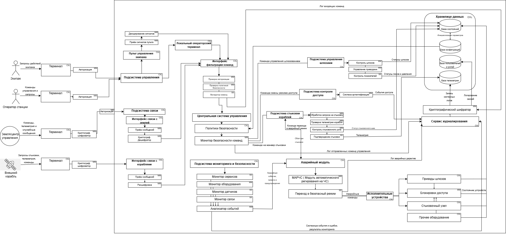

## Описание декомпозиции
Для обеспечения кибериммунитета системы и защиты целей безопасности (ЦБ1–ЦБ20) исходные монолитные и сложные сервисы были подвергнуты декомпозиции. Критические функции проверки параметров, криптографии и разграничения прав вынесены из недоверенных компонентов (таких как Центральная система управления и интерфейсы связи) в изолированные доверенные модули минимального размера. Теперь, даже если ЦСУ или внешние интерфейсы будут полностью скомпрометированы, новые доверенные прослойки заблокируют выполнение опасных или неавторизованных команд.

| Компонент | Функции |
| :--- | :--- |
| **Аутентификация** | Терминал<br>Криптографический шифратор<br>Авторизация |
| **Подсистема управления** | Локальный операторский терминал<br>Пульт управления экипажа<br>Интерфейс фильтрации команд |
| **Интерфейс фильтрации команд** | Проверка авторизации<br>Проверка политикой безопасности<br>Валидатор команд |
| **Пульт управления экипажа** | Приём сигналов пульта<br>Декодирование сигналов |
| **Интерфейс связи с Землёй** | Приём сообщений<br>Криптографический дешифратор |
| **Интерфейс связи с кораблями** | Приём сообщений<br>Криптографический дешифратор |
| **Центральная система управления (ЦСУ)** | Политики безопасности<br>Монитор безопасности команд |
| **Подсистема управления шлюзами** | Контроллер шлюзов<br>Управление приводами<br>Контроль показателей |
| **Подсистема контроля доступа** | Система аутентификации |
| **Подсистема стыковки кораблей** | Обработка запроса на стыковку<br>Проверка телеметрии корабля<br>Контроль стыковочного узла<br>Подтверждение стыковки |
| **Подсистема мониторинга и безопасности** | Монитор сервисов<br>Монитор оборудования<br>Монитор датчиков<br>Монитор связи<br>Анализатор событий |
| **Аварийный модуль** | МАРЧС<br>Переход в безопасный режим |
| **Исполнительные устройства** | Приводы шлюзов<br>Блокировки доступа<br>Стыковочный узел<br>Прочее оборудование |
| **Хранилище данных** | База состояний<br>База конфигураций<br>База пользователей и ролей<br>База телеметрии |
| **Сервис журналирования** | Криптографический шифратор |
| **Локальный операторский терминал** | | 
| **Шифрование** | |

# Таблица новых компонентов

| Компонент | Описание | Комментарий |
| :--- | :--- | :--- |
| **Терминал** | Внешний интерфейс для ввода команд и отображения статуса | Точка входа для оператора, инженера или экипажа |
| **Криптографический шифратор** | Обеспечивает защиту данных путем наложения криптографического слоя | Используется в терминалах и сервисе журналирования для защиты логов |
| **Авторизация** | Проверка заявленной идентичности источника запроса на терминале | Локальный фильтр доступа перед отправкой команды в систему |
| **Локальный операторский терминал** | Программная оболочка для управления станцией на месте | Обрабатывает сложный графический интерфейс пользователя |
| **Пульт управления экипажа** | Аппаратно-программный комплекс для ручного управления | Интегрирует физические кнопки и тумблеры в систему управления |
| **Интерфейс фильтрации команд** | Единая точка входа и очистки всех управляющих сообщений | Изолирует центральную систему от прямых внешних воздействий |
| **Проверка авторизации** | Верификация прав субъекта на выполнение конкретного типа действий | Первый эшелон защиты внутри интерфейса фильтрации |
| **Проверка политикой безопасности** | Сверка команды с глобальным набором правил | Второй эшелон защиты, блокирующий опасные запросы |
| **Валидатор команд** | Проверка синтаксической и логической корректности структуры команды | Финальный проверяющий блок перед передачей команды в ЦСУ |
| **Приём сигналов пульта** | Захват и первичная обработка сигналов от физических интерфейсов | Изолирует аппаратный уровень кнопок от логики системы |
| **Декодирование сигналов** | Преобразование сигналов матриц кнопок в цифровые идентификаторы | Интерпретирует физические нажатия экипажа |
| **Приём сообщения** | Приемник внешних данных из радиоканалов связи | Работает с сырыми пакетами из внешней среды Земли и кораблей |
| **Криптографический дешифратор** | Снятие защиты с внешних и внутренних сообщений | Необходим для перевода зашифрованных данных в читаемый формат |
| **Политики безопасности** | Вычислительный центр принятия решений на основе бизнес-логики | Определяет допустимость действий в текущем контексте станции |
| **Монитор безопасности команд** | Диспетчер и контролер исходящих управляющих воздействий | Распределяет одобренные команды по конкретным подсистемам |
| **Контроллер шлюзов** | Управляет последовательностью этапов шлюзования | Координирует совместную работу люков и насосов |
| **Управление приводами** | Прямое формирование команд для моторов и механизмов | Преобразует логическую команду в физический сигнал движения |
| **Контроль показателей** | Сбор и первичная обработка данных с датчиков подсистемы | Позволяет подсистеме видеть результат своих действий |
| **Система аутентификации** | Контроллер прав физического доступа персонала | Управляет электрозамками и допусками сотрудников в отсеки |
| **Обработка запроса на стыковку** | Логика взаимодействия с внешним кораблем при сближении | Принимает решение о возможности начала процесса стыковки |
| **Проверка телеметрии корабля** | Математический расчет параметров сближения и стыковки | Анализирует физические векторы и скорости объектов |
| **Контроль стыковочного узла** | Мониторинг состояния захватов и амортизаторов порта | Обеспечивает безопасность механического контакта при сцепке |
| **Подтверждение стыковки** | Фиксация успешного завершения операции и герметичности шва | Регистрирует финальный статус стыковки после проверок |
| **Монитор сервисов** | Контроль стабильности работы программных модулей | Выявляет зависания и внутренние ошибки софта |
| **Монитор оборудования** | Слежение за аппаратным статусом компонентов | Обнаруживает физические отказы вычислителей и памяти |
| **Монитор датчиков** | Непрерывный опрос сенсоров жизнеобеспечения | Следит за давлением, газами и температурой на станции |
| **Монитор связи** | Контроль доступности внешних каналов коммуникации | Проверяет наличие линка с Землей и кораблями |
| **Анализатор событий** | Корреляция данных от мониторов для выявления аномалий | Формирует сигнал тревоги для Аварийного модуля при ЧП |
| **МАРЧС** | Модуль автоматического реагирования на ЧС | Выступает главным диспетчером аварийного контура |
| **Переход в безопасный режим** | Исполнитель экстренных сценариев спасения станции | Отдает прямые команды на блокировку исполнительным органам |
| **Приводы шлюзов** | Физические механизмы открытия и закрытия люков | Отрабатывают штатные команды управления и аварийные директивы |
| **Блокировки доступа** | Электромагнитные и механические замки переборок | Физически ограничивают перемещение людей при ЧП или запрете |
| **Стыковочный узел** | Механика захвата и удержания космических аппаратов | Выполняет физическую стыковку и расстыковку кораблей |
| **Прочее оборудование** | Системы жизнеобеспечения, освещения и вентиляции | Вспомогательные устройства под контролем мониторинга |
| **База состояний** | Оперативное хранилище текущих параметров станции | Источник данных для принятия решений в бизнес-логике |
| **База конфигураций** | Хранилище эталонных настроек и лимитов безопасности | Используется для сверки действий с политиками безопасности |
| **База пользователей и ролей** | Реестр идентификаторов и прав доступа персонала | Обеспечивает работу всех систем авторизации списками прав |
| **База телеметрии** | Архив всех произошедших событий и метрик | Обеспечивает функцию «черного ящика» для последующего аудита |


## Диаграмма последовательности


## Доверенные компоненты на архитектуре
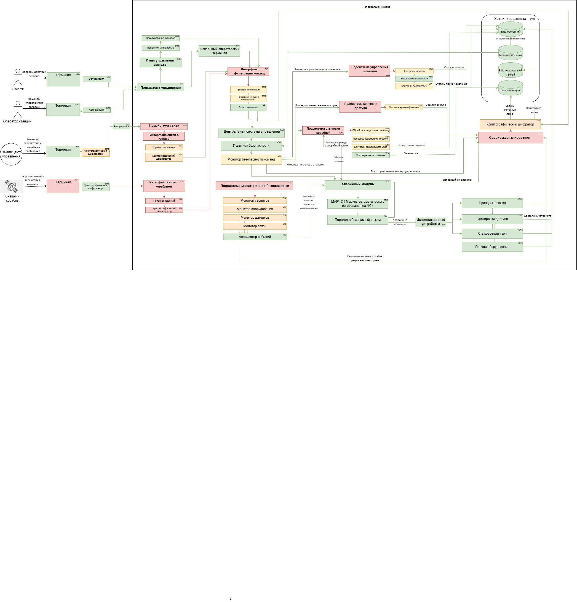

# Таблица доверенности компонентов

| Компонент | Уровень доверия | Обоснование | Комментарий |
|---|---|---|---|
| **Терминал** | Недоверенный | | Внешняя оболочка интерфейса рабочих мест, оцениваемая по наихудшему сценарию из-за потенциальных уязвимостей UI-софта |
| **Криптографический шифратор** | Повышающий доверие | Соблюдается ЦБ 2, ЦБ 6 | Накладывает защитный криптографический слой на логи и исходящие сообщения терминалов |
| **Авторизация** | Доверенный | Соблюдается ЦБ 1, ЦБ 2 | Локально верифицирует личность и подлинность сессии оператора на самом терминале |
| **Локальный операторский терминал** | Доверенный | Соблюдается ЦБ 1, ЦБ 2 | Изолированная программная среда на мостике для прямого ввода директив управления станцией |
| **Пульт управления экипажа** | Доверенный | Соблюдается ЦБ 1, ЦБ 2 | Защищенный физический модуль со стационарными органами управления для космонавтов |
| **Интерфейс фильтрации команд** | Недоверенный | | Внешняя программная граница, принимающая сырые входящие пакеты управления |
| **Проверка авторизации** | Повышающий доверие | Соблюдается ЦБ 1, ЦБ 4 | Инспектирует поток данных и проверяет права субъекта на выполнение запрошенного типа действий |
| **Проверка политикой безопасности** | Повышающий доверие | Соблюдается ЦБ 1, ЦБ 2, ЦБ 3 | Сверяет параметры пришедшей команды с глобальной матрицей ограничений системы |
| **Валидатор команд** | Доверенный | Соблюдается ЦБ 1, ЦБ 2, ЦБ 3, ЦБ 8 | Выполняет финальную синтаксическую очистку и проверку структуры команды перед отправкой в ядро |
| **Приём сигналов пульта** | Доверенный | Соблюдается ЦБ 1, ЦБ 2, ЦБ 7 | Физически перехватывает нажатия кнопок и тумблеров со стационарного пульта экипажа |
| **Декодирование сигналов** | Доверенный | Соблюдается ЦБ 1, ЦБ 2, ЦБ 6 | Безопасно преобразует электрические замыкания матрицы кнопок в цифровые коды команд |
| **Приём сообщения** | Недоверенный | | Первичный радиоприемник пакетов из открытого космоса, работающий в незащищенной среде |
| **Криптографический дешифратор** | Недоверенный | | Разбирает и парсит внешние зашифрованные пакеты связи, изолируя сложные библиотеки дешифрации |
| **Политики безопасности** | Доверенный | Соблюдается ЦБ 1, ЦБ 2, ЦБ 3, ЦБ 4, ЦБ 8 | Главное доверенное ядро ЦСУ, вычисляющее допустимость действий в текущем контексте станции |
| **Монитор безопасности команд** | Повышающий доверие | Соблюдается ЦБ 1, ЦБ 3, ЦБ 8, ЦБ 10 | Контролирует и распределяет одобренные ядром команды по исполнительным подсистемам |
| **Контроллер шлюзов** | Повышающий доверие | Соблюдается ЦБ 1, ЦБ 3, ЦБ 10 | Обеспечивает строгую пошаговую последовательность этапов открытия и закрытия люков шлюза |
| **Управление приводами** | Доверенный | Соблюдается ЦБ 3, ЦБ 10 | Переводит логические команды подсистемы шлюзования в физические сигналы для силовых реле |
| **Контроль показателей** | Повышающий доверие | Соблюдается ЦБ 3, ЦБ 5, ЦБ 10 | Превращает сырые телеметрические данные с датчиков давления и люков в проверенные статусы |
| **Система аутентификации** | Повышающий доверие | Соблюдается ЦБ 4, ЦБ 9 | Управляет правами доступа персонала на перемещение между внутренними отсеками станции |
| **Обработка запроса на стыковку** | Повышающий доверие | Соблюдается ЦБ 2, ЦБ 8 | Отвечает за логику начального сеанса связи и удержание протокола сближения с кораблем |
| **Проверка телеметрии корабля** | Повышающий доверие | Соблюдается ЦБ 2, ЦБ 8 | Обсчитывает физические векторы, скорость и соосность подлетающего аппарата |
| **Контроль стыковочного узла** | Повышающий доверие | Соблюдается ЦБ 8, ЦБ 10 | Проверяет готовность механических захватов, амортизаторов и замков порта к контакту |
| **Подтверждение стыковки** | Доверенный | Соблюдается ЦБ 8 | Фиксирует жесткую сцепку и собирает финальный статус герметичности шва |
| **Монитор сервисов** | Повышающий доверие | Соблюдается ЦБ 5, ЦБ 10 | Контролирует стабильность работы программных модулей операционной системы платформы |
| **Монитор оборудования** | Повышающий доверие | Соблюдается ЦБ 5, ЦБ 10 | Следит за аппаратным здоровьем вычислителей, плат, шин данных и оперативной памяти |
| **Монитор датчиков** | Повышающий доверие | Соблюдается ЦБ 3, ЦБ 5 | Постоянно опрашивает сенсоры жизнеобеспечения на предмет задымления, газов или падения давления |
| **Монитор связи** | Повышающий доверие | Соблюдается ЦБ 5 | Анализирует наличие и качество радиосигнала внешних каналов коммуникации |
| **Анализатор событий** | Доверенный | Соблюдается ЦБ 5, ЦБ 10 | Сопоставляет логи всех четырех мониторов для выявления скрытых аномалий, атак и признаков ЧП |
| **МАРЧС** | Доверенный | Соблюдается ЦБ 5, ЦБ 10 | Главный логический диспетчер, обрабатывающий сигналы тревоги от Анализатора событий |
| **Переход в безопасный режим** | Доверенный | Соблюдается ЦБ 5, ЦБ 9, ЦБ 10 | Автономный силовой блок, выдающий прямые директивы на блокировку железа в обход ЦСУ |
| **Приводы шлюзов** | Доверенный | Соблюдается ЦБ 3, ЦБ 10 | Физические электромоторы люков, гарантированно исполняющие штатные и аварийные приказы |
| **Блокировки доступа** | Доверенный | Соблюдается ЦБ 4, ЦБ 9 | Механические ригели и электрозамки дверей, запечатывающие отсеки при аварии или запрете |
| **Стыковочный узел** | Доверенный | Соблюдается ЦБ 8 | Исполнительные механизмы и стягивающие замки стыковочного порта станции |
| **Прочее оборудование** | Доверенный | Соблюдается ЦБ 3, ЦБ 5, ЦБ 10 | Вспомогательные агрегаты станции и системы поддержания атмосферы |
| **База состояний** | Доверенный | Соблюдается ЦБ 3, ЦБ 5, ЦБ 6, ЦБ 10 | Защищенное хранилище оперативных параметров и текущих технологических режимов станции |
| **База конфигураций** | Доверенный | Соблюдается ЦБ 3, ЦБ 4, ЦБ 6, ЦБ 8 | Изолированный реестр эталонных настроек, лимитов датчиков и констант безопасности |
| **База пользователей и ролей** | Доверенный | Соблюдается ЦБ 1, ЦБ 2, ЦБ 4, ЦБ 6 | Доверенное хранилище идентификаторов, мандатов доступа и криптографических ключей персонала |
| **База телеметрии** | Доверенный | Соблюдается ЦБ 6, ЦБ 7 | Функция «черного ящика», обеспечивающая неизменяемость исторических логов для аудита |


## Качественная оценка доменов

| Компонент | Уровень доверия | Оценка | Кол-во входящих интерфейсов | Комментарий |
| :--- | :--- | :---: | :---: | :--- |
| **Тернимал** | Недоверенный | CXL | 1 | Внешняя оболочка интерфейса рабочих мест, оцениваемая по наихудшему сценарию из-за потенциальных уязвимостей UI-софта |
| **Криптографический шифратор** | Повышающий доверие | MM | 1 | Накладывает защитный криптографический слой на логи и исходящие сообщения терминалов |
| **Авторизация** | Доверенный | MM | 1 | Локально верифицирует личность и подлинность сессии оператора на самом терминале |
| **Локальный операторский терминал** | Доверенный | CXL | 1 | Изолированная программная среда на мостике для прямого ввода директив управления станцией |
| **Пульт управления экипажа** | Доверенный | CXL | 1 | Защищенный физический модуль со стационарными органами управления для космонавтов |
| **Интерфейс фильтрации команд** | Недоверенный | CXL | 4 | Внешняя программная граница, принимающая сырые входящие пакеты управления |
| **Проверка авторизации** | Повышающий доверие | MM | 1 | Инспектирует поток данных и проверяет права субъекта на выполнение запрошенного типа действий |
| **Проверка политикой безопасности** | Повышающий доверие | MM | 1 | Сверяет параметры пришедшей команды с глобальной матрицей ограничений системы |
| **Валидатор команд** | Доверенный | SS | 1 | Выполняет финальную синтаксическую очистку и проверку структуры команды перед отправкой в ядро |
| **Приём сигналов пульта** | Доверенный | MM | 1 | Физически перехватывает нажатия кнопок и тумблеров со стационарного пульта экипажа |
| **Декодирование сигналов** | Доверенный | MM | 1 | Безопасно преобразует электрические замыкания матрицы кнопок в цифровые коды команд |
| **Приём сообщения** | Недоверенный | MM | 1 | Первичный радиоприемник пакетов из открытого космоса, работающий в незащищенной среде |
| **Криптографический дешифратор** | Недоверенный | MM | 1 | Разбирает и парсит внешние зашифрованные пакеты связи, изымая сложные библиотеки дешифрации |
| **Политики безопасности** | Доверенный | CXL | 1 | Главное доверенное ядро ЦСУ, вычисляющее допустимость действий в текущем контексте станции |
| **Монитор безопасности команд** | Повышающий доверие | MM | 1 | Контролирует и распределяет одобренные ядром команды по исполнительным подсистемам |
| **Контроллер шлюзов** | Повышающий доверие | MM | 1 | Обеспечивает строгую пошаговую последовательность этапов открытия и закрытия люков шлюза |
| **Управление приводами** | Доверенный | MM | 1 | Переводит логические команды подсистемы шлюзования в физические сигналы для силовых реле |
| **Контроль показателей** | Повышающий доверие | SS | 1 | Превращает сырые телеметрические данные с датчиков давления и люков в проверенные статусы |
| **Система аутентификации** | Повышающий доверие | MM | 1 | Управляет правами доступа персонала на перемещение между внутренними отсеками станции |
| **Обработка запроса на стыковку** | Повышающий доверие | MM | 1 | Отвечает за логику начального сеанса связи и удержание протокола сближения с кораблем |
| **Проверка телеметрии корабля** | Повышающий доверие | MM | 1 | Обсчитывает физические векторы, скорость и соосность подлетающего аппарата |
| **Контроль стыковочного узла** | Повышающий доверие | MM | 1 | Проверяет готовность механических захватов, амортизаторов и замков порта к контакту |
| **Подтверждение стыковки** | Доверенный | SS | 1 | Фиксирует жесткую сцепку и собирает финальный статус герметичности шва |
| **Монитор сервисов** | Повышающий доверие | SS | 1 | Контролирует стабильность работы программных модулей операционной системы платформы |
| **Монитор оборудования** | Повышающий доверие | MM | 0 | Следит за аппаратным здоровьем вычислителей, плат, шин данных и оперативной памяти |
| **Монитор датчиков** | Повышающий доверие | SS | 0 | Постоянно опрашивает сенсоры жизнеобеспечения на предмет задымления, газов или падения давления |
| **Монитор связи** | Повышающий доверие | SS | 0 | Анализирует наличие и качество радиосигнала внешних каналов коммуникации |
| **Анализатор событий** | Доверенный | MM | 4 | Сопоставляет логи всех четырех мониторов для выявления скрытых аномалий, атак и признаков ЧП |
| **МАРЧС** | Доверенный | MM | 1 | Главный логический диспетчер, обрабатывающий сигналы тревоги от Анализатора событий |
| **Переход в безопасный режим** | Доверенный | SS | 1 | Автономный силовой блок, выдающий прямые директивы на блокировку железа в обход ЦСУ |
| **Приводы шлюзов** | Доверенный | CXL | 1 | Физические электромоторы люков, гарантированно исполняющие штатные и аварийные приказы |
| **Блокировки доступа** | Доверенный | MM | 4 | Механические ригели и электрозамки дверей, запечатывающие отсеки при аварии или запрете |
| **Стыковочный узел** | Доверенный | CXL | 1 | Исполнительные механизмы и стягивающие замки стыковочного порта станции |
| **Прочее оборудование** | Доверенный | CXL | 0 | Вспомогательные агрегаты станции и системы поддержания атмосферы |
| **База состояний** | Доверенный | MM | 5 | Защищенное хранилище оперативных параметров и текущих технологических режимов станции |
| **База конфигураций** | Доверенный | MM | 1 | Изолированный реестр эталонных настроек, лимитов датчиков и констант безопасности |
| **База пользователей и ролей** | Доверенный | MM | 1 | Доверенное хранилище идентификаторов, мандатов доступа и криптографических ключей персонала |
| **База телеметрии** | Доверенный | MM | 2 | Функция «черного ящика», обеспечивающая неизменяемость исторических логов для аудита |

## Проверка негативных сценариев

| Название сценария | Описание                                                                                                                                                                                                                                                  |
| ----------------- | --------------------------------------------------------------------------------------------------------------------------------------------------------------------------------------------------------------------------------------------------------- |
| НС-1              | Тест негативного сценария 1. Интерфейс связи с Землёй скомпрометирован и изменяет корректную команду, но так как введён валидатор команд, изменённая команда не передаётся в центральную систему управления. Шлюз не открывается, ЦБ не нарушаются.       |
| НС-2              | Тест негативного сценария 2. Интерфейс связи с кораблями скомпрометирован и формирует поддельный запрос на стыковку, но так как введено подтверждение стыковки, запрос не приводит к активации стыковочного узла. ЦБ не нарушаются.                       |
| НС-3              | Тест негативного сценария 3. Центральная система управления скомпрометирована и пытается открыть шлюз без проверки давления, но так как введён контроль показателей, команда не выполняется без подтверждения давления и герметичности. ЦБ не нарушаются. |
| НС-4              | Тест негативного сценария 4. Сервис управления шлюзами скомпрометирован и пытается открыть обе створки шлюза одновременно, но так как введён контроль шлюзов, опасная команда не передаётся приводам. ЦБ не нарушаются.                                   |
| НС-5              | Тест негативного сценария 5. Подсистема контроля доступа скомпрометирована и пытается разрешить доступ пользователю без прав, но так как введена система аутентификации, доступ не подтверждается. Блокировка не снимается, ЦБ не нарушаются.             |
| НС-6              | Тест негативного сценария 6. Сервис контроля отсеков скомпрометирован и передаёт ложные данные о нормальном давлении, но так как введён контроль показателей, данные сверяются с телеметрией. Команда открытия шлюза не выполняется, ЦБ не нарушаются.    |
| НС-7              | Тест негативного сценария 7. Подсистема стыковки кораблей скомпрометирована и пытается подтвердить стыковку при неисправном узле, но так как введён контроль стыковочного узла, стыковка не разрешается. ЦБ не нарушаются.                                |
| НС-8              | Тест негативного сценария 8. Центральная система управления скомпрометирована и подменяет команду закрытия шлюза на открытие, но так как введены политики безопасности, опасная команда блокируется. Шлюз не открывается, ЦБ не нарушаются.               |
| НС-9              | Тест негативного сценария 9. База состояний скомпрометирована и показывает ложный статус шлюза, но так как введён контроль шлюзов, система проверяет фактическое состояние приводов. Ложный статус не используется, ЦБ не нарушаются.                     |
| НС-10             | Тест негативного сценария 10. Сервис журналирования скомпрометирован и не сохраняет запись о критическом событии, но так как введён криптографический шифратор, событие сохраняется в защищённом виде. ЦБ не нарушаются.                                  |
| НС-11             | Тест негативного сценария 11. Монитор сервисов скомпрометирован и скрывает отказ, но так как введён анализатор событий, отказ выявляется по данным оборудования и датчиков. Система передаёт событие в аварийный контур, ЦБ не нарушаются.                |
| НС-12             | Тест негативного сценария 12. Локальный операторский терминал скомпрометирован и отправляет несанкционированную команду, но так как введена проверка авторизации, команда не передаётся в центральную систему управления. ЦБ не нарушаются.               |
| НС-13             | Тест негативного сценария 13. Аварийный модуль скомпрометирован и не включает безопасный режим, но так как введён МАРЧС, аварийное событие обрабатывается по независимому маршруту. Система переходит в безопасный режим, ЦБ не нарушаются.               |
| НС-14             | Тест негативного сценария 14. Интерфейс связи с Землёй скомпрометирован и повторно отправляет старую команду, но так как введён монитор безопасности команд, повторная команда распознаётся и не передаётся в ЦСУ. ЦБ не нарушаются.                      |
| НС-15             | Тест негативного сценария 15. Интерфейс связи с кораблями скомпрометирован и искажает телеметрию корабля, но так как введена проверка телеметрии корабля, повреждение выявляется. Стыковка не подтверждается, ЦБ не нарушаются.                           |
| НС-16             | Тест негативного сценария 16. Центральная система управления скомпрометирована и формирует конфликтующие команды, но так как введён монитор безопасности команд, взаимоисключающие команды не исполняются одновременно. ЦБ не нарушаются.                 |
| НС-17             | Тест негативного сценария 17. Центральная система управления скомпрометирована и задерживает аварийную команду, но так как введён МАРЧС, аварийное реагирование запускается без ожидания ЦСУ. Шлюз закрывается, ЦБ не нарушаются.                         |

### НС-1. Компрометация интерфейса связи с Землёй
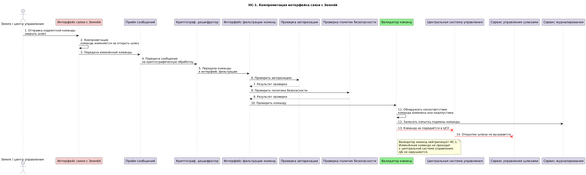

### НС-2. Поддельный запрос на стыковку
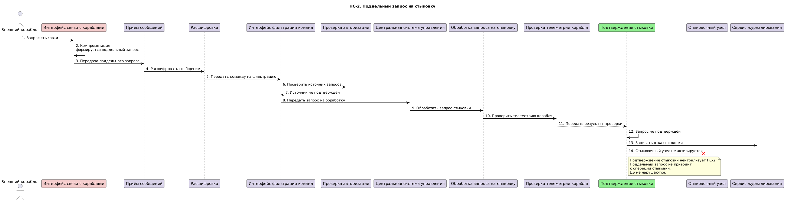

### НС-3. Открытие шлюза без проверки давления
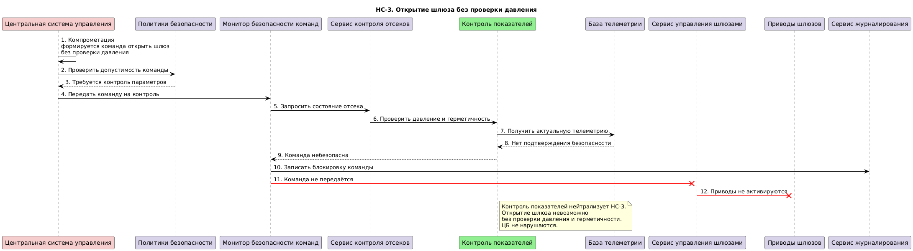

### НС-4. Одновременное открытие створок шлюза
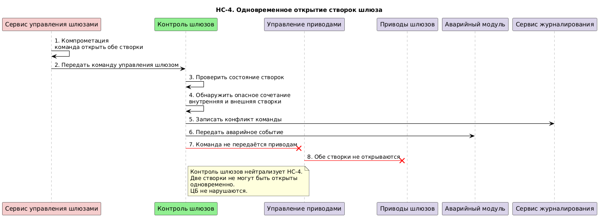

### НС-5. Доступ без полномочий
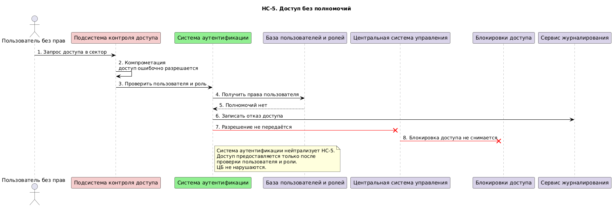

### НС-6. Ложные данные о давлении
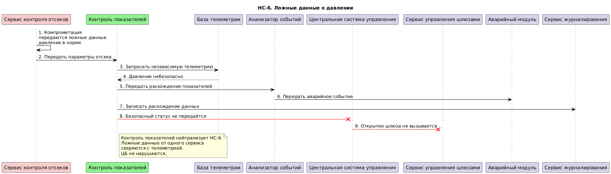

### НС-7. Стыковка при неисправном узле
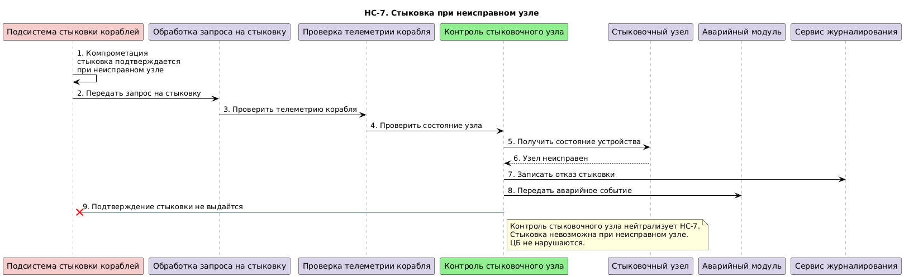

### НС-8. Подмена команды закрытия на открытие
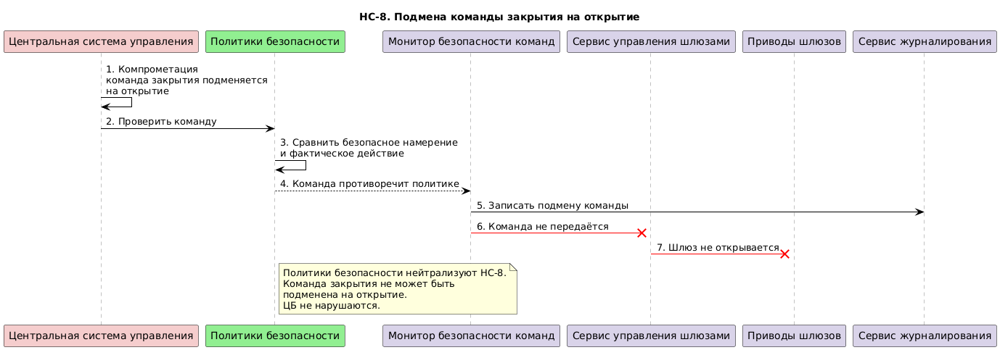

### НС-9. Ложный статус шлюза в базе состояний
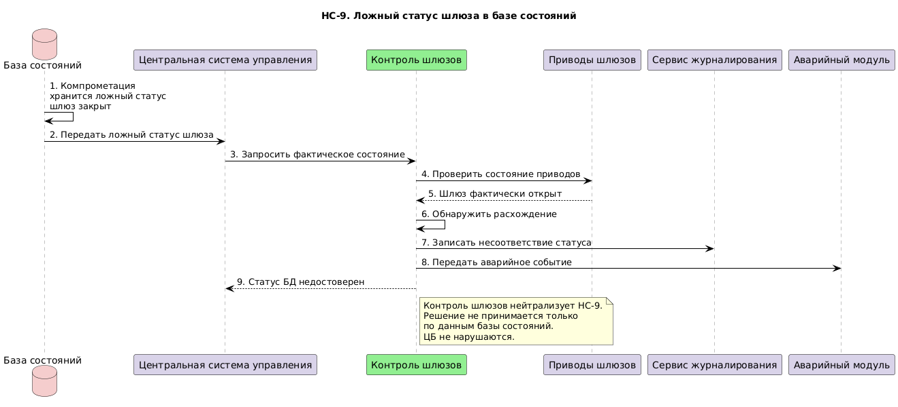

### НС-10. Отсутствие записи в журнале
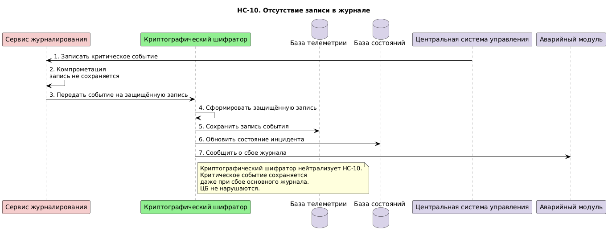

### НС-11. Скрытие отказа мониторингом
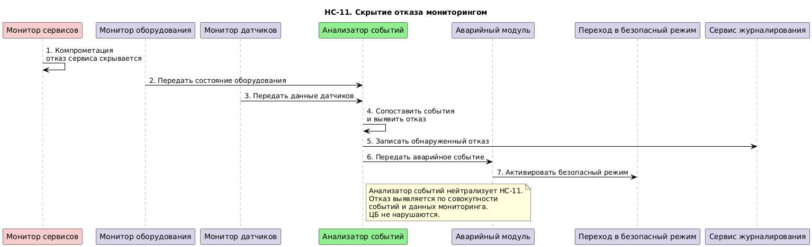

### НС-12. Несанкционированная команда с терминала
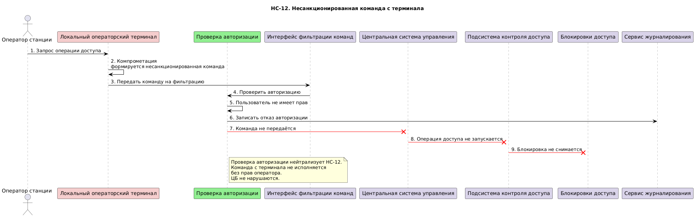

### НС-13. Аварийный модуль не включает безопасный режим
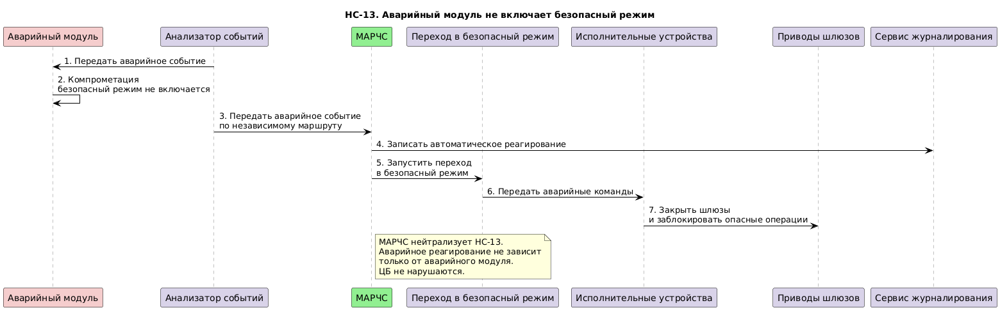

### НС-14. Повтор устаревшей команды
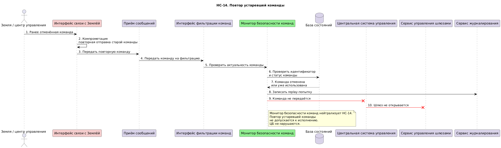

### НС-15. Искажение телеметрии корабля
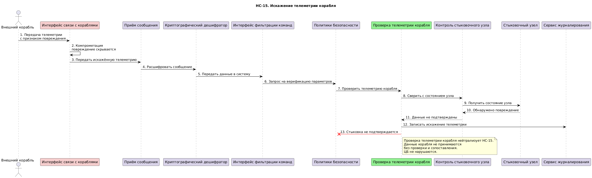

### НС-16. Конфликтующие команды
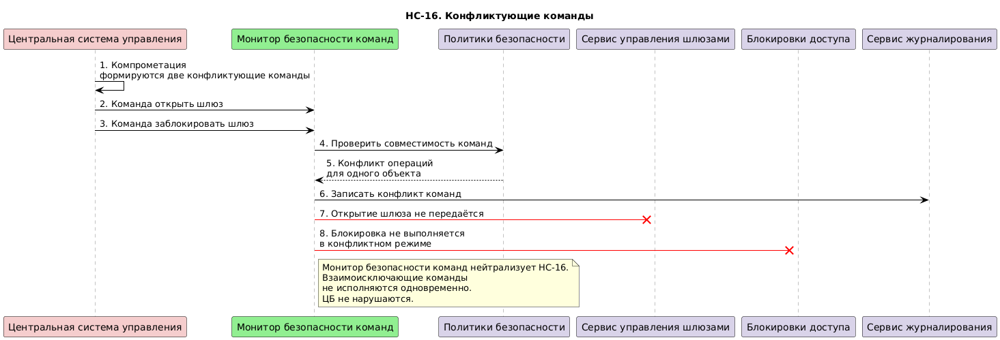

### НС-17. Задержка аварийной команды
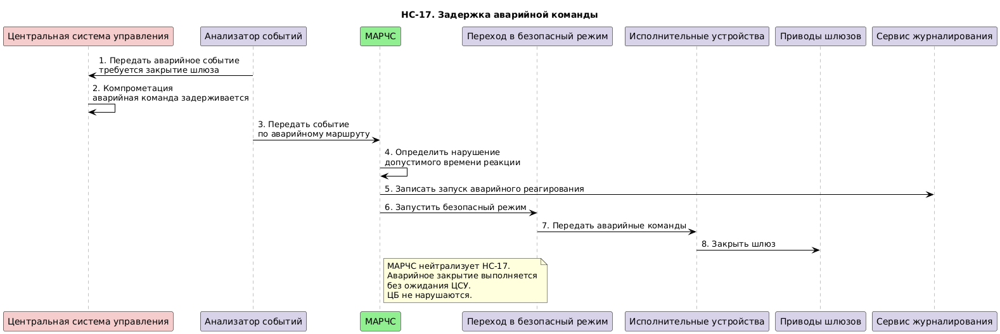

| Компонент | Соответствие |
|---|---|
| 1. Интерфейс связи с Землёй | earth-interface |
| 2. Валидатор команд | command-validator |
| 3. Интерфейс связи с кораблями | ship-interface |
| 4. Подтверждение стыковки | docking-confirmation |
| 5. Центральная система управления | central-control |
| 6. Контроль показателей | metrics-control |
| 7. Сервис управления шлюзами | airlock-control-service |
| 8. Контроль шлюзов | airlock-control |
| 9. Подсистема контроля доступа | access-control-subsystem |
| 10. Система аутентификации | authentication-system |
| 11. Сервис контроля отсеков | compartment-control-service |
| 12. Подсистема стыковки кораблей | docking-subsystem |
| 13. Контроль стыковочного узла | docking-node-control |
| 14. Политики безопасности | security-policies |
| 15. База состояний | state-db |
| 16. Сервис журналирования | logging-service |
| 17. Криптографический шифратор | crypto-encryptor |
| 18. Монитор сервисов | service-monitor |
| 19. Анализатор событий | event-analyzer |
| 20. Локальный операторский терминал | local-operator-terminal |
| 21. Проверка авторизации | authorization-check |
| 22. Аварийный модуль | emergency-module |
| 23. МАРЧС | emergency-response-module |
| 24. Монитор безопасности команд | command-security-monitor |
| 25. Проверка телеметрии корабля | ship-telemetry-check |

### Политики безопасности

```python
policies = (
    {"src": "local-operator-terminal", "dst": "command-filter"},
    {"src": "earth-interface", "dst": "command-filter"},
    {"src": "ship-interface", "dst": "command-filter"},

    {"src": "command-filter", "dst": "authorization-check"},
    {"src": "authorization-check", "dst": "command-filter"},

    {"src": "command-filter", "dst": "security-policies"},
    {"src": "security-policies", "dst": "command-filter"},

    {"src": "command-filter", "dst": "command-validator"},
    {"src": "command-validator", "dst": "command-filter"},

    {"src": "command-filter", "dst": "command-security-monitor"},
    {"src": "command-security-monitor", "dst": "command-filter"},

    {"src": "command-filter", "dst": "central-control"},

    {"src": "central-control", "dst": "security-policies"},
    {"src": "security-policies", "dst": "central-control"},

    {"src": "central-control", "dst": "command-security-monitor"},
    {"src": "command-security-monitor", "dst": "central-control"},

    {"src": "central-control", "dst": "compartment-control-service"},
    {"src": "compartment-control-service", "dst": "metrics-control"},
    {"src": "metrics-control", "dst": "central-control"},

    {"src": "central-control", "dst": "access-control-subsystem"},
    {"src": "access-control-subsystem", "dst": "authentication-system"},
    {"src": "authentication-system", "dst": "access-control-subsystem"},
    {"src": "access-control-subsystem", "dst": "central-control"},

    {"src": "central-control", "dst": "airlock-control-service"},
    {"src": "airlock-control-service", "dst": "airlock-control"},
    {"src": "airlock-control", "dst": "airlock-control-service"},
    {"src": "airlock-control-service", "dst": "central-control"},

    {"src": "central-control", "dst": "docking-subsystem"},
    {"src": "docking-subsystem", "dst": "ship-telemetry-check"},
    {"src": "ship-telemetry-check", "dst": "docking-node-control"},
    {"src": "docking-node-control", "dst": "docking-confirmation"},
    {"src": "docking-confirmation", "dst": "docking-subsystem"},
    {"src": "docking-subsystem", "dst": "central-control"},

    {"src": "central-control", "dst": "state-db"},
    {"src": "state-db", "dst": "central-control"},

    {"src": "airlock-control-service", "dst": "state-db"},
    {"src": "docking-subsystem", "dst": "state-db"},

    {"src": "command-security-monitor", "dst": "state-db"},
    {"src": "state-db", "dst": "command-security-monitor"},

    {"src": "central-control", "dst": "logging-service"},
    {"src": "command-validator", "dst": "logging-service"},
    {"src": "security-policies", "dst": "logging-service"},
    {"src": "command-security-monitor", "dst": "logging-service"},
    {"src": "metrics-control", "dst": "logging-service"},
    {"src": "airlock-control", "dst": "logging-service"},
    {"src": "authentication-system", "dst": "logging-service"},
    {"src": "docking-confirmation", "dst": "logging-service"},
    {"src": "ship-telemetry-check", "dst": "logging-service"},

    {"src": "logging-service", "dst": "crypto-encryptor"},
    {"src": "crypto-encryptor", "dst": "state-db"},

    {"src": "service-monitor", "dst": "event-analyzer"},
    {"src": "event-analyzer", "dst": "emergency-module"},
    {"src": "event-analyzer", "dst": "emergency-response-module"},

    {"src": "emergency-module", "dst": "emergency-response-module"},
    {"src": "emergency-response-module", "dst": "airlock-control-service"},
    {"src": "emergency-response-module", "dst": "access-control-subsystem"},
    {"src": "emergency-response-module", "dst": "logging-service"},
)


def check_operation(id, details) -> bool:
    """Проверка возможности совершения обращения."""
    src: str = details.get("source")
    dst: str = details.get("deliver_to")

    if not all((src, dst)):
        return False

    print(f"[info] checking policies for event {id}, {src}->{dst}")

    return {"src": src, "dst": dst} in policies
```

